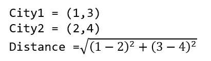
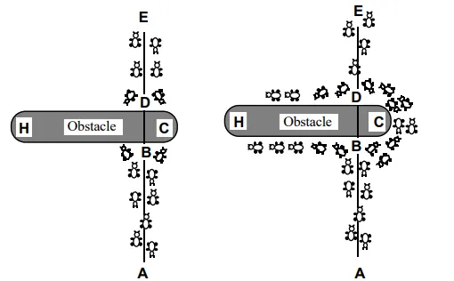
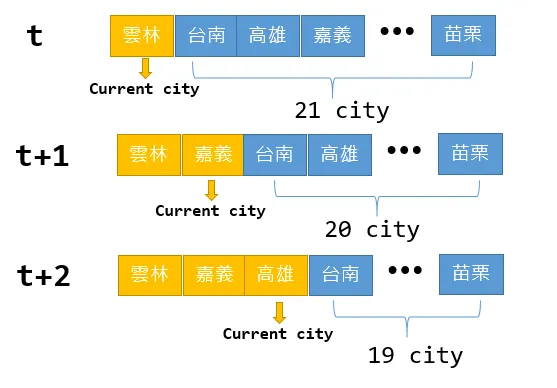
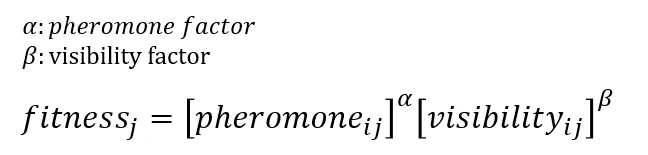
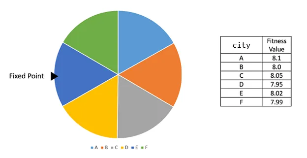
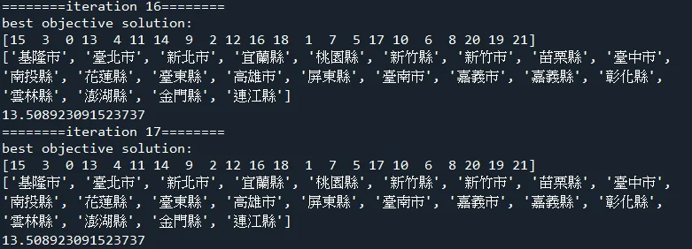
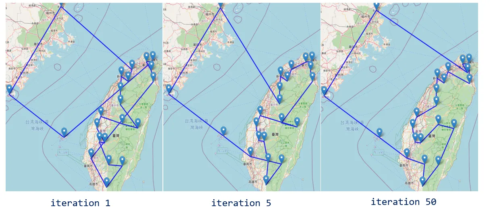

+++
author = "Bingcheng"
title = "實作蟻群演算法 (Ant Colony Optimization, ACO) 並解決旅行商人問題 (Traveling Salesman Problem, TSP)"
date = "2021-01-26"
description = "以 Python 實作蟻群演算法"
tags = [
    "啟發式演算法",
    "蟻群演算法",
    "Python"
]
categories = [
    "資料分析"
]
series = ["Themes Guide"]
+++

蟻群最佳化演算法有許多的版本，這篇文章會聚焦在最原始的螞蟻系統 (Ant System, AS)，分享如何以 Python 進行演算法的實作，並用台灣22個縣市的經緯度作為測試資料集，規劃出一條踏訪台灣縣市的最短路線，最後以 `folium` 套件進行路線的可視化。

<!--more-->

# 旅行推銷員問題(traveling salesman problem, TSP)

在以 Python 實作粒子群演算法一文中提到，最佳化問題分為連續最佳化問題與組合優化，TSP 是一個尋求最短路徑的組合優化問題。

TSP 情境是給定城市和城市之間的距離，旅人會踏訪每座城市，最終返回到起始城市，期間同一座城市不能踏訪兩次以上，如何決定踏訪城市的順序，使得總路徑距離最短，即是該情境的問題；或是在工廠的生產線上，機器人從起始的位置出發，前往不同的工作站進行特定的操作，最後再返回到起始的位置，要如何規劃出一條最佳路徑。

秉持著物件導向的精神，TSP 問題本身亦可成為一個物件。 `coordinate` 是城市的經緯度，`cities_name` 如字面上意思，就是城市的名字。`get_distance` 負責計算兩個城市之間的距離，python 的 `Haversine` 套件可以計算地理距離，但在此只是為了解釋演算法流程，便採用跟論文相同的歐式距離。

<p style="text-align: center;">
  
</p>

```Python
class TSPProblem:
    def __init__(self,coordinate,cities_name):
        self.coordinate = coordinate
        self.cities_name = cities_name
    
    def get_distance(self,arr1,arr2):
        #Euclidean distance
        return np.sqrt(np.power(arr1-arr2,2).sum())
    
    def compute_objective_value(self,cities_id):
        total_distance = 0
        for i in range(len(cities_id)):
            city1 = cities_id[i]
            city2 = cities_id[i+1] if i<len(cities_id)-1 else cities_id[0]
            total_distance += self.get_distance(self.coordinate[city1],self.coordinate[city2])
        return total_distance
    
    def to_cities_name(self,cities_id):
        return [self.cities_name[i] for i in cities_id]
```
# 蟻群最佳化演算法 (Ant Colony Optimization, ACO)

蟻群最佳化演算法是由 Dorigo 等人於 1996 年提出，該演算法的概念是來自生物界中螞蟻覓食的行徑路線，螞蟻會透過費洛蒙 (pheromones) 的分泌來告知同伴合適的路徑，最終誘使大部分的螞蟻會走在同一路徑上。如下論文圖片所示，在螞蟻從 A 抵達 E 的行徑過程中，遇到一個障礙物，螞蟻會先分開兩頭探訪，在 C 側路徑有較短的距離，因此會聚集越多的費洛蒙，螞蟻會逐漸傾向從 C 側經過。

<p style="text-align: center;">
  
</p>

蟻群最佳化演算法最早的版本是螞蟻系統 (Ant System, AS)，其後延伸出許多的改良版本，應用最為廣泛是螞蟻族群系統 (Ant Colony System, ACS)，兩者最大的不同之處在於路徑挑選規則及費洛蒙的更新方式。本日將用物件導向設計的精神建構一個螞蟻系統，螞蟻族群系統 (Ant Colony System, ACS)則留在下篇分享。

# 螞蟻系統 (Ant System, AS) 演算法流程
首先，初始化螞蟻族群、費洛蒙等必要參數。

一隻螞蟻就是表示一個解，建構每一個解都會進行以下流程：

1. 隨機挑選起始縣市。
2. 計算候選縣市清單的合適度。依照**能見度 (visibility)** 及**費洛蒙 (pheromone)**計算合適度。
3. 使用輪盤法挑選本次欲踏訪縣市。
4. 更新候選縣市清單。其實就是移除本階段踏訪的縣市。
5. 重複上述 1–4 動作，直到所有縣市踏訪完畢
   
舉例來說，在時間t我隨機挑選起始縣市為雲林，我的候選清單就是台南、高雄、嘉義等21縣市，演算法會評估 21 個縣市的合適度 (fitness)，這個合適度主要是雲林與該縣市的能見度加上雲林到該縣市的費洛蒙值。具體挑選方式為 輪盤法 (roulette wheel selection)，待會介紹。假如挑中的縣市是嘉義市，嘉義市會從候選清單中被移除，在下個時間點 t+1，嘉義市就會變成目前的縣市，候選清單會變成台南、高雄等 20 個縣市，嘉義市會逐一與這 20 個縣市計算合適度，再使用輪盤法挑選，做為下一個踏訪的縣市，如此反覆直到踏訪最後一個城市為止。

<p style="text-align: center;">
  
</p>

以上流程就是建構一個解的動作。每隻螞蟻都建構過一次，即是一次 iteration，重複執行直到指定的次數，演算法流程結束。

經過上述圖文並茂說明，相信讀者對演算法流程有大致的認識，接著讓我們聊聊細節的部份。

## 合適度 (fitness)

合適度是費洛蒙 (pheromone) 乘上能見度 (visibility)。費洛蒙代表該線段有多少螞蟻行徑過，越多則越值越大 (氣味越濃厚)。能見度就是距離的倒數，距離越短則能見度越大。alpha 與 beta 分別代表這兩個因子的權重，要通過試誤法來得知比較適合的權重分配。通常 beta>alpha ，也就是距離會比費洛蒙的濃度還要重要一些。



以下為兩個極端分配：

### alpha=0
表示螞蟻選擇距離最短的鄰近縣市作為下一個拜訪縣市。這就是典型的貪婪啟發 (greedy heuristic, GH)

### beta=0
則螞蟻選擇下一踏訪縣市時完全不考量縣市之間距離長短， **僅以費洛蒙濃度作為選擇下一個拜訪縣市之依據**。

## 輪盤法(roulette wheel selection)

輪盤法是一種挑選的方式，最早是運用在基因遺傳演算法。每個縣市都會計算合適度，有一種想法就是以合適度最高的縣市做為下個踏訪縣市，**輪盤法的概念是希望能夠提供多樣性，因此用隨機的方式決定**。在此合適度可以轉換成機率的概念，比如說cityA合適度為8.1，cityB 合適度為8.0等等，想像一個由縣市合適度組合的輪盤，隨機投擲飛鏢到輪盤上，**合適度最高的縣市被投中的機率越高，但是合適度低的縣市也有可能被投中，只是被挑中的機率相對來說較低**。



# Python程式碼實現

因為排版緣故，建議讀者可以先將視窗拉至底部下載完整程式碼，一邊閱讀一邊參照程式碼。

認識變數
首先，先來認識演算法中重要的幾個變數。

* `pop_size`：螞蟻的族群大小。
* `one_solution`：一隻螞蟻踏訪城市的順序。例如 `[5,2,1,4,3]` 表示尋訪第5座城市=>第2座城市..以此類推。
* `objective_value`：所有的螞蟻行徑總距離。
* `best_solution`：所有螞蟻截至目前為止踏訪城市的最佳順序。
* `pheromone_drop_amount`：費洛蒙分泌量。螞蟻行徑時會分泌固定量的賀爾蒙
* `evaporate_rate`：費洛蒙蒸發速度。每隔一段時間費洛蒙會蒸散。
* `pheromone_map`：費洛蒙表。儲存每一條路徑的費洛蒙量，值越大表示表示路徑合適度 (fitness)越高
* `pheromone_factor`：費洛蒙因子。計算路徑合適度 (fitness) 的一項權重，如果該因子越高，表示越看重賀爾蒙的效果。
* `visibility`：能見度 (visibility)或稱啟發值。城市之間距離的倒數。值越大表示路徑合適度 (fitness)越高。
* `visibility_factor`：能見度因子。計算路徑合適度 (fitness) 的一項權重，如果該因子越高，表示越看重能見度的效果。

## 初始化

`one_solution` 表示一隻螞蟻拜訪城市的順序，初始化就先以原始城市順序排列，因此是0,1,2..N 。`best_objective_value` 就是表示截至目前為止的最短距離，預設賦予最大值。`visibility` 就是城市之間距離的倒數。城市距離以簡單的歐式距離計算，請參照 TSP 章節，這個距離函式為 TSP 物件提供。因為變數繁多，剩下的便不再逐一贅述。

```Python
def initialize(self):
    self.one_solution = np.arange(self.num_cities,dtype=int)
    self.solutions  = np.zeros((self.num_ants,self.num_cities),dtype=int)
    for i in range(self.num_ants):
        for c in range(self.num_cities):
            self.solutions[i][c] = c
            
    self.objective_value = np.zeros(self.num_ants)
    self.best_solution = np.zeros(self.num_cities,dtype=int)
    self.best_objective_value = sys.float_info.max
    
    self.visibility = np.zeros((self.num_cities,self.num_cities))
    self.pheromone_map = np.ones((self.num_cities,self.num_cities))
    
    #heuristic_values
    for from_  in range(self.num_cities):
        for to in range(self.num_cities):
            if(from_==to):continue
            distance = self.get_distance(self.coordinate[from_],self.coordinate[to])
            self.visibility[from_][to] = 1/distance
```

## 建構一個解

一隻螞蟻完成踏訪所有城市的流程，就會是建構一個解，流程即是剛剛提到的三個步驟

1. **隨機挑選起始城市**。`candidates` 表示候選城市清單，我們先從 `candidates` 用 `current_city_id = random.choice(candidates)`，隨機取出一個城市作為起始城市。
2. **計算候選縣市清單的合適度**。`for t in range(1,self.num_cities-1)` 這個外部迴圈就是決定時間點 t 要踏訪的城市，這裡可以注意 range 從1開始，因為第一個起始城市已經在上個步驟決定， `for city_id in candidates` 這個迴圈就是在計算候選縣市清單中每座縣市的合適度，並用 `fitness_list` 變數盛裝。
使用輪盤法挑選本次欲踏訪縣市。本次欲踏訪的縣市以 `next_city_id` 表示，`do_roulette_wheel_selection` 這個函示負責輪盤法的操作。將每座縣市的合適度轉為相對機率，其實就是個別合適度除以合適度的和，再隨機產生0–1亂數，一旦累計合適度>=該縣市的合適度，相當於飛鏢投中該區塊，返回該縣市的索引值。
4. **更新候選縣市清單**。其實就是移除本階段踏訪的縣市。`candidates.remove(next_city_id)` 從候選城市清單中移除本階段踏訪縣市，以免下個階段重複踏訪。
5. **重複上述動作**，直到 `for t in range(1,self.num_cities-1)` 這個外部迴圈結束，候選縣市清單會剩下一個，`self.one_solution[-1] = candidates.pop()` 直接指派作為最後踏訪縣市。

**輪盤法**

```Python
def do_roulette_wheel_selection(self,fitness_list):
    sum_fitness = sum(fitness_list)
    transition_probability = [fitness/sum_fitness for fitness in fitness_list]
    
    rand = random.random()
    sum_prob = 0
    for i,prob in enumerate(transition_probability):
        sum_prob += prob
        if(sum_prob>=rand):
            return i
```

**建構一個解**

```Python
def _an_ant_construct_its_solution(self):
    candidates = [i for i in range(self.num_cities)]
    #random choose city as first city 
    current_city_id = random.choice(candidates)
    self.one_solution[0] = current_city_id
    candidates.remove(current_city_id)
    
    #select best from candidate
    for t in range(1,self.num_cities-1):
        #best
        fitness_list = []
        for city_id in candidates:
            fitness = pow(self.pheromone_map[current_city_id][city_id],self.pheromone_factor)*\
                pow(self.visibility[current_city_id][city_id],self.visibility_factor)
            fitness_list.append(fitness)
        
        next_city_id = candidates[self.do_roulette_wheel_selection(fitness_list)]
        candidates.remove(next_city_id)
        self.one_solution[t] = next_city_id
        
        current_city_id = next_city_id
    self.one_solution[-1] = candidates.pop()
```

## 建構所有解

使用迴圈將逐一建構個別螞蟻的解，並計算目標值，目標值就是行徑總距離。

```Python
def each_ant_construct_its_solution(self):
    for i in range(self.num_ants):
        self._an_ant_construct_its_solution()
        for c in range(self.num_cities):  
            self.solutions[i][c] = self.one_solution[c]
            
        self.objective_value[i] = self.compute_objective_value(self.solutions[i])
                
```
## 更新費洛蒙

費洛蒙會隨時間蒸散，因此需要有 `self.pheromone_map *= (1-self.evaporate_rate)` 蒸散的動作，之後就是在每隻螞蟻行徑的途中增添費洛蒙。這裡注意踏訪城市需要返回原始城市，因此最後的城市跟第一個城市的路徑也有賀爾蒙添加。

```Python
def update_pheromone(self):
    #evaporate hormones all the path
    self.pheromone_map *= (1-self.evaporate_rate)
            
    #Add hormones to the path of the ants
    for solution in self.solutions:
        for j in range(self.num_cities):
            city1 = solution[j]
            city2 = solution[j+1] if j<self.num_cities-1 else solution[0]
            self.pheromone_map[city1,city2] += self.pheromone_drop_amount
```

## 更新最佳路徑

`best_solution` 和 `best_objective_value` 分別代表最佳路徑及最佳路徑的距離，逐一判斷目前解有無勝過最佳路徑，有則取代。

```Python
def update_best_solution(self):
    for i,val in enumerate(self.objective_value):
        if(val<self.best_objective_value):
            for n in range(self.num_cities):
                self.best_solution[n] = self.solutions[i][n]
            
            self.best_objective_value = val
```

## 執行結果


## 可視化

`folium` 套件可以進行地圖的繪製，我已經寫好一個函式 `draw_map`，這裡要注意`location` 參數要放置的是 `[緯度,經度]` 的 list，跟一般經緯度的用語順序正好相反

```Python
def draw_map(path,locations,names):
    
    fmap = folium.Map(location=[locations[:,0].mean(),locations[:,1].mean()], zoom_start=10)
    
    folium.PolyLine(   
        locations=locations,  
        weight=4, 
        color='blue',
        opacity=0.8 
         ).add_to(fmap)
    
    i = 1
    for loc,name in zip(locations,names):
        fmap.add_child(folium.Marker(location=loc.tolist(),
                                     popup=f'{i}.{name}'))
        i += 1
    fmap.save(path)    
```

# 總結
蟻群最佳化擅長處理組合優化的問題，如同今天舉例的TSP問題，今天分享的是螞蟻系統 (Ant System, AS) 演算法，是蟻群最佳化中最原始的版本，此外，在現實中最被廣泛地應用，其實是螞蟻族群系統 (Ant Colony System, ACS)，AS 與 ACS 最大差別是在挑選規則和費洛蒙的更新，但是核心概念和基本流程差異不大，因此我選擇先分享AS，下次有時間再分享ACS！

**資料集/完整代碼：**
[Github Code](https://github.com/QiuBingCheng/MediumArticle/blob/main/HeuristicAlgorithms/ant_system.py)