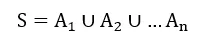
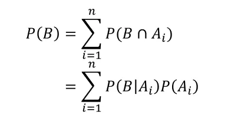
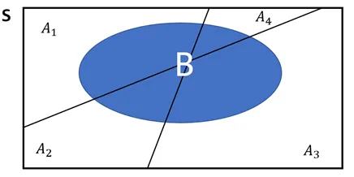
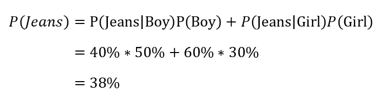
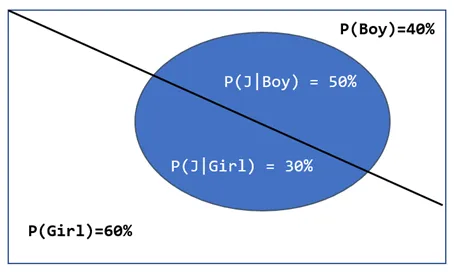
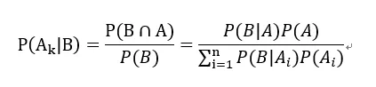
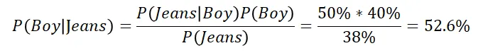
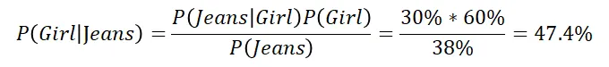

+++
author = "Bingcheng"
title = "貝氏定理 (Bayes’ Theorem)"
date = "2021-02-26"
description = "貝氏定理，一種條件機率的轉換"
tags = [
    "統計學",
    "條件機率"
]
categories = [
    "資料分析"
]
series = ["Themes Guide"]
+++

貝式定理是很重要的統計工具，可以視為條件機率的轉換過程，白話來說 
$P(A|B)$ 可以推導出 $P(B|A)$；$P(B|A)$ 可以推導出 $P(A|B)$，看在現實生活中你知道什麼已知條件機率，就可以推導出相對的條件機率囉！

<!--more-->

貝氏定理也可以幫助我們在基於已知的條件，預測特定事件發生的機率，而透過貝氏定理來進行分類的演算法，則是貝氏分類器，有興趣的讀者可以參考這篇[實作單純貝氏分類器 (Naive Bayes Classifier)，並應用於垃圾訊息分類](/post/naive-bayes-classifier)。

# 全機率法則 (Law of Total Probability)

貝氏定理會牽涉到全機率法則，因此這裡簡單做介紹。

全機率法則是在說明當我們好奇B事件的機率，我們可以找到 **互斥且互補 (mutually exclusive and exhaustive)** 的 $A$ 事件集合[註1]，逐一計算在A集合底下的每個事件發生下，$B$ 的事件同時發生的機率有多少，並且將機率加總在一起，即為 $B$ 事件。

比如我不清楚今晚看到老鼠的機率有多少　(欲預測的事件 $B$)，但是我知道桌上一定會擺放花生、巧克力任一種食物(互斥且互補的 $A$ 事件集合)，則今晚看到老鼠的機率就是『擺放花生且同時出現老鼠的機率』，加上『擺放巧克力且同時出現老鼠的機率』，這就是全機率法則的一個簡單的應用。

**註**

互斥且互補 (mutually exclusive and exhaustive)：涵蓋所有可能發生的事件，且一次只能發生一個事件。例如擲骰子涵蓋投出 1~6 六種可能，且一次不會同時擲出兩個點數，就是典型的互斥且互補。

## 公式

假設一樣本空間 $S$，是由 $A_1, A_2, …A_n$一系列互斥互補的事件組成，樣本空間可表示為

  

對於任何一事件 B，其機率可以表示如下：

  

  

## 舉例

**隨意看到班級的一個人，其穿牛仔褲的機率為何**？全機率法則告訴我們，要找到一個 互斥互補 的事件集合，顯然性別是很適當的事件集合，簡化問題，在不考慮多元性別的情況下，性別集合只有男生或女生。

假設班級是由男生 $40\\%$ 和女生 $60\\%$ 組成，在男生中穿牛仔褲的比例為 $50\\%$ ，表示機率為 $P(Jeans|Boy)=50\\%$；在女生中穿牛仔褲的比例為 $30\\%$，表示機率為 $P(Jeans|Girl)=30\\%$，則根據全機率法則，隨機抽取班級的任一人，其穿牛仔褲(藍色區域)機率為下：

  

  

# 貝氏定理
顯而易見地，『在事件 $A$ 的情況下發生事件 $B$ 的機率』和『在事件 $B$ 的情況下發生事件 $A$ 的機率』不一定相同，比如小狗大概率是可愛的，但是可愛的事物就不見得大概率是小狗，很有可能是小貓、小鳥等。

當我們只知道在『事件 $A$ 的情況下發生事件 $B$ 的機率』，要如何反過來求『在事件 $B$ 的情況下發生事件 $A$ 的機率』？或者以上述例子，當我們知道一個事物是可愛的，試問這個可愛的事物為小狗的機率為何？

貝氏定理是回答這個問題的好方法。

## 公式

假設一樣本空間 $S$，是由 $A_1, A_2, …A_n$一系列互斥互補的事件組成，經過條件機率公式的推導，在任意 $B$ 事件的條件下，$A_k$ 的機率可表示
為

  

## 舉例

假設樣本空間是一個班級，班級是由男生 $40\\%$ 和女生 $60\\%$ 組成，在男生中穿牛仔褲的比例為 $50\\%$，表示為 $P(Jeans|Boy)=50\\%$，在女生中穿牛仔褲的比例為 $30\\%$，表示為 $P(Jeans|Girl)=60\\%$。這是上述在介紹全機率法則時提到例子。現在讓我們延伸出兩個新問題。

**如果看到一個人穿牛仔褲，其為男生的機率是多少？**

  

**如果看到一個人穿牛仔褲，其為女生的機率是多少？**

  

由上述可知，**貝氏定理，其實就是一種條件機率的互換過程**，**在已知『一個男孩穿牛仔褲的機率』，可以反過來求得『穿牛仔褲的人為男孩子的機率』**。以垃圾訊息分類的例子來說明，就是在已知『垃圾訊息中出現好康關鍵詞的機率』，反過來求得『出現好康關鍵詞時，為垃圾訊息的機率』，如此就能基於訊息關鍵詞決定是否要攔截該信封，有興趣的讀者在參考這篇囉~。

有讀者問，為什麼是已知「一個男孩穿牛仔褲的機率」，其實這可以應用在不同情境，我們也可以反過來先已知「穿牛仔褲的人為男孩子的機率」的條件下，求「一個男孩穿牛仔褲的機率」。

重點就是條件機率的互換，$P(A|B)$ 可以推導出 $P(B|A)$；$P(B|A)$ 可以推導出 $P(A|B)$。例如

* 已知「一個男孩穿牛仔褲的機率」 那就可以用貝氏定理推算出「穿牛仔褲的人為男孩子的機率」
* 已知「穿牛仔褲的人為男孩子的機率」 那就可以用貝氏定理推算出「一個男孩穿牛仔褲的機率」。

重點就是條件機率的互換，看在現實生活中你知道什麼已知條件，就可以推導出另一個條件機率囉！

