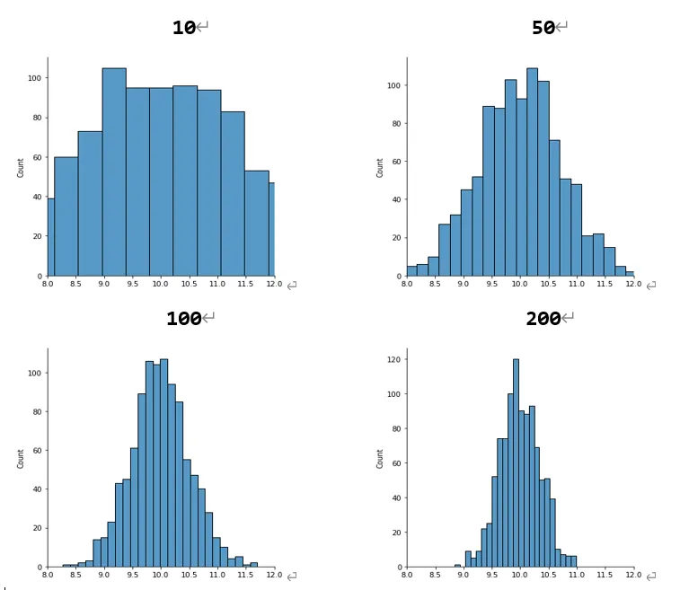
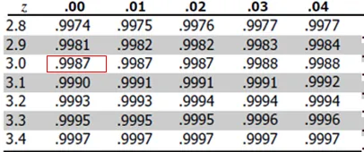

+++
author = "Bingcheng"
title = "中央極限定理 (Central Limit Theorem , CLT)"
date = "2021-02-27"
description = "中央極限定理 (Central Limit Theorem , CLT)"
tags = [
    "統計學",
    "Python"
]
categories = [
    "資料分析"
]
series = ["Themes Guide"]
+++

中央極限定理是指，**從任何母體隨機抽取大量獨立的隨機變數，其平均值會趨近於常態分佈**。
<!--more-->

提到常態分佈，讀者興許就明白為何該定理如此重要了。無論原始母體為何，當樣本數夠大，樣本平均數就會趨於常態分佈，便可以運用統計手法來驗證宣稱的樣本平均值是否合理，進一步幫助我們完成假設檢定的一系列流程。請參考 [假設檢定基礎觀念](/post/hypothesis-test)。

# 公式

假設母體的平均值為 $μ$，變異數為 $σ²$，從母體抽取隨機變數 $x_1, x_2, x_3..x_n$，這 $n$ 個隨機變數的平均值 ($\bar{X}$) 會服從常態分配。

一般而言，在針對常態分佈的假設檢定，我們都會將原始分數標準化，作法為將x減去母體平均 $μ$，再將兩者的差除以母體標準差 $σ$。以標準差做為單位來衡量原始分數與母體的真實距離，又稱為 z-score。

$$ Z=\frac{(X-\mu)} {\sigma} $$

這裡要注意的是，上述的 z-score 是原始的隨機亂數，但是如今是樣本的平均值 $\bar{X}$ 服從常態分佈，因此我們分別推導 $\bar{X}$ 的期望值與變異數。

**$\bar{X}$ 的期望值**

$$
\begin{aligned}
\mu_{\bar{X}} &= E(\bar{X}) = E\left(\frac{x_1 + x_2 + x_3 + \cdots + x_n}{n} \right) \\
&= \frac{1}{n} \left( E(x_1) + E(x_2) + \cdots + E(x_n) \right) \\
&= \frac{1}{n} (n \mu) \\
&= \mu
\end{aligned}
$$

估計式的期望值等於母體參數，因此是不偏估計 (unbiased estimator)。

**$\bar{X}$ 的變異數**

$$
\begin{align*}
\sigma^2_{\bar{X}} &= Var\left( \frac{x_1 + x_2 + x_3 + \cdots + x_n}{n} \right) \\
&= \frac{1}{n^2} Var(x_1 + x_2 + x_3 + \cdots + x_n) \\
&= \frac{1}{n^2} (n \sigma^2) \\
&= \frac{\sigma^2}{n}
\end{align*}
$$

經過上述推導，明白 $\bar{X}$ 會服從母體平均值為 $μ$、母體標準差為 $σ/\sqrt{n}$ 的常態分佈。因此 z-score 重新表示如下：

$$
Z = \frac{\bar{X} - \mu}{\frac{\sigma}{\sqrt{n}}}
$$

# 模擬

用隨機亂數的樣本平均值檢測分布的情形。

我們先隨意產生 $μ$ 為10、$σ$ 為 5 的高斯隨機變數作為母體，每次抽取10個樣本並計算平均值作為一個觀察值，如此抽取 1000 次，繪製成下方左上角的第一張圖，接著讓我們來試試看使用不同樣本大小，用以下程式依序使用 `[10,50,100,200]` 作為抽取的樣本大小並計算樣本平均值，如此各自抽取 1000次，最後使用 seanborn 的 displot 繪製圖形。

可以發現隨著樣本大小的增加，樣本平均越趨近於常態分布，並且變異數會越小，這是源於上述推導樣本平均數的標準差為 $σ/\sqrt{n}$。

```Python
import random
import matplotlib.pyplot as plt
import seaborn as sns

gaussian_population = [random.gauss(10, 5) for _ in range(20000)]

sample_size_list = [10,50,100,200]

result = {}
for sample_size in sample_size_list:
    l = []
    for _ in range(1000):
        x_bar = sum(random.sample(gaussian_population,sample_size))/sample_size
        l.append(x_bar)
    result[sample_size] = l

for i,sample_size in enumerate(result):
    plt.figure()
    p = sns.displot(result[sample_size])
    p.set(xlim=(8, 12))
```

**在不同樣本大小，其樣本平均值的機率分佈**



# 舉例

用中央極限定理的觀念來進行假設檢定。

假設乘客等候公車時間平均為 8.5 分鐘，標準差為 3.5 分鐘。假設今天隨機抽取 49 位乘客，平均候車的時間少於10鐘內的機率為何？

從題意上我們不知道真實乘客等候公車的時間是來自於何者分佈，但是由於今天抽取的樣本數目夠大(一般而言，樣本數量需要>=30)，因此我們知道樣本的平均值會趨近常態分佈，將樣本平均值標準化，求得 z-score 如下：

$$
Z = \frac{\bar{X} - \mu}{\frac{\sigma}{\sqrt{n}}} =  \frac{10-8.5}{\frac{3.5}{\sqrt{49}}} = {\frac{1.5}{0.5}} = 3
$$

z-score 為3，意味 10 分鐘是樣本平均距離母體有三倍標準差，透過查表就可以得知 z-score 小於 3 倍標準差的面積為 0.9987，表示平均候車的時間少於10鐘內的機率為 0.9987。



# 小結

中央極限定理是指，**從任何母體隨機抽取大量獨立的隨機變數，其平均值會趨近於常態分佈**，當樣本數目夠大，越趨近於常態分佈，且變異數會越小。