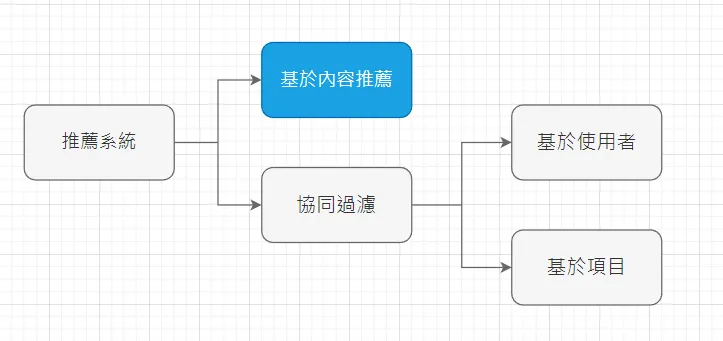
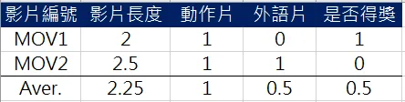
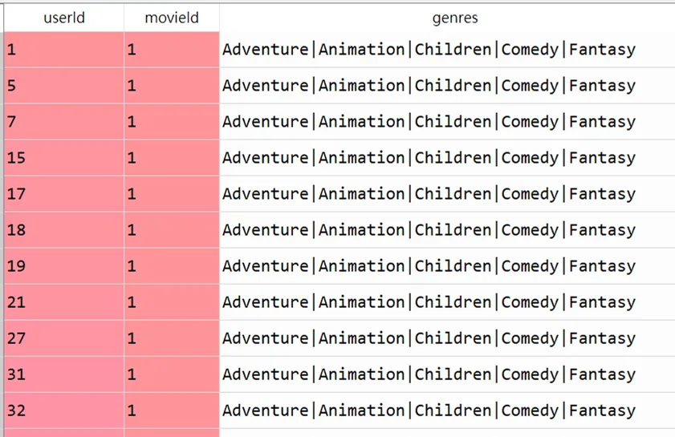
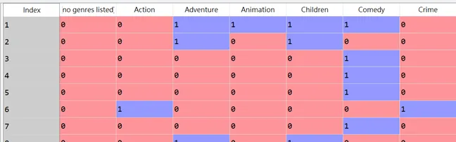
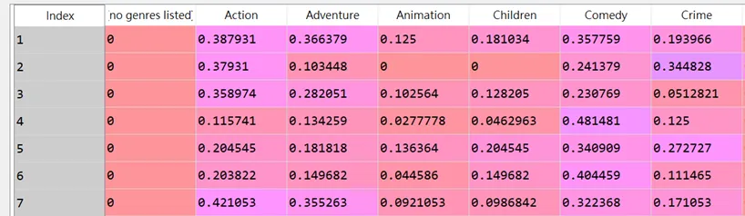
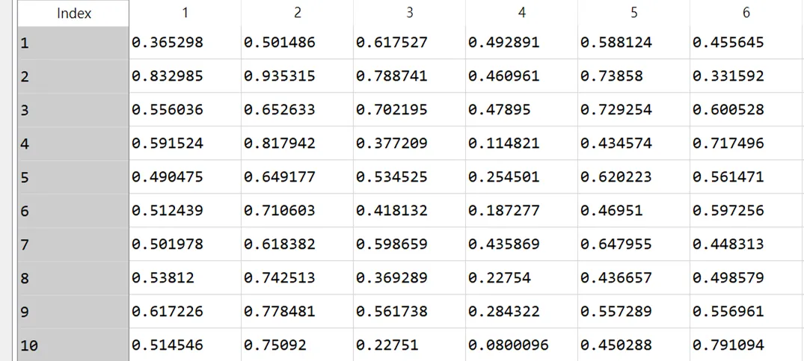

+++
author = "Bingcheng"
title = "以Python打造簡單實用的電影推薦系統 (Content-based Recommendation)"
date = "2020-02-09"
description = "實現用戶找影片、影片找用戶的非典型推薦系統"
tags = [
    "推薦系統",
    "基於內容推薦"
]
categories = [
    "資料分析"
]
series = ["Themes Guide"]
+++

筆者在大四時擔任資策會數創所工讀生，其中一項任務是負責實作影音平台的推薦系統，概念通俗易懂，沒有使用複雜的演算法或是高深的數學原理，只要有一點距離度量的概念即可(可以參考筆者撰寫的[歐氏距離與餘弦相似度的比較](/post/euclidean-vs-cosine/))，因此本篇分享對象適合對於推薦系統剛入門的朋友

<!--more-->

一般而言，推薦系統可粗分為 **基於內容推薦 (Content-based Recommendation)** 和 **協同過濾 (User-based Collaborative Filtering)**，而這兩種方式又可再細分為幾種算法，我會再找時間寫一篇導讀詳細說明。

今天我要打造的推薦系統是**基於內容推薦的其中一種方式，將用戶和標的物嵌入到同一個向量空間，基於向量相似做推薦**，這種推薦方式的優點是，它不需要兩套算法，即可以同時達到推薦用戶/推薦影片的功能。



# 目的
清晰目的助於我們釐清實作的方向。身為影音業主的各位，想必對於以下兩件事情極為感興趣。**這部影片要推薦給哪位用戶？這個用戶要推薦哪部影片？** 動機產生的疑問句順理成章引導出具體的實踐目標：

* 輸入影片的ID，返回最相似的用戶名單。
* 輸入用戶的ID，返回最相似的影片名單。
  
在業界，列出推薦用戶/影片名單的動作叫做**洗名單**。

# 實作概念
好的，現在目的非常清晰，但首先會遇到的第一個難題是，人跟影片怎麼衡量相似度？很簡單，這裡先記住一個概念，人跟影片存在於同一個向量空間。

一部影片本身會有很多的特徵屬性，例如**影片長度、影片類型、是否得獎等等各種的標籤，而歷史記錄中使用者所觀看過的影片的特徵屬性，就會構成這個使用者的特徵屬性**。以下面作為例子，使用者看過了 MOV1 和 MOV2 兩部影片，我們將這些影片的特徵以數值表示，並且計算平均值來做為使用者的特徵屬性。如此一來使用者跟影片就擁有同樣的特徵屬性 (影片長度、動作片、外語片及是否得獎)，就可以計算兩者之間的相似度了。



# 實作方法
前面介紹完概念，接著進入到實作環節。大抵我們會有**讀取資料、萃取影片特徵、萃取用戶特徵、建構用戶-影片相似度矩陣及獲取推薦名單**等步驟

首先我們會先讀取影片資料集，包括影片的類型及使用者的觀看紀錄，然後我們會進行特徵的萃取，也就是將**影片的特徵屬性轉變成數值形式，而使用者的特徵屬性就是從觀看紀錄中的影片特徵屬性聚合而成**，最後**計算使用者跟影片的相似度**，如此便知道要推薦使用者哪部影片，或是將這部影片推播給哪個使用者。
(提醒資料集和完整程式碼放置文末)。

## 1. 讀取資料

我們使用公開資料集 [MovieLens](https://grouplens.org/datasets/movielens/) 來實作，以 pandas 讀取兩個檔案。movies.csv 留下 movieId、genres 兩個欄位，ratings.csv 留下 userId、 movieId，並以 movieId 作為主鍵將兩個檔案合併，如下圖 dataframe 所示。

```python
movies = pd.read_csv(r"dataset\MovieLens\movies.csv")
movies.drop('title',axis=1,inplace=True)
df = pd.read_csv(r"dataset\MovieLens\ratings.csv")
df.drop(['rating', 'timestamp'],axis=1,inplace=True)
df = pd.merge(df, movies, on='movieId')
```


## 2. 萃取影片特徵
影片只有一個特徵，叫做genres(類型)，一部影片可以擁有多個類型，**將影片類型以離散數字的0與1表示**，**如果本部影片的屬性包含該類型(比如動作、喜劇等)，則在該特徵是1，否則為0**。善用pandas的內建函式，使用 `movies["genres"].str.get_dummies('|')` 就可以將原先以 `|` 分隔的特徵類型，編碼成 0 和 1 的格式了。

```python
#movie vector
dummies = movies["genres"].str.get_dummies('|')
movie_vec = pd.concat([movies, dummies], axis=1)
movie_vec.drop('genres',axis=1,inplace=True)
movie_vec.set_index("movieId",inplace=True)
```



## 3. 萃取用戶特徵
用戶特徵則是觀看紀錄中的影片類型，取平均值表示。假設 user1 有10條觀看紀錄，其中動作類型佔4條，則在動作類型這個特徵為0.4分。這種聚合運算請多加善用`groupby`函式。

```python
#user vector 
dummies = df["genres"].str.get_dummies('|')
user_vec = pd.concat([df, dummies], axis=1)
user_vec.drop(['movieId', 'genres'],axis=1,inplace=True)
user_vec = user_vec.groupby("userId").mean()
```



## 4. 建構用戶-影片相似度矩陣

既然用戶、影片特徵一致，接著便容易許多。常見相似性度量有歐式距離、餘弦相似度等，相關應用場景這裡不多贅述。回歸到最初目的，輸入影片的ID，得到一組影片特徵向量，逐一計算與用戶特徵向量的相似度，列出相似度最高的前幾名即是可能的受眾名單，反之亦然。

**用戶-影片相似度矩陣的用途為何?**

**情境1 — 影片找人**

今日要找出與movie1相似度最高的20個用戶(換言之，即是最喜歡該電影的前20個受眾)，方法是**得到movie1影片特徵向量，逐一計算與用戶特徵向量的相似度，列出相似度最高的前20名**。

**情境2 — 人找影片**

今日要找出與user1相似度最高的20個影片，方法是**得到user1特徵向量，逐一計算與影片特徵向量的相似度，列出相似度最高的前20名**。

很顯然的，無論情境1-影片找人還是情境2-人找影片，**兩個情境真正耗時之處在於逐一計算與用戶跟影片兩者特徵向量的相似度，倘若我事先就構成用戶-影片相似度矩陣，ID檢索時就能直接以sort排列索取出最相似的名單，以降低頻繁計算造成伺服器負擔**。

我們使用 sklearn 的函示 `cosine_similarity` 來幫助我們計算cosine相似度。

```python
#user movie similar matrix
user_movie_similarity_matrix = cosine_similarity(user_vec.values,movie_vec.values)
user_movie_similarity_matrix = pd.DataFrame(user_movie_similarity_matrix, index=user_vec.index,columns=movie_vec.index)
```
用戶-影片相似度矩陣如下圖，index為userId；columns name是movieId，因此 `user_movie_matrix[i,j]` 表示user i 和 movie j 的相似度。



## 5. 獲取推薦名單
承接上步構成用戶-影片相似度矩陣，任一用戶及任一影片的相似度已然悉知，以ID檢索時直接以sort排列並索取最相似的名單即可。

我們現在終於可以達到最初目的了。

**輸入影片的ID，返回最相似的用戶名單**。使用`get_the_most_similar_movies` 函式中`user_movie_matrix.loc[user_id,:]` 儲存的就是該user與所有影片的相似度，使用 `np.argsort` 函式獲取排序索引，用 `np.argsort` 預設是遞增排序，因此我們要記得先使用 `[::-1]` 翻轉索引陣列，才會是由相似度高到低排序歐！’

**輸入用戶的ID，返回最相似的影片名單**。使用`get_the_most_similar_users` 函式，其中`user_movie_matrix.loc[:,movie_id]` 儲存的就是該movie與所有用戶的相似度，一樣使用 `np.argsort` 函式獲取排列索引並進行反轉，得到由相似度高到低的影片清單。

```python
def get_the_most_similar_movies(user_id, user_movie_matrix,num):
    """Find the top-n movies most similar to the user"""
    user_vec = user_movie_matrix.loc[user_id].values 
    sorted_index = np.argsort(user_vec)[::-1][:num]
    return list(user_movie_matrix.columns[sorted_index])
 
def get_the_most_similar_users(movie_id, user_movie_matrix,num):
    """Find the top-n users most similar to the movie"""
    movie_vec = user_movie_matrix.loc[:,movie_id].values 
    sorted_index = np.argsort(movie_vec)[::-1][:num]
    return list(user_movie_matrix.index[sorted_index])  
```

# 小結
本篇實作經過極度簡化，在實務上的處理必然複雜許多，影片特徵不只類型，還有導演、演員、語言、得獎紀錄等，但是核心概念相差無幾，**人的特徵就是觀看紀錄的影片特徵取平均的結果，在相同維度下人跟影片便容易計算相似度，進而洗出欲推薦的影片/用戶名單**，往後會逐一介紹其他常見的推薦系統。

**資料集/完整代碼：**
[Github Code](https://github.com/QiuBingCheng/MediumArticle/tree/main/Recommendation%20System?source=post_page-----b372769939af---------------------------------------)
