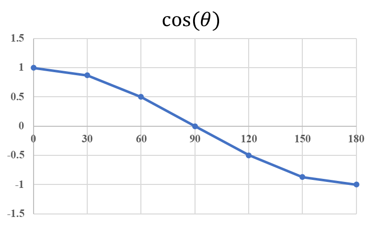

+++
author = "Bingcheng"
title = "歐氏距離與餘弦相似度的比較"
date = "2020-02-09"
description = "Sample article showcasing basic Markdown syntax and formatting for HTML elements."
tags = [
    "相似度"
]
categories = [
    "資料分析"
]
series = ["Themes Guide"]
+++

在數據挖掘中，相似性度量是個基礎且重要的問題，我們經常想得知兩個個體之間存在的差異大小，藉由一個合適的度量方式，幫助我們執行分群、分類等任務。在眾多度量方式，最耳熟能詳的莫過於**歐式距離**、**餘弦相似度**，這篇文章將帶領讀者初探兩者的原理及應用場景。
<!--more-->

# 歐式距離

歐式距離或稱歐幾里得距離，一種簡單直觀且有效的距離度量方式。回想初中計算座標 $(x1,y1)$、$(x2,y2)$ 兩點之間的距離，便是 $(x1-x2)^2+(y1-y2)^2$ 再將其開根號即得出結果。以數學表示，假設歐式空間中，存在點 $x =(x_1,…,x_n)$ 和點 $y =(y1,…,y_n)$，以下的公式用以求出兩者之間的歐式距離。

$$ d(x,y) = \sqrt{(x_1-y_1)^2+(x_2-y_2)^2+,...(x_n+y_n)^2} $$

不難發現，歐式距離就是畢氏定理的一個推廣。

用 python 代碼實現歐式距離度量只消一行程式碼。假設vec1、vec2表示等長向量，則兩者之間的歐式距離如下 。

```
np.sqrt(sum(pow(vec1-vec2,2)))
```

# 餘弦相似度

餘弦相似度，顧名思義，藉由測量兩個向量夾角的餘弦值，來度量它們之間的相似性。
向量之間夾角越小，表示兩個向量的方向越接近，方向一致夾角度數θ為0，餘弦值為1；反之向量之間夾角θ越大，表示兩個向量的方向差異越大，當方向相反時餘弦值為-1。由下圖可以明顯體會出來夾角大小θ與餘弦值的關係。



餘弦相似度越大，表示個體之間越接近，與歐式距離度量概念相反，歐式距離是值越小，表示距離越近，個體越相似。此外，餘弦相似度與歐式距離最大不同之處在於，餘弦相似度的衡量不會受到向量大小的影響，因為在計算上會除以本身向量大小，類似標準化的動作，公式可由基本的三角函數運算推導成內積表達形式，數學推導如下。


公式推導結果是**兩個向量的內積再除以兩個向量大小相乘**，這也是為何餘弦不受向量大小的緣故！

# 應用比較分析
歐氏距離體現數值上的絕對差異，而餘弦距離體現方向上的相對差異。

## 情境1 一 客戶分群
假設超商以顧客消費能力進行分群，指標是消費頻率及消費金額，區間一律落在[1,10]。客戶A的消費能力向量為(0,1)，客戶B為(1,0)，此時向量間的夾角呈現90度，餘弦相似度為0，因此餘弦距離極大，表示客戶A、B兩者完全不相似，這顯然不合理，反觀以歐氏距離度量只有1.41，表示客戶相似程度極高，顯然合理許多，因為兩個客戶的消費頻率、消費金額都很低，歐式距離考慮的正是數值上絕對的差異。

## 情境2 - 推薦系統
假設針對用戶基於對影視的偏好分群，衡量指標是用戶對影視的評分，分數區間[1,10]，由於用戶評分標準不一致，不同用戶評分方式差異頗大，有人評分嚴格，認為給到5分便是極佳；有人則認為5分是最差勁的電影，至少給到7、8分。假設用戶A對兩個影視評分向量為(2,5)，用戶B的評分向量為(4,10)，以歐式距離衡量兩者用戶極為不相似，但以餘弦相似度衡量則可以視為同一群，顯然以後者度量比較恰當，因為餘弦相似度對於絕對值的差異不敏感，我們想知道的是用戶對於影視的相對偏好，因此只要偏好影視種類的比例相仿，餘弦相似度就會比較高，易於分為同一族群。

欲知相似性度量是如何應用在推薦系統上，請參考這篇以Python實現推薦系統的協同過濾算法(User-based Collaborative Filtering)。

# 參考資料
* https://zh.wikipedia.org/wiki/%E4%BD%99%E5%BC%A6%E7%9B%B8%E4%BC%BC%E6%80%A7
* https://zh.wikipedia.org/wiki/%E6%AC%A7%E5%87%A0%E9%87%8C%E5%BE%97%E8%B7%9D%E7%A6%BB
* https://www.zhihu.com/question/19640394
* https://www.twblogs.net/a5b837d322b71776c51e34aa4