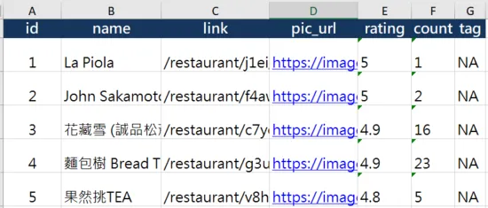
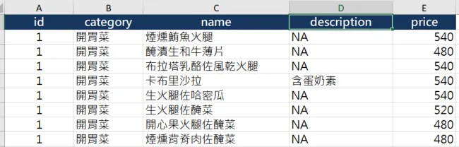
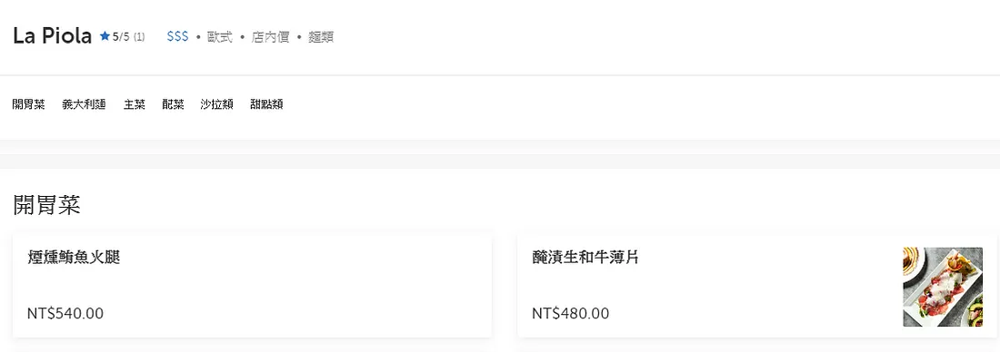
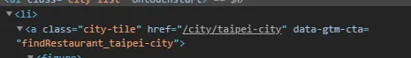
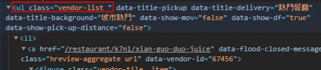
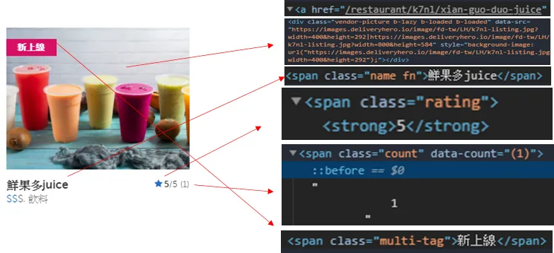
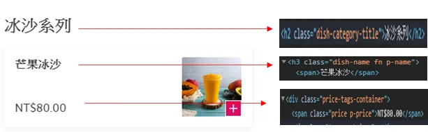

+++
author = "Bingcheng"
title = "最香的爬蟲教學文 - foodpanda"
date = "2020-07-08"
description = "Sample article showcasing basic Markdown syntax and formatting for HTML elements."
tags = [
    "網路爬蟲"
]
categories = [
    "資料分析"
]
series = ["Themes Guide"]
+++

本文將介紹如何使用 Python 實作爬取 foodpanda 網站的網路爬蟲，並將爬取結果儲存到 excel 中。

<!--more-->

# 前言

在資料科學的領域，資料是一切的基石，而在網際網路蘊藏的大量資料便如同寶藏，等著我們去一一挖掘。挖掘必須有方法，網路爬蟲便是一項實用的技能，透過程式自動擷取、解析網頁上的資訊，並且整理成結構化的格式 (例如上班族離不開的excel等)，如此一來方便做後續的數據分析。

網路爬蟲的原理我會另外寫一篇詳談，篇幅有限，這裡暫且不表。

網路爬蟲應用廣泛，基本上網路上公開的任何資訊都可以爬取，筆者曾經爬取的網站有：

* google news
* Facebook
* Rotten tomatoes
* IMDb
* Wikipedia

今天我要介紹我爬取的網站中，無疑是最香的那一個，復胖達。

# 成果

**餐廳的資訊**

**餐廳的菜單**

先談這次爬蟲會得到什麼資訊，爬蟲結果會產生一個excel檔案，含有兩張表格，第一張表格是餐廳的整體資訊，包含名稱、餐廳頁面的網址、照片網址、整體評分、評分人數、標籤；第二張表格是餐廳的菜單，包含種類、菜色名稱、備註、價格，其中兩張表格的ID是作為餐廳的識別碼，以方便未來必要時可以合併在一起處理。

# 爬取頁面介紹
這次會依序擷取三個頁面的資訊來達到這次爬蟲目的，分別是：

**1. 復胖達主頁**

**2. 該城市熱門餐廳頁面**

**3. 特定餐廳頁面**

全部程式碼拆成三個函示，希望未來能更彈性地運用。

# Python代碼實現

## 復胖達主頁-獲取所有城市對應的連結

首先，在復胖達主頁會看到所有城市列表，點擊進去後才會看到該城市的熱門餐廳。第一步我們先按滑鼠右鍵，點選檢查 (inspect)。

這時應該會發現到，城市的推薦餐廳頁面連結是包含在`<li>` 的子元素 `<a>` 的 ` href` 屬性，而 `<a>` 的 `class` 是 `"class-title"`，經過檢查是獨一無二的，因此直接用 `find_all("a",class_="city-tile")`便可以獲取所有連結，因為連結是相對路徑，我用列表推導式在每個連結加上*https://www.foodpanda.com.tw*，以台北而言，完整網址會成為*https://www.foodpanda.com.tw/city/taipei-city*。

## 城市熱門餐廳頁面-獲取該城市熱門餐廳資訊

上述我們已經得到城市的推薦餐廳網址，筆者以台北為例(讀者可以隨意替換其他城市，無妨)，按右鍵檢查頁面元素，熱門餐廳是在 `class="vendor-list"` 的 `<ul>` 子元素 `<li>`。

我們用 `soup.find("ul",class_="vendor-list").children` 進行跌代，每一次跌代都會解析如下圖範圍的元素，而餐廳資訊對應的HTML元素如下：

這個函式得到的結果，便是會成為我們excel的第一張表格，餐廳的整體資訊。

## 特定餐廳頁面-獲取餐廳菜單
要能到達特定餐廳頁面，就是透過上一步驟擷取的各熱門餐廳網址，這裡回傳的menu是列表，裡面的元素是字典型態，包含菜單名稱、敘述、價格等資料。如果上面的網頁元素讀者都可以順利解析，那這一頁應該也不難，就留給讀者慢慢摸索了。

# 小結
今天主要跟大家分享如何爬取 foodpanda 外送平台的網站資料，只要仔細檢查欲爬取的資料其對應的 html 元素，膽大心細地進行解析萃取，相信都不會是太困難的事情，未來我會嘗試探索爬取的資料，看看有沒有什麼有趣的發現。

**資料集/完整代碼：**
[Github Code](https://github.com/QiuBingCheng/MediumArticle/blob/main/Crawler/foodpanda_crawler.py)
