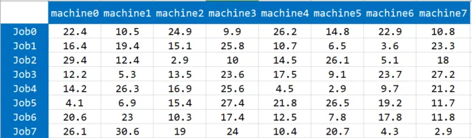
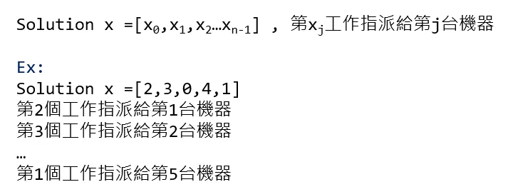
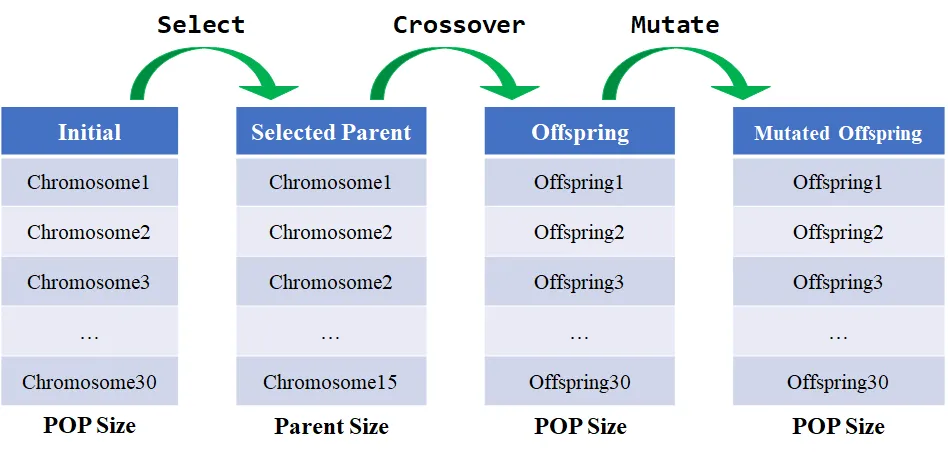
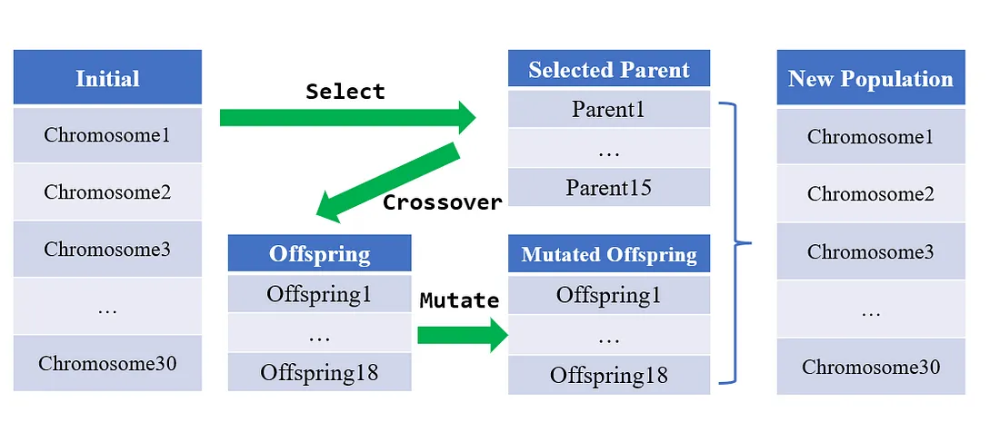
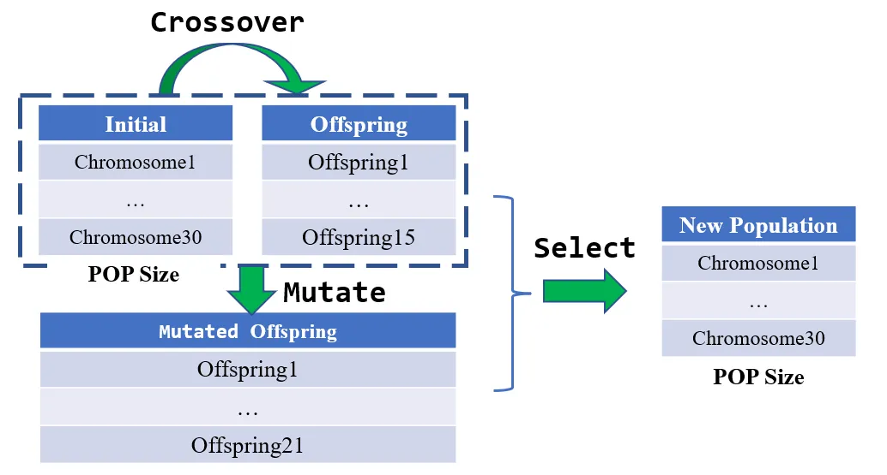
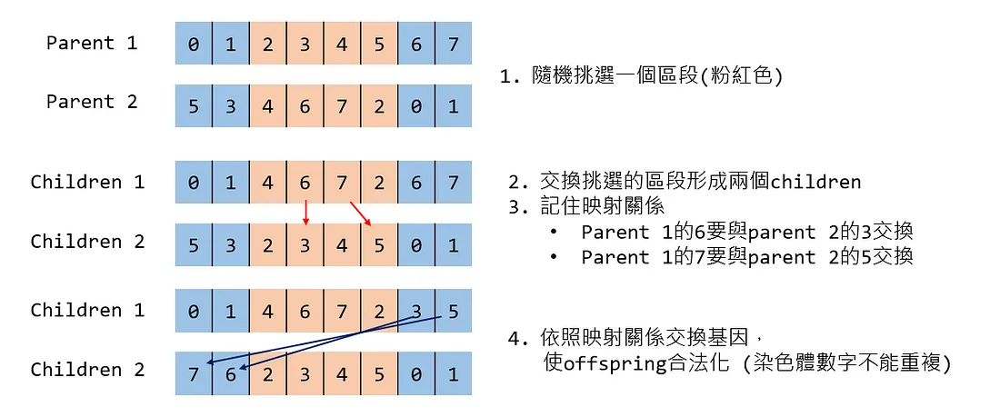
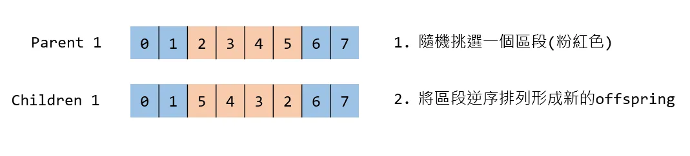
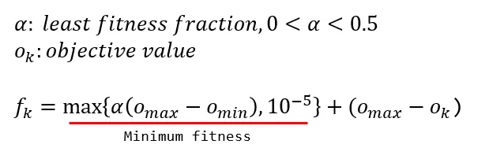
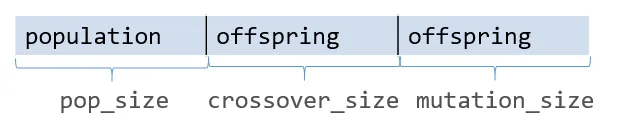
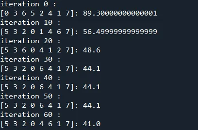

+++
author = "Bingcheng"
title = "實作基因演算法 (Genetic Algorithm , GA) 並解決工作指派問題 (Job Assignment Problem, JAP)"
date = "2021-01-30"
description = "以 Python 實作基因演算法"
tags = [
    "啟發式演算法",
    "基因演算法",
    "Python"
]
categories = [
    "資料分析"
]
series = ["Themes Guide"]
+++


這篇文章會介紹啟發式演算法中的基因演算法，分享如何以 Python 進行實作，並解決工作指派問題。

<!--more-->

**提醒**
本文第一次出現的專有詞彙會以中英雙語同時表述，後文則是盡量以英文為主。會傾向用英文表述是因為中文翻譯大相逕庭，況且中文不是原文，偶爾會出現詞不達意的情形。
對於 Python 基法語法還不熟悉的可以先參考這篇 Python 基本教學，裡面會簡單介紹一些我常使用到的 Python 語法。
以下正文開始~

# 工作指派問題 (Job Assignment Problem, JAP)
工作指派問題是一種最佳化問題中的**組合優化問題**。工作指派問題經過大幅簡化描述如下，假設有N件任務要處理，手邊有N個代理人(agent)可以指派，每個代理人必須處理任意一件任務，每個任務也必須被任意一個代理人處理，試問如何指派使得總成本最低。

以這次測試的資料集為例。假設手中有 8 台機器、 8 件工作，每台機器皆可以處理任何工作，考量機型特性等因素，不同機台擅長不同的加工模式，因此造成機器處理不同工作的時間有所差異，**要如何分配工作到不同的機台，使得機器加工的總時間最少，即為本次問題的目標。**

<p style="text-align: center;">
  
</p>


在程式設計上仍然以物件導向精神封裝成類別，這時可以看得出來 `compute_objective_value`是共同函數，下次可以試著寫一個 Problem 的父類別，分別由TSP、JAP等類別繼承為子類別，再覆寫這個函式~。

```Python =
class JAPProblem:
    def __init__(self,job_machine):
        self.job_machine = job_machine
        self.number_of_jobs = len(job_machine)
    def compute_objective_value(self,jobs):
        total_time = 0
        for i,job in enumerate(jobs):
            total_time += self.job_machine[job][i]
        return total_time
```

# 基因演算法 (Genetic Algorithm, GA)
基因演算法是一種受到自然選擇 (natural selection) 機制所啟發的演算法。自然選擇解釋生物如何適應環境，基於生物中個體的某種優勢或劣勢，導致生存能力存在差異，進而影響繁殖能力，使得特徵逐漸被保存或者淘汰。基因演算法便是在模擬自然選擇的機制，將解比擬成一條染色體 (chromosome)，模仿生物學中交配 (crossover)、突變 (mutation) 等現象，並根據適應度 (fitness) 的高低，決定染色體的去留，達到去蕪存菁的效果。

通俗地說，**基因演算法就是在特定大小的解集合中，透過增添亂數、兩兩排列組合等操作來改變/產生新的解，並從中挑選較好的解保留到下個世代中，以確保解變異的方向能夠逐漸收斂**。

## 染色體的編碼方式 (Representation and Encoding)

上述提到基因演算法是將解比擬成一條染色體，常見的編碼方式如下：

### 二進位 (Binary Representation and Encoding)
二進位是最常見的編碼方式，每條染色體都是由0、1組成。整數、實數的最佳化問題也可以轉換成二進位來處理。

### 整數 (Integer Representation and Encoding)
染色體是由一連串的整數表達，適合用來表示組合優化問題的解，例如旅行推銷員問題(TSP)，染色體就是由城市的id組成，或是**本文要解決的工作指派問題就是使用整數編碼形式，染色體就是每台機器要處理的工作id組成**，以下舉例說明。

<p style="text-align: center;">
  
</p>


### 實數 (Real Representation and Encoding)

直接用實數表達染色體的基因，每個變數應該要有上界及下界，常用來表達連續優化問題的解。可以參考[實作粒子群演算法](/post/particle-swarm-optimizaiton)一文。

在[蟻群最佳化演算法的實作](/post/ant-colony-optimization) 一文中有提到，**蟻群最佳化演算法擅長處理如旅行推銷員問題等組合優化問題**，對於連續優化問題比較力不從心。相形之下，基因演算法能夠勝任的地方便十分廣泛，連續優化問題、組合優化問題都有學者研究出相對應的改良版本，具體運用在多目標優化、設施規劃、排程、存貨控制，還有本次欲解決的工作指派問題等，因此在眾多啟發式演算法中，基因演算法時常是處理最佳化問題的第一選擇。

## 基因演算法流程

基因演算法有許多版本，筆者會先簡單介紹最經典的原始版本，再來介紹本文採納的演算法版本流程。

### 經典基因演算法流程

<p style="text-align: center;">
  
</p>


經典的基因演算法流程如圖所示，首先根據設定的母體 (population) 大小初始化，並以輪盤法 (roulette wheel selection) 隨機挑選染色體成為父母 (parent)，適應度 (fitness) 越高的染色體被挑選的機率越大，同一染色體可能被挑選兩次 (如Chromosome2) ，因此字面上是挑選，實際行為更像選擇並複製染色體。parent會隨機兩兩交配 (crossover) 產生後代 (offspring)，offspring再進行突變 (mutation)，mutate後的offspring成為下一個代次新的 population，如此反覆進行，直到達到中止條件。

### 菁英挑選策略演算法

<p style="text-align: center;">
  
</p>

還有一種非常熱門的版本，就是使用到**菁英挑選策略 (Elitism Selection)**，最初從 population 中根據適應值大小挑選染色體成為父母 (parent)，parent 會隨機兩兩交配 (crossover) 產生後代(offspring)，offspring 再進行突變 (mutation)，此時**挑選中的parent 會與 mutate 後的 offspring 成為下一個代次新的population**，因此菁英挑選策略最大優點是可以盡量維持住優秀染色體，不進行任何的突變，但也容易陷入局部最佳解~。

在演算法中的 parent selection、crossover、mutation等流程都有許多的版本可以嘗試，詳請可以參考 `Pygad`，這個簡單易用的GA套件，已經實作許多的不同的方法！

### 本文基因演算法流程

本文要實作的又是另一版本，用意在擴大解的空間，以隨機方式從原始的population 挑選 parent 進行 crossover 產生 offspring，並且讓原始的 population 和 offspring 擁有相同的機率進行 mutation 產生新的 offspring，最後在從全部染色體 (原始的population+offspring+Mutated offspring) 中以輪盤法挑選染色體成為下個代次的 population，如下圖所示。

<p style="text-align: center;">
  
</p>


本文實作的演算法大致流程如下：

1. **初始化 (initiate)**。根據 population 大小進行 population初始化。
2. **交配 (crossover)**。從 population 隨機抽取幾對染色體作為parent進行crossover產生新的offspring。
3. **突變 (mutation)**。從 population 隨機抽取幾條染色體進行突變產生新的offspring。
4. **計算適應度 (fitness)**。計算所有染色體 (population 加上新的offspring)的fitness。
5. **更新最佳解**。倘若此代次最佳解的 fitness 勝過歷史最佳解(so far the best)，則更新歷史最佳解。
6. **挑選 (selection)**。根據所有染色體的 fitness以輪盤法進行挑選，成為下個代次的 population。

相信讀者此時對演算法流程有大致的認識，接著讓我們談談細節的部份。

### 交配 (crossover)

同時擷取兩個染色體的基因，重新排列組合成新的染色體。不同的染色體編碼形式有不同的 crossover 方法。本文採納的染色體是整數編碼方式，採取的是D. Goldberg and R. Lingle等人提出的 **Partially matched crossover(PMX)**。 PMX 擁有比大多數的 crossover 方法還要優異的表現，致使它成為使用頻率最高的方法。

PMX 的圖解流程在下方，流程大抵就是一對 parent 交換特定區段的基因成為 offspring。在某些情況，整數編碼形式的解是不允許數字重複(例如本文欲解決的工作指派問題，一個工作不能同時給兩個以上的機器處理)，因此要記住交換時的映射關係，如果圖解流程的第3點所示。至於為什麼數字2、4沒有在映射關係內，因為這兩個數字同時存在parent的交換區段(粉紅色)中，這表示在非交換區段(淺藍色)中不會再出現數字2、4，因此自然也不會有映射關係。

**注意**

這裡的parent 1、parent 2 分別指父母的意思，並非有兩對parent。

<p style="text-align: center;">
  
</p>

在此羅列其他常見的 crossover 方式 (基於整數編碼) 供讀者參閱。

* Order crossover (OX)
* Position-based Crossover
* Order-based Crossover
* Cycle Crossover(CX)

### 突變 (mutation)

改變原本的染色體基因，增加染色體的多樣性，用意在擴大搜尋解的空間。以二進位編碼為例，就是將某些基因從0變成1，或是從1突變成0。本次採用的突變方式為 **Inversion mutation**，適用於染色體為二進位或整數編碼形式，是將染色體特定區間的基因逆序排列。例如在區間2-5逆序排列染色體 `[0,1,2,3,4,5,6,7]` 的結果則是 `[0,1,5,4,3,2,6,7]` (索引值從0開始)。

<p style="text-align: center;">
  
</p>

在此羅列其他常見的 mutation 方式供讀者參閱：

* Displacement mutation (DM)
* Inversion mutation operator (SIM)
* Scramble mutation (SM)
  
### 適應度 (fitness)

評估染色體的生存能力，也就是評估這個解的優劣，用來作為判斷染色體是否能成為下個代次的 population 的重要依據。公式如下：

<p style="text-align: center;">
  
</p>

### 挑選 (selection)

挑選策略分為 Deterministic 和 Stochastic 兩種，以下分別闡述

* Deterministic。顧名思義就是確定型的選法，完全依照適應度高低進行選取。
* Stochastic。隨機型的選法。依照適應度的高低有不同的機率被選取，一種著名的方法為輪盤法 (roulette wheel selection)，讀者可以參閱 [實作蟻群最佳化演算法](/post/ant-colony-optimization) 一文。

# Python 程式碼實現

**認識變數**

首先，先來認識演算法中重要的幾個變數。

* `pop_size`： population 的數量。
* `chromosomes`：所有染色體。數量為 population size 加上offspring size。
* `selected_chromosomes`：表示在 selection 階段被挑選作為下個代次的 population 的染色體。事實上這只是在計算上的一個暫時變數，在存取 population 時會以 `chromosomes[:pop_size]` 存取population
* `best_chromosome`：截止目前fitness最高的染色體。
* `number_of_genes`：一條染色體的基因數量。也就是這個解的變數個數，以這次的工作指派問題為例就是指機台數量。
* `fitness`：染色體適應度。計算公式如上節所示。
* `objective_values`：目標值。機台加工總時間。
* `indexs`：染色體的索引。在 crossover、mutation 階段，是以隨機方式從 population 抽取作為 parent，因此藉由 shuffle 該變數得到隨機抽取的效果。

## 初始化(initiate)

`chromosomes` 初始化時要注意，值必須在 `[0,number_of_genes-1]` 區間，且絕對不可重複，再次強調，一個工作只能被一台機器處理。為了增加多樣性，會以 `np.random.shuffle(self.chromosomes[i])` 打亂原始順序。

```Python = 
def initialize(self):
    self.selected_chromosomes = np.zeros((self.pop_size,self.number_of_genes))
    self.indexs = np.arange(self.total_size)
    self.chromosomes = np.zeros((self.total_size,self.number_of_genes),dtype=int)
    for i in range(self.pop_size):
        for j in range(self.number_of_genes):  
            self.chromosomes[i][j] = j
        np.random.shuffle(self.chromosomes[i])
    
    for i in range(self.pop_size,self.total_size):
        for j in range(self.number_of_genes):
            self.chromosomes[i][j] = -1
            
    self.fitness = np.zeros(self.total_size) 
    self.objective_values = np.zeros(self.total_size)
    self.best_chromosome = np.zeros(self.number_of_genes,dtype=int)
    self.best_fitness = 0
```

## 交配 (crossover)

首先使用 `self.shuffle_index(self.pop_size)` 將 population 長度的索引重新隨機排序。每次 crossover 都會產生兩個 children，因此第一對 parent 產生的 offspring，位置會是 `pop_size`、`pop_size+1`，第二對 parent 產生的 offspring，位置會是 `pop_size+2`、`pop_size+3`，以此類推。因此這裡也可以注意到一點，`crossver_size` 一定是偶數，因為每次 crossver 都會產生兩個children。

<p style="text-align: center;">
  
</p>

`partial_mapped_crossover` 流程在上面章節有介紹，用程式實現其實有難度也不好解釋，因此這裡不具體講解實現過程，讀者可以參閱程式碼揣摩，不懂在寫信詢問。

```Python
def perform_crossover_operation(self):
    self.shuffle_index(self.pop_size)
    
    child1_index = self.pop_size
    child2_index = self.pop_size+1
    count_of_crossover = int(self.crossover_size/2)
    for i in range(count_of_crossover):
        parent1_index = self.indexs[i]
        parent2_index  = self.indexs[i+1]
        
        if(self.crossover_type == CrossoverType.PartialMappedCrossover):
            self.partial_mapped_crossover(parent1_index,parent2_index,child1_index,child2_index)
            self.objective_values[child1_index] = self.compute_objective_value(self.chromosomes[child1_index])
            self.objective_values[child2_index] = self.compute_objective_value(self.chromosomes[child2_index])
        
        child1_index +=2
        child2_index +=2
```

## 突變 (mutation)

這裡一樣先用 `self.shuffle_index(self.pop_size)` 將 population 長度的索引重新隨機排序。第一對 parent 產生的 offspring，位置會是 `pop_size+crossover_size`、`pop_size+crossover_size+1`，第二對 parent 產生的 offspring，位置則是`pop_size+crossover_size+2`、`pop_size+crossover_size+3`，以此類推。至於 mutation 採取的是 Inversion 方法，將染色體特定區間的基因逆序排列成為新的 offspring，具體請看 `inversion_mutation`。

```Python =
def perform_mutation_operation(self):
    self.shuffle_index(self.pop_size+self.crossover_size)
    child1_index = self.pop_size+self.crossover_size
    for i in range(self.mutation_size):
        if(self.mutation_type==MutationType.Inversion):
            parent1_index = self.indexs[i]
            self.inversion_mutation(parent1_index,child1_index)
            self.objective_values[child1_index] = self.compute_objective_value(self.chromosomes[child1_index])
            child1_index += 1
```

## 計算適應度 (fitness)

首先計算 `objective_values`，由於 crossover 和 mutation 產生offspring 同時，也一併計算 `objective_value`，因此這裡只要計算population 的即可。然後再計算所有染色體的 fitness。

```Python
def evaluate_fitness(self):
    for i,chromosome in enumerate(self.chromosomes[:self.pop_size]):
        self.objective_values[i] = self.compute_objective_value(chromosome)
        
    min_obj_val = np.min(self.objective_values)
    max_obj_val = np.max(self.objective_values)
    range_obj_val = max_obj_val-min_obj_val
    
    for i,obj in enumerate(self.objective_values):
        self.fitness[i] = max(self.least_fitness_factor*range_obj_val,pow(10,-5))+\
            (max_obj_val-obj)
```

## 更新最佳解

取得本次 iteration 最佳解，如果有大於 `best_fitnes` 則取代之

```Python =
def update_best_solution(self):
    best_index = np.argmax(self.fitness)
    if(self.best_fitness<self.fitness[best_index]):
        self.best_fitness = self.fitness[best_index]
        for i,gene in enumerate(self.chromosomes[best_index]):
            self.best_chromosome[i] = gene
```

## 挑選 (selection)

從 population 和 offspring 中挑選下一代的 population。這裡分為Deterministic 和 Stochastic 兩種。Deterministic 就是直接 sort排列，再取前面最高的幾條染色體成為新一代的 population，Stochastic 就是以輪盤法進行選取。

`selected_chromosomes` 在此派上用場，因為使用輪盤法是針對所有染色體反覆進行隨機抽取，因此便不能直接用 `chromosomes` 直接賦值，先賦值到 `selected_chromosomes`，最後在轉移至 `chromosomes` 變數。

```Python
def perform_selection(self):
    if self.selection_type == SelectionType.Deterministic:
        index = np.argsort(self.fitness)[::-1]
    
    elif self.selection_type == SelectionType.Stochastic:
        index = [self.do_roulette_wheel_selection(self.fitness) for i in range(self.pop_size)]
    
    else:
        index = self.shuffle_index(self.total_size)
    
    for i in range(self.pop_size):
        for j in range(self.number_of_genes):
            self.selected_chromosomes[i][j] =  self.chromosomes[index[i]][j]
    
    for i in range(self.pop_size):
        for j in range(self.number_of_genes):
            self.chromosomes[i][j] = self.selected_chromosomes[i][j]
```

## 執行結果

執行結果因模型參數而不同，可以調整的模型參數有 population size、selection type、crossover type 、crossover rate、 mutation type、 mutation rate 等，每次參數的調整都會影響模型的表現，需要透過試誤法來得知最合適的參數。

<p style="text-align: center;">
  
</p>

# 總結
基因演算法是一種受到自然選擇 (natural selection) 機制所啟發的演算法，透過交配 (crossover)、突變 (mutation) 等操作，根據適應度來挑選適合生存的個體，如此迭代一步一步逼近最佳解。雖然在數學上難以證明該種演算法尋解的能力，但在實務上卻是非常強大的工具，在諸多啟發式演算法中表現十分出色。今天為讀者介紹基因演算法，並且用Python進行實作，希望各位讀者能有所獲益~，文中有任何問題都可以留言告知我，謝囉。

**資料集/完整代碼：**
[Github Code](https://github.com/QiuBingCheng/MediumArticle/blob/main/HeuristicAlgorithms/genetic_algorithm.py)