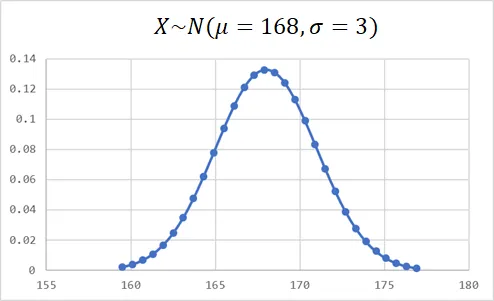

+++
author = "Bingcheng"
title = "假設檢定基礎觀念"
date = "2020-08-18"
description = "用一個簡單實例，引領讀者逐步窺探假設檢定的基礎觀念。"
tags = [
    "假設檢定",
    "機率分布"
]
categories = [
    "統計學"
]
series = ["Themes Guide"]
+++

假設檢定就是經由觀察一組數據，推論一個對母數的估計是否正確。我們通常會選擇一個合適的檢定統計量，如果檢定統計量在基於特定分配底下出現的機率很低，我們就會推翻虛無假設，認為對母數的估計是錯誤的。

<!--more-->

# 簡單的例子
舉個例子。假設有人**宣稱國人的身高均值是168公分**，你要怎麼推翻他的宣稱為錯誤？最直覺的方法就是隨機找30個路人，將他們的身高加總取平均，結果發現**抽樣平均只有167公分**，與他宣稱的168公分有落差，因此你懷疑他的宣稱是錯誤的。

**假設檢定就是透過機率統計，試圖推翻一個對母體的假設的過程。**

針對上述例子，要**如何考量抽樣的誤差**，以及**如何用機率來描述樣本平均167公分和母體均值為168公分這段差距**，需要有更嚴謹的一套流程。例如對方如果不服氣，於是反問你，請問在基於你的觀察樣本底下，國人的身高均值的確是168公分的機率有多少？我相信憑"感覺"是很難繼續回答這個問題了。事實上這是典型的型一錯誤 (Type I Error)，有興趣讀者可以繼續參閱這篇如何計算型一錯誤 (Type I Error)、型二錯誤 (Type II Error) 的機率。

如果想要知道樣本平均167公分距離母體均值168公分有多"不可能"，我們需要藉助機率分布的概念，因為**機率分布可以告訴我們任何觀測值發生的"可能性"**。

# 機率分布

在毫無頭緒的情況底下，將隨機抽取得到的身高樣本值，視為服從常態分布隨機變數，通常是個不錯的選擇，這就是常態分布如此強大、好用的地方，因為世界上大多數的變數都是服從常態分布。

每個連續型機率分布都有自己的一個**機率密度函數 (Probability density function)**，輸入就是變數的實現值，輸出就是這個變數發生的"可能性"。常態分佈的機率密度函數為：

  

其中 $\sigma$ 就是標準差，$μ$ 就是期望值。按照那個人所宣稱的，國人身高平均 $μ=168$公分，假設標準差 $\sigma=3$，則按照這個機率密度函數繪製出來就是一個如下的鐘形分配：

  

再複習一次，常態分布的機率分布能幹嗎？**它告訴我們每個觀察值x發生的可能性，也就是隨機一個路人身高為x的可能性**。但這個可能性並非機率，**因為連續型機率分布的任何一點機率都是0**。但是機率密度函數曲線下的"面積"總和卻是1，代表面積可以用來表示機率。

我們已經掌握到對方宣稱國人身高 $μ=168$ 的機率分布，但是很不幸的，這個機率分布不會是抽樣時國人身高平均的機率分布，因為我**們是將觀測值 (隨機30個人的身高) 取平均值來估計母體**。

當然你可以用樣本最大值、最小值、中位數等任何你想得到的統計量來估計國人身高，但是使用樣本平均數來估計母體均值有兩個好處，第一他是**不偏估計** (unbiased estimator)，簡單來說就是**樣本平均的期望值會等於母體期望值**，第二個好處是**樣本數越大 (Sample size)，樣本平均值的標準差會越小**。基於上述這兩個理由我們選擇用平均數來估計母體。(人的直覺背後隱含這麼多有趣的概念！)

根據公式推導，樣本平均值的標準差是原始母體標準差再除以根號n，表示n越大，標準差越小，因此抽樣的平均值實際上會服從以下比較窄的常態分配。樣本平均值的標準差公式推導請見中央極限定理 (Central Limit Theorem , CLT)。

  

這時讀者可以注意到一件事，就是樣本平均的常態分配竟然變窄了！因為標準差從3變成0.548。不妨思考一下，隨機抽取1人、30人、還是抽取100個人取平均值來估計母體均值比較準？如果讀者可以自然地想到自然是抽取越多人估計越準確的話，表示讀者已經掌握到這個概念。Again，可以參考那篇推導，樣本平均值的標準差是原始母體標準差再除以根號n。

根據抽樣時的機率分布，我們可以使用積分求取身高平均等於 168 時底下的曲線面積，如下圖的橘色區域，計算結果為 3.4% ，這意味著在**宣稱 $μ=168$ 公分，標準差 $σ=3$ 的常態機率分布底下，隨機抽取30個人身高並取平均的結果，小於167的機率僅有3.4%**，或是以數學式表達 $P(\bar{X}<167)=3.4%$ 。

  

通常，在機率分配底下檢定統計量的機率少於5%，我們就認定它是顯著的，這意味母體參數的宣稱是錯誤的(國人身高平均168公分的宣稱是錯誤的)，否則機率不會那麼低。這個5%就是 **顯著水準 (Level of Significance)**。顯著水準越低，表示希望證據越充分才能推翻對母體的宣稱。

上述其實已經是一個假設檢定的完成流程，以一個實例來輔助講解，希望讀者能更容易體會假設檢定的精神。在下文就是補充一些細節的部分，關於橘色區域的面積如何計算。

# 曲線底下的面積
$P(\bar{X}<167)=3.4%$ 也就是曲線底下的橘色面積該如何計算？上述有提到一個數學技巧，那就是積分，將常態分布的機率密度函數積分得到 **累積分布函數 (Cumulative Distribution Function)**。但尷尬的是，常態分布的機率密度函數是無法求出導數的！

這裡列出幾種輔助計算累積分布函數的方法

## 查閱標準常態分佈累積機率表

相信修過統計學的讀者對這張表格一定都不陌生。我們習慣先進行標準化 (standardizing)，簡單來說，我們希望將觀測值轉換成距離母體幾個標準差，也就是服從標準常態分佈 $N(μ=0,σ=1)$，再去對照標準常態分佈累積機率表。

  

## 使用Excel

excel是世界上最強的基礎分析軟體之一，幾乎成為每台電腦的標配。打開excel任意在一個格子輸入以下函式
=NORM.DIST(167,168,3/SQRT(30),TRUE)

如果 excel 沒壞，就會得到差不多的結果了。
 