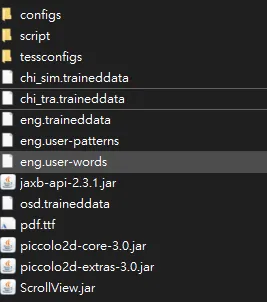
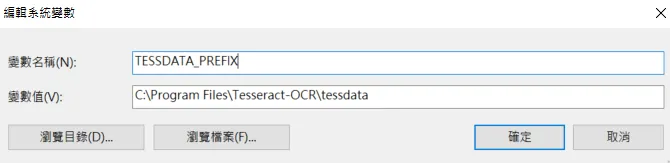
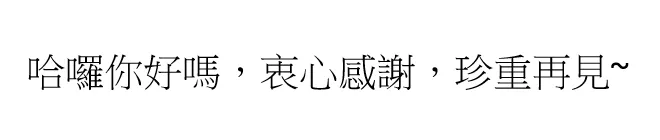
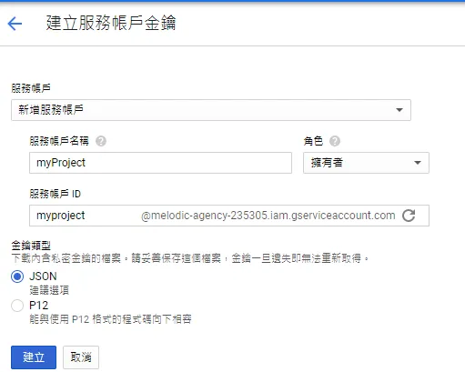
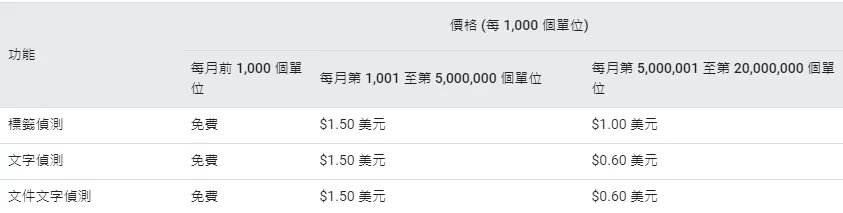
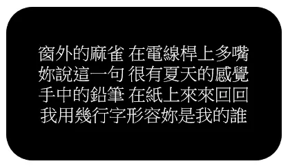
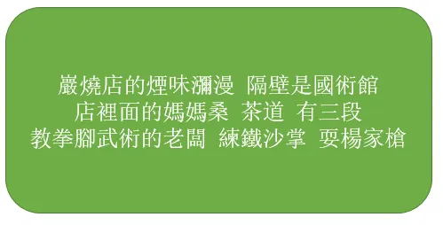

+++
author = "Bingcheng"
title = "圖像文字辨識：Google Cloud Vision API vs pytesseract"
date = "2020-08-13"
description = "評比 Google Cloud Vision API 和 pytesseract 對於圖像文字辨識表現 "
tags = [
    "影像辨識"
]
categories = [
    "資料分析"
]
series = ["Themes Guide"]
+++

這篇會介紹 Google Cloud Vision API 和 pytesseract 套件的環境安裝及使用教學，最後會進行兩者文字辨識效果的比較。辨識效果先講結論，Google Cloud Vision API 屌打 pytesseract 套件。

<!--more-->

# 前言

近來在處理一個案子，從PDF擷取公文資料到EXCEL檔案裡面，以方便進行彙整統計，其中住址的部分因為涉及個人隱私，因此住址特別設計成圖片，並非一般文字，防止有心人士萃取，在處理圖片就比較麻煩一點，我採取的做法就是先以PyPDF2套件萃取圖片，再想辦法從圖片辨識出文字。

# pytesseract
Tesseract 是一個光學字元辨識(OCR)引擎，目前由Google 贊助開發。python 使用 Tesseract的套件就是 pytesseract。

## 1. 備妥程式運行環境

* pip install pytesseract
* 根據電腦環境在該網站下載 tesseract.exe。
* 在Github respository下載 best trained model (ex:chi_tra.traineddata)，放入到上述下載 testdata 資料夾裡面，以我的路徑為例：

`C:\Program Files\Tesseract-OCR\tessdata`



* 加入系統環境變數

記得要加入系統環境變數，否則會噴出error，變數名稱是 TESSDATA_PREFIX，路徑則是剛剛的 testdata 資料夾



## 2. 測試圖片

用以下範例圖片測試：



## 3. 代碼實現
```Python
import pytesseract
from PIL import Image
#指定剛剛下載tesseract.exe的完整路徑
pytesseract.pytesseract.tesseract_cmd = r'C:\Program Files\Tesseract-OCR\tesseract.exe'
image = Image.open('test.png')
#這裡的lang就是剛剛下載的model
text = pytesseract.image_to_string(image, lang='chi_tra')
text = text.replace("\n","").replace(" ","")
text = text.strip()
print(text)
```
## 4. 結果

`哈囉你好嗎,衷心感謝,珍’`

# Google Cloud Vision API

在使用API之前要申請 Google Cloud Platform 帳號，操作十分直覺，這裡就不贅述，讀者可以先申請看看，有問題再詢問我。

## 1. 建立服務金鑰
使用 Google cloud 服務需要帳戶金鑰，按下建立會自動下載一個json檔案，裏頭就是金鑰，必須妥善保管。



## 2. 安裝套件

```Python
pip install google-cloud-core
pip install google-cloud-vision
```
## 3. 運行代碼

取自Google Cloud Vision API官方文件簡化而成：

## 4. 結果

`哈囉你好嗎,哀心感謝,珍重再見~`

## 5. 附註

Google Cloud Vision API 每個月前1000單位免費，超過免費額度則依照不同級距收費，請參閱定價。

**Google Cloud Vision API定價**



# 辨識評比
簡單用幾個範例來實測兩者辨識效果，隱藏格式、標點符號不列入考慮，單純計算字元辨識的正確率，若圖片文字有100個字，成功辨識80個字，則辨識率就是80%~。

## 測試1-白底黑字


|     | 辨識結果  | 辨識率|
|  ----  | ----  | ----|
| **pytesseract**  | `址:人台責縣了關廟鄉龜洞村9和交龜油\n\x0c` | 60%
| **Google API**  | `住址:台南縣關廟鄉龜洞村3鄰龜洞` |100%

## 測試2-黑底白字



|     | 辨識結果  | 辨識率|
|  ----  | ----  | ----|
| **pytesseract**  | `而放六合轉呈2(E壤很有看太的感克中的鉛筆在紙上來來回我用幾行形容妳是我的誰` | 52%
| **Google API**  | `窗外的麻雀在電線桿上多嘴妳說這一句很有夏天的感覺手中的鉛筆在紙上來來回回我用幾行字形容妳是我的誰` |100%

## 測試3-黑底白字




|     | 辨識結果  | 辨識率|
|  ----  | ----  | ----|
| **pytesseract**  | `巖燒店的煙味瀰漫隔壁是國術館語li條E上菩店2教拳腳武術的老闆練鐵沙掌耍楊家槍` | 73%
| **Google API**  | `巌燒店的煙味瀰漫 隔壁是國術館店裡面的媽媽桑茶道 有三段教拳腳武術的老闆 練鐵沙掌 耍楊家槍` |100%

# 小結
今天為各位介紹文字辨識常用的兩個工具，一個是 Google Cloud Vision API 另一個是 pytesseract 套件，經過實測，Google Cloud Vision API準確度高到不可思議，pytesseract 相形之下就遜色許多，如果使用量不大，建議直接串 Google API 比較合適，如果使用 pytesseract 就要自己訓練一個 model 來提高準確度！有空再寫一篇要如何訓練model來增加準確度~。

# 備註
如果程式有調用 Google Cloud Vision API，在使用Pyinstaller 套件打包成執行檔時容易噴出找不到google-cloud-vision 套件的錯誤代碼，解決辦法可以參考這篇。

