+++
author = "Bingcheng"
title = "簡單線性回歸的顯著性檢定 (Significance test)"
date = "2021-04-20"
description = "以 Auto MPG Data Set 作為例子。"
tags = [
    "統計學",
    "線性回歸",
    "顯著性檢定",
    "Python"
]
categories = [
    "資料分析"
]
series = ["Themes Guide"]
+++

本文介紹線性回歸的顯著性檢定，並輔以 [Auto MPG Data Set](https://archive.ics.uci.edu/dataset/9/auto+mpg) 作為實例分析。

<!--more-->

# 何謂顯著性檢定 (Significance test)
顯著性檢定就是檢驗檢定統計量 (Test statistics) 是否落在拒絕區域 (顯著水準 $α$ 臨界值之外)，如果落在拒絕區域，我們便說這個假設檢定是達到統計上的顯著 (statistical significant)。

* Test statistics 就是從樣本算出來的一個值，通常會趨於某種機率分布
* 顯著水準 $α$ 就是要認定 test statistics 為顯著的嚴苛程度，如果顯著水準 $α$ 越小，表示 test statistics 必須是**更加『極端』的值**，才能夠達到統計上的顯著。
  
如下圖所示，假設 test statistics 服從常態分布，顯著水準為5%，因為是雙邊檢定，表示 test statistics 如果太大or太小，我們都認定是顯著的，因此在檢定時兩邊方向的拒絕區域必須是除以2，變成 2.5%。如果 test statistics 落在兩邊紅線之外的拒絕區域，我們便認為達到統計上的顯著 (statistical significant)。更詳細的說明可以參考[假設檢定基礎觀念](/post/hypothesis-test)。

  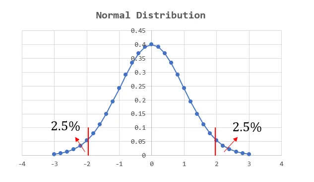

# 回歸分析要檢定什麼?

簡單線性回歸的數學表達如下：

  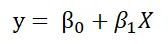

$X$ 就是我們可以控制的自變數，$y$ 則是我們感興趣的應變數。$β_0$ 為截距，$β_1$ 則是 $X$ 的係數，可理解為權重。

在此可以參考筆者先前的文章[簡單線性回歸 (Simple Linear Regression) 的公式推導 (Formula Derivation)](/post/simple-linear-regression-formula)，利用最小平方法(least squares method)，可以得到以下的不偏估計式

  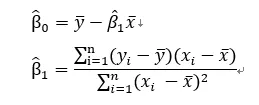

假設檢定的根本原因在於，任何估計都會存在誤差，上面的估計式自然也不例外，在進行回歸分析時，我們通常會從兩個面向進行顯著性檢定。

1. **迴歸模型中的單一解釋變數。檢定該自變數之 $β$ 係數是否為0**。適合用來判斷自變數的去留，變數的估計係數與該估計係數的標準誤會決定 t檢定 的結果。
2. **整個模型(整組變數)。檢定迴歸模型中的 $β$ 係數是否全部為0 ($β_1$)**，適合用在考慮加入一個或是一組新變數時，對整個模型的解釋力有沒有「顯著」提升，這裡使用 F檢定。
   
值得注意的是，在簡單線性回歸中，因為只有一個 $β_1$ 的自變數係數，因此檢定整個模型的解釋力等同於檢定單一 $β_1$ 係數有沒有顯著。

# 檢定單一解釋變數

我們要看迴歸模型中的單一解釋變數是否顯著，採用的  t-statistic。

採用 t-statistic 的理由

* **當樣本數量很小**，通常不會服從常態分佈，而是較為扁平的t分布，即便樣本數量很大，t分布也會逼近常態分佈，因此選擇t檢定比起常態分佈相對來說較為合適。
* **當母體的σ未知**，我們會用其他樣本值來估計母體參數，此時也會使用t檢定。
  
# β估計式的變異數推導

  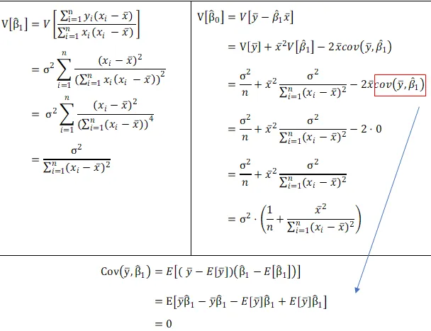

上面的變異數推導結果會有母體 $σ$，而現實生活中我們通常是不會知道的，因此母體 $σ$ 同樣必須估計。

## 估計 $y$ 的 $σ$
我們用 Residual Mean Square 來做為 σ 的估計式，這同時也是被稱為 regression 的 standard error。

  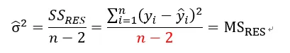

前面有論述到為何使用 t 檢定，是因為母體 $σ$ 未知，因此檢定統計量服從的分配會變成 t distribution，根據上面公式的推導整理如下：

  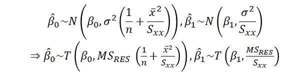

## 檢定流程

  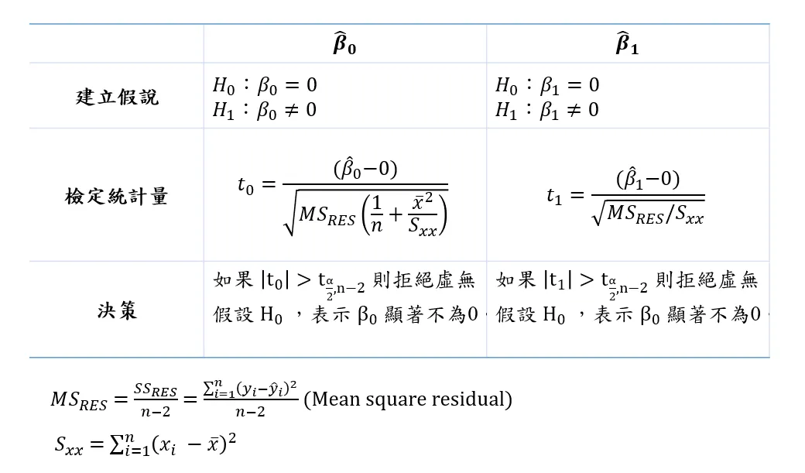

# 檢定模型顯著性

模型顯著性就是在檢測模型解釋變異的程度，在回歸分析 (Regression analysis) 的 R平方(R squared) 與[調整後R平方(Adjusted R squared)一文有帶到類似的概念](/post/r-square-index)，變異程度是種資訊含量，因此將 Regression Mean of Squares 除以 Residual Mean of Squares 作為檢定統計量，背後直覺的想法是模型能解釋的部分，遠超出不能解釋的部分(residual)。

  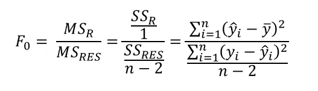

## 檢定流程

  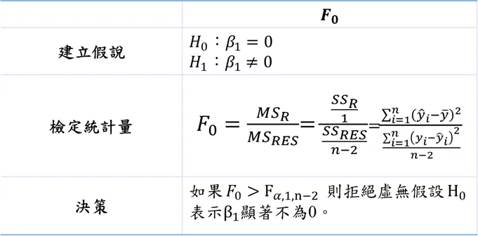

**Again, 在簡單線性回歸中，因為只有一個 $β_1$ 的自變數係數，因此檢定整個模型的解釋力等同於檢定單一 $β_1$ 係數有沒有顯著。**

# Auto MPG Data Set實例分析

以 MPG Data 的油耗 (mpg) 和馬力 (horsepower) 作為分析對象，以excel的資料分析功能求解。

## 繪製散佈圖
使用簡單線性回歸存在一個很大的好處，就是方便視覺化，即便不是統計學家的你還是能從這兩個變數看到他們的負相關性，因此用馬力來預測油耗看似一個好的選擇

  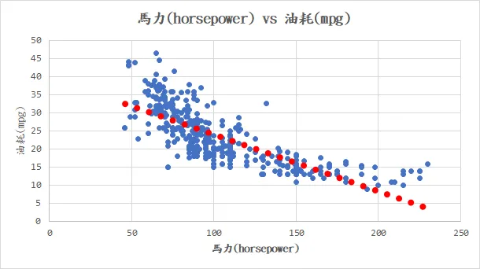

## 回歸分析
Excel本身就自帶回歸分析的功能，我們來看以下的分析結果。

  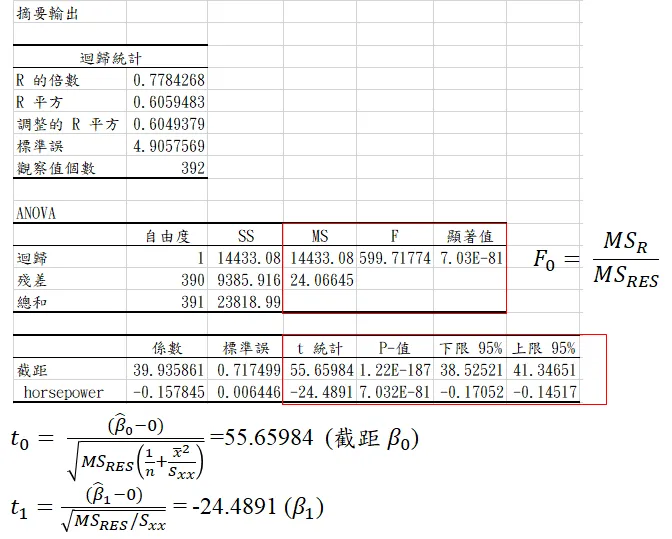

Anova 分析就是在檢定整個模型的解釋力，可以看到模型解釋的變異遠大於不能解釋的變異，因此其 ratio 值 F 就很大，達到統計顯著。單一解釋變數這是最下面的表格，截距部分和 horsepower 的 t檢定量用紅線框住，就是套用我們剛剛辛苦推導出來的方法計算，可以與95% 的 t值 相比，發現落在 reject region，因此截距與 $β_1$ 係數都達到顯著水準。