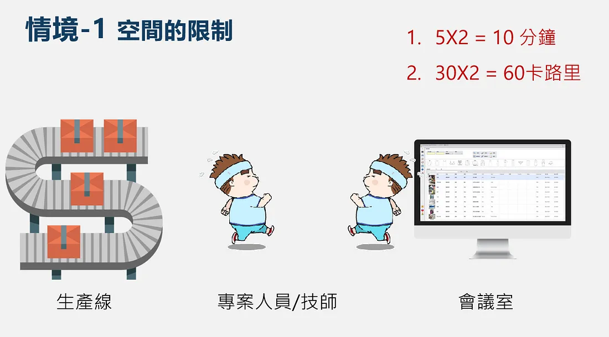
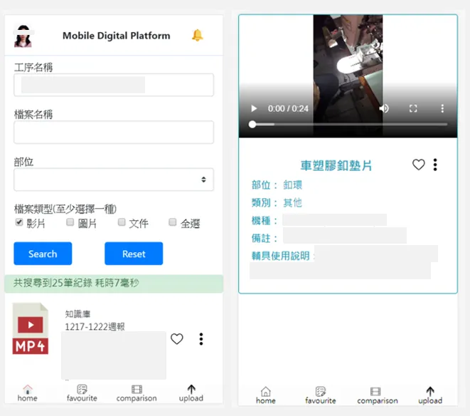

+++
author = "Bingcheng"
title = "我在聚陽資訊部擔任暑期實習生的心得分享 (二)"
date = "2020-05-27"
description = "分享實習心得"
tags = [
    "實習分享"
]
categories = [
    "工作心得"
]
series = ["Themes Guide"]
+++

在經過書審、筆試、面試層層關卡後，我有幸在大三暑假成為聚陽人，開始這趟非凡的旅程。有興趣的讀者可以參考我 [第一篇](/post/makalot-internship) 的分享，希望對你面試準備有些許幫助。

<!--more-->

# 公司氛圍

對我而言，聚陽是一間很溫暖的傳產公司，會特別強調傳產兩字，是因為許多人都有刻板印象，傳產公司的工作環境十分壓抑，呆板守舊等，包括之前的我也是這麼認為，但進入到聚陽實習的第一天開始，就發現這些擔憂、疑慮都是多餘的，聚陽是一間富有人情味的公司，同事之間相處融洽(互相餵食?)，也沒有壁壘分明的的上下級關係，只要提出合理的想法，主管都很願意接受採納，像是我提出實習專案開發模式的更動，學長、主管聽聞我的想法後便允許，也沒有讓我為難之處。

公司氛圍是我心中感到最大反差之處，所以網路上的評價可以參考，但不能盡信，因為人的經歷有限，不可能親自參訪每一間公司，只基於自身有限經歷得出的結論，往往有失偏頗，包括我現在這篇心得也只是基於我個人經歷，因此多聽多看多想囉^^

# 實習內容

聚陽很用心在實習內容的規劃上，有線上課程、實體課程、分組活動，還有實習生最重要的成果發表，整體而言實習內容相當多元，短短兩個月經歷了不少事情。

## 線上課程

聚陽有安排一定份量的線上課程。線上課程包山包海，幾乎把聚陽企業營運狀況梳理一次：生產流程、ERP系統、各式服飾的介紹及裁縫方式等等，每堂線上課程結束之後還有線上測驗，兩次沒通過課程系統就會被鎖住，要請HR幫你解鎖(窘)。

要把課程上完是要花上好幾天的時間，如果認真學習可以對公司實際運作及產業現況有更深認識，但我本身對服飾不感興趣，希望能多琢磨在資訊部門。我有與HR反映過，他們也承諾會針對不同實習部門進行課程調整，聚陽向來重視實習生的聲音，只要提出建設性的想法，他們都很願意聆聽並採納。

## 實體課程

實體課程主要是會輪流聚陽各部門的經理上台簡報，為我們介紹各部門的職責，我記得有產品開發部門、工業工程部門、業務部門等，每個部門介紹時間都有開放讓實習生自由提問，畢竟主管們平常都很忙，可以好好把握住機會發問，提出好的問題也能讓主管、同儕對你留下較多深刻印象。

除了公司內部人員，偶爾也有業師來分享，像是請職涯顧問來為我們做性向/職涯測驗，為我們分析什麼性格的人適合什麼工作。這類的性向測驗感覺做起來結果都大同小異，有一派心理學主張，人的性格除非受到重大變故否則不會輕易改變，我是支持認同這種主張的，因為根據我自己人生經歷似乎如此，我一時忘記那個理論是什麼，如果你知道歡迎在底下留言與我分享。
## 分組活動
聚陽HR很喜歡辦分組活動，破冰、分組任務等等，我生性比較喜歡獨處，不善與人交際，這是少數我會與同儕有互動的時候，同儕都是很優秀的人，大抵都是台清交成，或是輔大服裝設計相關科系，我也遇到兩個與我一樣來自台科的學生，有種在異鄉遇到同鄉的親切感。

## 實習專案
成果發表是實習生最重要的活動，我大概有八成的時間都在忙實習專案。每位實習生在第一周會與帶你的Mentor、部門主管討論，共同擬定一個題目，來做為實習結尾的成果發表，表現形式不拘，只要能夠說明這段間的收穫以及對公司的貢獻等等。

我的實習題目是數位平台行動版的開發。公司內部有一套用C#撰寫的數位平台(就是我的Mentor阿輝學長寫的！)，它可以讓產區同仁搜索並瀏覽紡織工序的圖片和影片，也有上傳/下載功能，近似於公司內部知識庫，數位平台功能十分齊全，美中不足的是有空間的限制，只能在會議室的電腦上觀看，因此我與阿輝學長討論後決定開發一套數位平台行動版，讓產區同仁能隨時在有網路的地方使用。公司內部系統大多是C#撰寫，但我熟悉的語言是Python，因此與阿輝學長討論後，決定用Djano框架開發，部屬到IIS上面，再分別用Android/IOS App的Web view框住。

合適的Mentor讓你上天堂。我的導師阿輝學長人很好，會耐心地為我解答任何疑惑，在開發過程中有許多難關，尤其是資料庫錯綜複雜，需要用到好幾層嵌套的SQL語法，謝謝阿輝學長的細心指點，總讓我關關難過關關過，當然我自己本身也非常努力，常常早上八點半到公司，弄到晚上八點才離開，阿輝學長曾多次向我坦承，如果不是我這麼努力，他也不會花這麼多時間在我身上。

> 天助自助者，自助人恆助之

別人要幫助你絕非義務的，而是在你身上看到一些特別的東西，可能是天賦，可能是努力，我是屬於後者。

# 成果發表
這一天聚陽各部門的同仁都會聚集在一塊，一同欣賞實習生成果發表會，其中創辦人周先生還坐在第一排呢。成果發表是以組為單位發表，每組都用盡巧思，有一組是用話劇形式呈現服裝特色；有一組是個人發表，直接展示實習階段親自操刀設計的衣服，工業工程部門實習生是用軟體模擬如何將訂單與產能協調，讓公司效益最大化。

我的成果發表是用簡報展示我開發的APP，在發表開頭我直接戲稱『歡迎來到秉誠的APP發表會』，馬上獲得一些掌聲和笑聲，整場報告採用詼諧有趣的基調來說明本專案的開發流程，像是為了說明原先數位平台的空間限制，我便用一個可愛的胖子來回跑動的示意圖，來闡述時間及卡路里的浪費，在提出解決方案秀出我APP的截圖時，便用神聖上帝的音效，營造出一種莊嚴肅穆的氣氛。以下附上簡報投影片及APP實際截圖(為避免公司機密，已遮住重要資訊)。

# 尾聲

短短的實習八周，其實有很多細節值得探討，只是礙於篇幅的緣故，只能暫且擱筆不談，以下是我在實習結束當天的臉書貼文，以此作本篇分享的結尾。

# 後記 (8/22)
今天收到資訊部門+人資部門合寫的卡片，內心無比感動，我也逐一逐一回信了，聚陽是名副其實的幸福企業，從第一天踏入到現在要離開，我的想法未曾稍以更改，可愛的人資小姐們以及友善的 IT 部門同事..。

儘管八周時光轉眼即逝，收藏的回憶卻飽滿十分呢!希望你們都會永遠記住學弟的真誠。祝我們各自未來的旅程，不求一帆風順，只求在挫折中，還能憶起最初的美好。