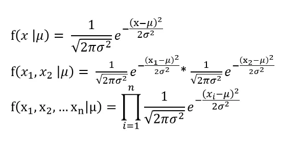

+++
author = "Bingcheng"
title = "最大概似估計 (Maximum Likelihood Estimation, MLE)"
date = "2021-03-01"
description = "最大概似估計 (Maximum Likelihood Estimation, MLE)"
tags = [
    "統計學",
    "Python"
]
categories = [
    "資料分析"
]
series = ["Themes Guide"]
+++

**最大概似估計是一種估計模型參數的方法**。適用時機在於手邊有模型，但是模型參數有無限多種，透過真實觀察到的樣本資訊，想辦法導出最有可能產生這些樣本結果的模型參數，也就是**挑選使其概似性 (Likelihood) 最高的一組模型參數**，這系列找參數的過程稱為最大概似估計法。

<!--more-->

本文會以服從伯努利分布 (Bernoulli distribution)、常態分布 (Normal distribution) 的模型作為例子分別解說。至於相關程式碼則是放在文末。

本文的公式推導僅是化簡或者微分，但對於沒相關基礎的讀者可能較為吃力，公式推導個人認為可以選擇性閱讀，了解機率統計的概念比較重要。

# 概似函數 (likelihood function)

概似函數是一種關於統計模型中的母數的函數，**函數值反映出統計模型輸出特定樣本值的可能性**，換言之，**如果找到特定的模型參數，使得概似函數值最大化，那就是該模型最合適的參數**。

常見的概似函數有**機率密度函數 (Probability density function)**、**機率質量函數 (Probability mass function)** 等。是的，機率密度函數也是一種概似函數，當我們在談起常態分布的機率密度函數：

$$
f(x \mid \mu) = \frac{1}{\sqrt{2\pi\sigma^2}} e^{\displaystyle{-\frac{(x - \mu)^2}{2\sigma^2}}}
$$

將機率密度函數代入一個特定的樣本值 $a$，時常書寫為 $P(X=a)$，**表示為該隨機變數X坐落在樣本值 $a$ 附近的可能性 (likelihood)**，這裡的可能性不是樣本值發生的機率 (Probability)，因為連續變數在任何點取值都為 0。

至於機率質量函數，則是離散隨機變數，因此特定值的都有機率。我們會預測連續投擲 2 次硬幣為正面的機率是 0.25，我們也會說觀察到這 2 次硬幣為正面的可能性是 0.25，兩者都說得通。

概似性 (likelihood) 及機率 (probability) 兩者都表示事件的可能性，兩個甚至可以是一樣的東西，比如上述機率質量函數，但在數學上卻有截然不同的意涵，重新梳理如下。

**機率 (probability)，是指模型參數確定的條件下，用模型來預測接下來觀測的結果**。比方用服從常態分佈的統計模型，來預測路人身高大於 170 的機率有多少。所以當我們在說機率，我們通常是以預測為目的。

**概似性 (likelihood)，則是已知某些觀測所得到的結果，對統計模型的可能性進行估計**。比方實際觀察到路人的身高為170，透過機率密度函數計算出在這個統計模型下發生的可能性有多大。

以更新統計模型的流程檢視，統計模型會基於一組特定的參數推論或預測，某個值發生的機率，比如說硬幣正面的機率是 0.5，連續投擲兩次正面機率為 0.25，等到我實際收集到樣本資料，比如說擲好幾次硬幣，我們可以計算擲硬幣的結果在這個統計模型的概似性有多高，不同的模型參數會得到不同的概似性，**最大概似估計就是選擇一組使其概似性最高的一組模型參數**。

從上述的意義解讀，也可以想成是機率是『給定一組模型參數條件下，預測資料點發生的機率』；概似性則是『給定實際觀察到的樣本的條件下，這組模型參數產生這組樣本的可能性』，這當中是運用貝氏定理去進行條件機率的轉換。

$$
P(B|A) = \frac{P(A|B)P(B)}{P(A)}
$$

關於貝氏定理，可以閱讀這篇文章[貝氏定理](/post/bayes-theorem)。

# 伯努利分布 (Bernoulli distribution)

我們先從服從伯努利分布 (Bernoulli distribution) 的模型談起。

Bernoulli大概是世界上最簡單易懂的機率分布，它假設試驗只有成功或失敗兩種可能，如果成功的機率是 $θ$ ，那麼失敗的機率就是 $1-θ$ 。

考慮連續擲硬幣的例子，正面和反面可視作成功或失敗，因此每次的投擲都是一場獨立 Bernoulli trial，正面的機率是 $θ$；反面的機率$1-θ$。

假設今天連續投擲硬幣的結果為正面/反面的次數分別是 $H/T$，則投擲結果的機率質量函數為：

$$f(\theta,H,T) = \theta^H(1-\theta)^T $$

上述的機率質量函數的相乘就是概似函數 (likelihood function)，當實際觀察到 $H$ 次正面次數、$T$ 次反面次數的投擲結果，則在不同的模型參數 $θ$ 底下，產生出這組樣本結果的概似性。

假設今天連續投擲5次硬幣，很不湊巧地，這是一枚質地不均勻的硬幣，觀察到的投擲結果依序為4個正面、1個反面，我們以 0.1 為間距，枚舉9個可能的模型參數，藉由計算不同模型參數 $θ$ 底下，產生4個正面、1個反面這組樣本的概率為何。

**註**

如果不考慮投擲硬幣順序，只在乎"成功的次數"，那麼將會服從二項式分布 (Binomial distribution)，在此簡化處理，因此假設服從Bernoulli distribution。

不難發現，上述的候選者中，0.8作為模型參數似乎是最合適的選擇，因為這組樣本是基於這個模型參數的概似性 (Likelihood) 最大。我們嘗試用程式模擬更多模型參數的概似性，可以得到大致的結果。(程式碼請見文末。)

當然，我們不能每次都用窮舉的方式來找到最佳模型參數，何況上述只是為了舉例說明，實際上可能的模型參數是有無限多種，我們必須有一套更嚴謹的數學方法來實現。

投擲硬幣為正面的機率是 $θ$，在無限個 $θ$ 中，找到一個使概似性最大的 $θ$，其概似估計可以用以下數學式子：

一個函式的極值往往坐落在斜率等於 $0$ 之處，因此將概似函數一次微分，計算等於 $0$ 時的值為何，最後得到 $H/(T+H)$ 的估計。

因此，推導出來的模型參數符合直覺地，將投擲硬幣正面次數除以所有次數，就是每次投擲硬幣為正面的機率，想一想就感到十分奇妙，硬幣投擲結果為4個正面、1個反面，我們腦中的直覺就會告訴我們，投擲硬幣為正面的機率為 0.8，但從未想過，原來我們大腦觀察到數據、並建立一個模型，其背後的機制其實就是使用到最大概似估計！

# 常態分布(Normal distribution)

基於常態分佈的模型同樣可以用最大概似估計法計算出最合適的模型參數。

假設我們知道國人身高的標準差為3公分，我們有30個國人身高的隨機樣本，要如何從樣本資訊反推出國人身高的平均呢？概念其實與硬幣例子如出一轍，只是在計算上比較繁瑣。

我們思考服從常態分配的模型是如何估計不同樣本結果的概似性。如果今天只有隨機抽取 2 個樣本，概率函數會是第一個樣本身高為 $x1$ 的機率密度 (通俗地說，就是任一國人在身高為 $x$ 的可能性)，再乘以第二樣本身高 $x2$ 的機率密度，至於為何變數之間可以直接相乘，是基於變數獨立的假設，因此公式可以推導如下：

所以我們的任務就是要找到一個 $μ$，讓我將國人身高的樣本資訊代入時，使上面的概似函數值最大化。

Attention!
如果實際用上面的公式計算，一個小於1的值會連續相乘n次，你的程式很快就面臨到浮點數下溢 (floating point underflow) 問題，通俗來說，就是電腦受限硬體的限制，無法處理太多小數位的數值，以至於失去計算結果的精準度。(在小算盤計算0.5的30次方，大概就有感覺了。)

因此概似函數我們通常都會取 log 計算，因為 log 是單調遞增函數，我們可以確保函式取 log 之後，其以下式子仍然成立

因此概似函數取log重新表達如下

這時，我們就可以用程式模擬，分別以 `[160,161,162,163..180]`作為母體平均值 $μ$，來計算模型產生30個國人身高的機率為何，發現170 公分左右最吻合身高樣本的資訊。因此可以推斷母體 $μ$ 大致坐落在 170 左右。

註：因為實際的值很小，下圖是以相對機率表示。

用程式模擬只是為了輔助說明，但實際上還是透過一次微分求極值，來幫助我們快速求得精準的答案。假設 $X$ 服從一個 $(μ ,σ²)$ 的常態分佈， $𝜇$ 是未知，概似函數剛剛已經整併成簡單的形式， 以下為數學推導：

微分的結果告訴我們，樣本的平均值，其實就是母體平均值 $𝜇$ 最好的估計！又是一個相當符合直覺的答案！當然其他的最大概似估計就沒那麼直覺漂亮了。

# 小結
最大概似估計是一種估計模型參數的方法。目的在透過真實觀察到的樣本資訊，找出最有可能產生這些樣本結果的模型參數。

**大致流程**

1. 找到合適概似函數估計，例如聯合機率密度函數、機率質量函數等。
2. 概似函式數取log，並且進行一次微分求極值所在。
   
本文不是容易書寫的題目，如果文中有疏漏之處，歡迎在底下留言指正~。