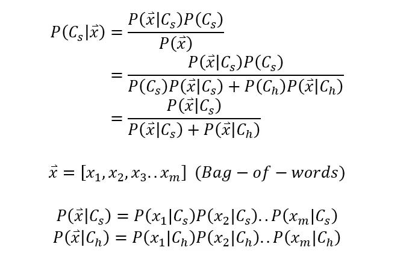

+++
author = "Bingcheng"
title = "實作單純貝氏分類器 (Naive Bayes Classifier)，並應用於垃圾訊息分類"
date = "2020-08-26"
description = "Sample article showcasing basic Markdown syntax and formatting for HTML elements."
tags = [
    "貝氏定理",
    "分類器",
    "Python"
]
categories = [
    "資料分析"
]
series = ["Themes Guide"]
+++

貝氏定理是機率論的一種定理，描述在已知某些條件下，計算某個特定事件發生的機率為何。例如已知某條訊息包含「優惠」這個單詞，使用貝氏定理可以計算出為廣告訊息的機率，進而大幅提高過濾垃圾訊息的精準度，因此時常作為攔截垃圾信件的用途。

<!--more-->

# 貝氏定理

貝氏定理的核心公式如下：

<p style="text-align: center;">
  
</p>


注意藍色機率部分，上述其實就是條件機率互換的關係而已。在中學階段我們學過條件機率的公式是 $P(A|B)=P(A∩B)/P(B)$，意味著在事件B發生的條件下，事件A發生的機率，而我們將分子P(A∩B)依照條件機率公式替換成 $P(B|A)P(A)$，來達到條件機率的互換，如下。

<p style="text-align: center;">
  
</p>

經過上述的轉換不難發現貝氏定理其實就是從『**給定A事件已發生的條件，B事件發生的條件機率**』轉變成『**給定B事件已發生的條件下，A事件發生的條件機率**』的互換過程而已。公式用常理推斷符合生活上的經驗，比如在已知一個人抽菸，計算他得肺癌的機率，假設為 P(肺癌|抽菸)，如果得肺癌的人越多人有抽菸行為，也就是 P(抽菸|肺癌) 的值越大，則 P(肺癌|抽菸) 的值也會比較大。

# 詞袋模型(Bag-of-words model)

在正式進入主題之前，我們需要了解一個先備知識，它可以告訴我們如何計算特定類別出現某個單詞的機率。假設出現以下兩個信件標題

<p style="text-align: center;">
  
</p>

在不考慮文法及語詞順序的情況下，可以建構出下列不重複的語詞清單

`["開信,"領取","限時","兩天","好禮","免費","折價券"]`

我們重新用向量方式表達，對應的數字表示該單詞出現的次數

<p style="text-align: center;">
  
</p>

這就是 詞袋模型 一個簡單的例子，就像拿袋子裝下每個語詞，不考慮順序及文法。

假設如果要計算某 $c$ 類別信件出現特定語詞的條件機率，我們就先將 $c$ 類別信件分詞，再用上述方式建構出詞袋模型，得到一組長長的一維向量，該單詞的次數，除以所有單詞的次數，就是該類別出現這個單詞的條件機率。

# 條件機率

貝氏定理表示條件機率轉換的關係，**貝氏分類器就是透過貝氏定理計算樣本在不同類別條件下的條件機率，並取得條件機率最大者作為預測類別。**

以 某 $c$ 類別為例。

若有一則訊息，用詞袋模型可以建構成一維向量 $x=<x_1, x_2….x_m>$，每個元素表示該單詞出現的次數，欲知道代表該訊息向量 $x$ 的條件下，為類別 $c$ 的條件機率，公式表達如下：

<p style="text-align: center;">
  
</p>

上述 $P(c|x)$ 是指訊息向量 $x$ 為特定類別 $c$ 的機率，倘若有多個類別，那就逐一將類別 $c$ 替換成不同類別，並且取最大值的那個類別作為預測結果，這就是貝氏分類器的運作原理。

在這裡有計算上的小技巧，眼尖的讀者會發現，代入不同的類別，影響的只有分子，分母都是固定為 $P(x)$，因此倘若只是單純要比較條件機率的大小，分母可以不用計算，單純比較分子就好！比如只有 $a$ 、$b$ 兩個類別計算各類別的條件機率時，分母都固定為 $P(x)$，因此貝氏分類器就單純比較 $P(x|a)P(a)$ 和 $P(x|b)P(b)$ 兩者之間大小，如果前者值比較大就判給類別 $a$ 作為預測結果，反之亦然。

# 垃圾郵件分類實例

上面提到，**貝氏分類器就是計算樣本在不同類別條件下的條件機率，並取得條件機率最大者作為預測類別**。

在垃圾郵件分類的例子，類別就是簡單的分為垃圾郵件類別 $(C_s)$ 及非垃圾郵件 $(C_h)$ 類別，因此根據全機率法則，在計算分母這則訊息向量x機率時，可以拓展成第二列公式，接著我們簡化處理，假設垃圾郵件類別 $(C_s)$ 和非垃圾郵件 $(C_h)$ 類別，他們的事前機率都一樣 $P(C_s)=P(C_h)$，我們可以將其化簡如第三列所示。

<p style="text-align: center;">
  
</p>

以例子輔助說明上面公式。

假設一則訊息由『優惠』、『特價』兩個單詞構成，根據詞袋模型建構成一維向量 $x=<x_1, x_2….x_m>$，計算這則訊息會被歸類到『垃圾訊息類別』的機率根據上述公式表示為：

<p style="text-align: center;">
  
</p>

**分子表示『垃圾訊息中含有優惠和特價兩個單詞』的機率**；**分母則是『垃圾訊息中含有優惠和特價兩個單詞』加上『非垃圾訊息中含有優惠和特價兩個單詞』的機率**，讀起來很複雜，但其實已經簡化成只有需要兩個計算的地方，且方法一模一樣：P(優惠=1,特價=1|垃圾訊息) 以及 P(優惠=1,特價=1|非垃圾訊息)。 

首先我們來看 P(優惠=1,特價=1|垃圾訊息)，要怎麼計算在已知為垃圾訊息類別條件下，訊息中含有優惠和特價兩個單詞？這是基於**貝氏定理十分重要的假設，特徵之間條件獨立**，根據條件獨立的假設，我們可以逐一攻克，化簡成兩個條件獨立相乘：

<p style="text-align: center;">
  
</p>

也就是，在已知訊息為垃圾訊息類別的條件下，同時出現『優惠』和『特價』兩個單詞的機率，就是將在『訊息為垃圾訊息類別的條件下，出現優惠單詞』的機率，乘上『訊息為垃圾訊息類別的條件下，出現特價單詞』的機率，公式可以展開如下：

<p style="text-align: center;">
  
</p>

在公式經過重整之後，計算過程變得非常簡單，就是單純計算各類別出現該單詞的條件機率，即可得到答案。

以 P(優惠=1|垃圾訊息) 為例，意味著垃圾信件類別中出現優惠單詞的機率，回顧 詞袋模型(Bag-of-words model) 章節，我們提到具體如何計算，將垃圾類別信件訊息分詞，建構出詞袋模型，得到一組長長的一維向量，該優惠這個單詞的次數，除以所有單詞的次數，就是該類別出現這個單詞的條件機率。

因為是單純的二元分類，類別只有垃圾訊息/非垃圾訊息兩種，只要這則訊息是『垃圾訊息』的機率>0.5，『非垃圾訊息』的機率就會<0.5，因此模型便能將其分類到垃圾訊息的類別，如果今天有三個以上的類別，則要把所有類別的條件機率依序算出取最大值者。

# Python實現
以上解釋貝氏定理，接著讓我們用 Python 實作貝氏分類器。這次採用的資料集是 *SMS Spam Collection*，每一行就是一條訊息，第一個字串(ham or spam)決定該行是否為垃圾訊息。

<p style="text-align: center;">
  
</p>

## 讀取資料集
寫一個讀取函式，會回傳一個訊息列表，列表內是元組，表示訊息及訊息分類(1表示為垃圾訊息)

```Python
def read_file(filepath):
    print(f"Reading {filepath}...")
    mails = []
    with open(filepath,encoding="utf-8") as file:
        for line in file.readlines():
            is_spam,message = line.split("\t")
            is_spam = 1 if is_spam=="spam" else 0
            message = message.strip()
            mails.append((message,is_spam))
    return mails
```

<p style="text-align: center;">
  
</p>

## 拆分資料集
資料集通常會拆成訓練跟測試，在此寫一個簡易的劃分函式，以82比例分割。

```Python
def split_data(mails,ratio=0.8):
    print("Spliting data..")
    random.seed(2)
    random.shuffle(mails)
    train_num  = round(0.8*len(mails))
    train_X = [mail[0] for mail in mails[:train_num]]
    train_y = [mail[1] for mail in mails[:train_num]]

    test_X = [mail[0] for mail in mails[train_num:]]
    test_y = [mail[1] for mail in mails[train_num:]]
    return (train_X,train_y,test_X,test_y)
```

## 訓練
先說明以下變數含意。

```Python
self.k = k  # smoothing factor
self.total_count_ = [0,0] # total word count in class
self.word_count_ = defaultdict(lambda :[0,0]) 
self.word_prob_ = defaultdict(lambda :[0,0])
```
* `k`。k 是拉普拉斯平滑的係數，是為了解決機率為零的相乘問題，上述有提到**貝氏定理十分重要的假設，特徵之間條件獨立**，同時含有多個單詞的機率，就是算出個別單詞的條件機率相乘而來，如果其中一個單詞機率為0，結果就是0，比如訊息是『買一送一，今日限定優惠，錯過可惜呦~』假設過往垃圾郵件沒有出現『可惜』兩個字，因此機率為0，即便『買一送一』、『優惠』這種單詞出現在垃圾郵件機多高，最終相乘起來仍然是0，因此我們會使用拉普拉斯平滑公式替換成一個趨於零的機率。
* `total_count_`。長度為2的列表，表示垃圾訊息類別/非垃圾訊息類別全部單詞出現的次數。
* `word_count_` 。字典格式。該單詞在垃圾訊息/非垃圾訊息中出現的數量。
* `word_proba_`。單詞在垃圾訊息類別/非垃圾訊息類別出現的頻率。請回顧詞袋模型章節。

訓練前使用 `tokenize` 函式對訊息進行預處理，先將其字母全部轉成小寫，再用正規表達式 `re.findall("[a-z]+", message)` 進行斷詞，然後以集合型態返回斷詞結果，有了單詞便可以計算 `word_count_` 及 `total_count_`。

最終目的是要算出 `word_prob_` 這個變數，一但知道每一單詞分別在垃圾訊息/非垃圾訊息出現的機率，就可以通過連乘計算出單詞組合為垃圾訊息的機率。

<p style="text-align: center;">
  
</p>

關於 `word_proba_` 這個變數的計算很簡單，就是該單詞在垃圾訊息中出現的個數/垃圾訊息全部單詞的個數，就是該單詞出現在垃圾訊息的機率，非垃圾訊息類別同理也是如此，所以主要程式碼就是以下這幾行：

```Python
for word,count in self.word_count_.items():
    word_prob_if_spam = (self.k+count[1])/(2*self.k+self.total_count_[1])
    word_prob_if_non_spam = (self.k+count[0])/(2*self.k+self.total_count_[0])

    self.word_prob_[word][1] = word_prob_if_spam
    self.word_prob_[word][0] = word_prob_if_non_spam
```

## 預測

將測試訊息進行斷詞處理，迭代上述訓練而得的 `word_proba_`這個變數，原先公式是進行連乘，但在計算很小的數值時電腦容易造成浮點數下溢的問題，也就是計算結果不會如預期的精準，因此我們通常會取 log 相加，最後再用指數函數還原計算結果。

<p style="text-align: center;">
  
</p>

要注意算出來的是垃圾訊息的機率，大於0.5才能判斷為垃圾訊息。

## 評估模型

在二元分類問題，混淆矩陣常用來評估分類模型的好壞，此外精準度 (Precision) 和 召回率 (Recall) 是常被使用的衡量指標。

* 精準度 (Precision) 指預測為垃圾訊息中，實際上也是垃圾訊息的機率
* 召回率 (Recall) 是指測試資料的垃圾訊息中，被成功偵測出來(預測為垃圾訊息)的機率。
  
* 以下是這次測試的結果：

<p style="text-align: center;">
  
</p>

從上表可以發現就算沒有經過特別處理，模型已經表現得可圈可點。

**模型如何改進**

* 預處理部分，訊息的分詞可更細緻，目前只是粗暴地用英文字母劃分，並未考慮到時態、複數等問題。
* 訓練時，單詞可以設下次數門檻，倘若次數少於一定值便捨棄不用，以增加精準度。

# 小結
貝氏定理是條件機率的轉換過程，透過新事件的資訊來更新後驗機率，它有條件獨立的基本假設，因此在計算條件機率時，是個別單詞在類別條件下的機率連乘而得，儘管這個基本假設脫離現實，但它模型效果通常表現得不錯。

**資料集/完整代碼：**
[Github Code](https://github.com/QiuBingCheng/MediumArticle/blob/main/Classifer/naive_bayes.py)


# 參考資料
* [貝氏定理在生活中很有用，可是它到底怎麼算？](http://blog.udn.com/nilnimest/124668370)
* [机器学习算法实践-朴素贝叶斯(Naive Bayes)](https://zhuanlan.zhihu.com/p/27906640)
* [條件機率與貝氏定理](https://ccjou.wordpress.com/2016/02/01/%E6%A2%9D%E4%BB%B6%E6%A9%9F%E7%8E%87%E8%88%87%E8%B2%9D%E6%B0%8F%E5%AE%9A%E7%90%86/)
* [BOOK] DATA SCIENCE FROM SCRATCH中文版：用PYTHON學資料科學
* [PAPER] Spam Filtering with Naive Bayes — Which Naive Bayes?