+++
author = "Bingcheng"
title = "期貨爬蟲：擷取期貨每日行情資料並寫入 Excel檔案"
date = "2020-08-06"
description = ""
tags = [
    "網路爬蟲",
    "openpyx"
]
categories = [
    "程式設計"
]
series = ["Themes Guide"]
+++

臺股期貨沒有提供免費API擷取資料，因此決定手刻一個，順便寫成教學文章，紀錄實作的過程。
<!--more-->

這篇文章比較基礎，只是單純爬取每日行情的資料，適合有心想學爬蟲的讀者，透過實際生活上的應用，可以讓人學程式學得越起勁，這也是我喜歡程式的原因，幫助我解決生活上很多難題！

# 前言

## 期貨
期貨是一種特別的交易方式，買賣雙方簽訂合約，約定在未來指定的時間、價格或者其他交易條件交出現貨。期貨有很多種契約，今天我欲抓取的是臺股契約(TX)。臺股期貨區分兩個交易時段，依序為盤後時段及一般交易時段，盤後交易時段可視為每日交易的第一個時段，結算作業則是以一般交易時段收盤為劃分點。

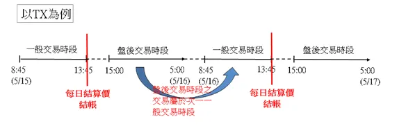

## 擷取資料

要紀錄每日行情也是麻煩的一件事，能不能透過程式自動擷取資料，並且幫我記錄在excel檔案裏面？下圖是台灣期貨交易行情的表格，我每天想抓的就是：

**盤後交易時段**
開盤價、最高價、最低價、最後成交價；

**一般交易時段**
開盤價、最高價、最低價、最後成交價、漲跌價、結算價。

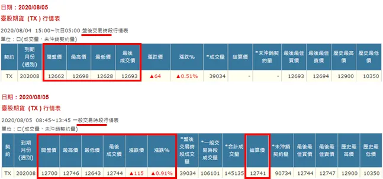

## 預計成果
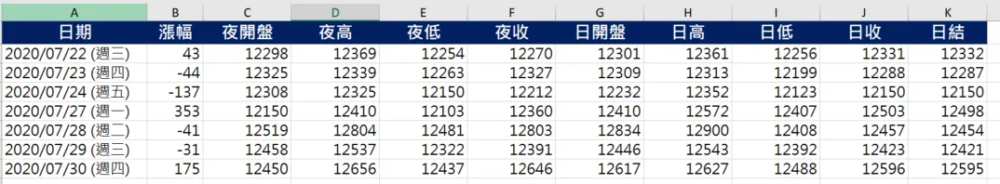

我的預計成果如上圖，當我執行Python程式時，會先判斷excel紀錄的最新日期，從最新日期的下個營業日擷取到最近一個營業日，每次都會擷取每日行情兩個時段的交易數據，這裡的『夜』、『日』，分別對應的就是盤後時段、一般時段。

這裡有值得注意的兩點：

**1. 程式執行當天沒有資料，則當天不會出現紀錄**

ex：在2020/7/25 (週六)，臺灣期貨交易所公休，因此當天就不會寫入excel檔案。

**2. 程式會自動判斷最新的紀錄日期，逐一擷取補齊至今**。

ex：平日上班繁忙忘了更新，excel最新紀錄是2020/7/27 (週一)，程式執行會擷取2020/7/28 (週二)、2020/7/29 (週三)...執行到今天日期為止。如此就可以避免中間有缺漏情況。


# Python代碼實現

以下講解Python代碼實現，以 2020/8/05 的盤後交易時段為例。

## 檢查查詢表格的 html 元素
在查詢表格按右鍵，選擇"檢查"，右邊會顯示表格的 html 元素，從中得知這表格是以 post 方式發出請求，紀錄每個輸入框的 name 及 value。

**表單元素**

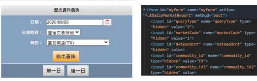

**表格對應的名稱、值**

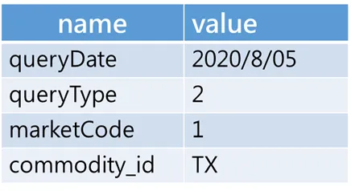

## 檢查行情表格的 html 元素
在臺股期貨 (TX ) 行情表按下右鍵，選擇"檢查"，右邊會顯示如下的html元素

**行情表格的元素**

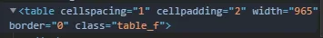

檢查發現，行情表格的class是 `table_f`，用 Ctrl+F 搜尋看看有幾個吻合：

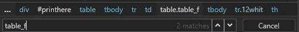

只有兩個吻合，一個是我們要抓的 **臺股期貨 (TX)** 行情表、另一個是**價差行情表**。待會我們用class名稱作為條件搜尋時，就擷取第一張表格即可。

## 爬取
至此，我們已經成功找到元素了，接著就是requests套件發出post請求，並且使用熱騰騰的濃湯(BeautifulSoup)為我們解析網頁元素，如果解析後結果的table變數，是如下圖所示，那就表示成功爬取囉！

```Python
import requests
from bs4 import BeautifulSoup
url ="https://www.taifex.com.tw/cht/3/futDailyMarketReport"
myobj = {'queryDate': "2020/8/05", "MarketCode":"1","commodity_id":"TX","queryType":2}
response = requests.post(url, data = myobj)
soup = BeautifulSoup(response.text,features="html.parser")   
table = soup.find("table",class_="table_f")
```

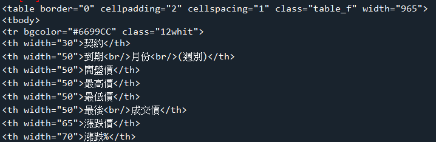

## 萃取交易行情

擷取整張表格，接著我們進行細部的資料擷取，`tr` 表示表格的每一列，我們要擷取的是表格的第二列，因此索引值是 1(python索引從0開始)，代碼是 `find_all("tr")[1]`，再繼續使用 `find_all("td")` 擷取該列所有的儲存格。

```Python
row = table.find_all("tr")[1].find_all("td")
row = [r.text.strip() for r in row]
```

**萃取行情表格的第二列**

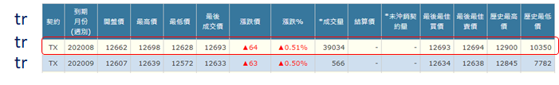

**row**

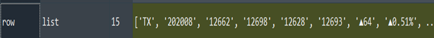

截至目前為止，盤後交易時段已經順利擷取，至於一般交易時段方法如出一轍，唯一差異只是 `MarketCode`，盤後交易是1；一般交易是0。我們將其包成函式方便調用：

```Python
def get_daily_quotes(date,market_code):
    """
    market_code
    1=盤後
    0=一般
    """
    myobj = {'queryDate': date, "MarketCode":market_code,"commodity_id":"TX","queryType":2}
    response = requests.post(url, data = myobj)
    soup = BeautifulSoup(response.text,features="html.parser")
    table = soup.find("table",class_="table_f")
    if not table:return None
    row = table.find_all("tr")[1].find_all("td")
    row = [r.text.strip() for r in row]
    return row
```

## 爬取一段期間的每日行情

經過上述的嘗試，我們成功抓取單日的每日行情。在寫入excel檔之前，我們回想一下剛剛提到的一個場景，平日可能上班/上課繁忙忘了每日更新，那中間遺漏的部分，豈不也要手動抓取嗎？因此首先，**我們先取得 excel 的最新紀錄，確定最新的那筆紀錄的日期，再寫一個輔助函式，能夠從最新日期直到今日的這段期間，都要執行擷取每日行情的爬蟲任務，確保紀錄沒有缺漏**。

註記：這裡的日期格式為**年/月/日 (周幾)** ，中間必須有空格，我會用 `split` 函式擷取前面的年/月/日，如果沒有符合格式會報錯，請參考我的 *options.xlsx* 檔案。

###  取得 excel 的最新紀錄日期

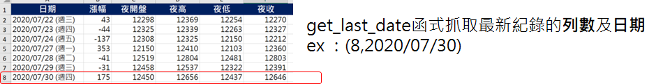

```Python
def get_last_date(ws):
    print("get excel last date...")
    for i in range(2,ws.max_row+2):
        #inspect date
        if not ws[f"A{i}"].value:
            #remove weekday
            last_date = ws["A"+str(i-1)].value.split(" ")[0]
            #new i and last date
            print(last_date)
            return (i-1,last_date)
    
```

###  取得最新紀錄日期至今日的這段日期列表

我們需要得到最新一筆紀錄至今日這段間的確切日期，`get_date_during_the_period` 負責的就是這個工作，例如從 *2020/7/31* 開始到 *2020/8/6*，則會回傳這段日期的列表，就是這麼簡單。

```Python
def get_date_during_the_period(start,end):
    duration = (end-start).days+1  #相差幾天(包含起始日)
    if duration>0:
        return [start+timedelta(days=d) for d in range(duration)]
    else:
        return None
```

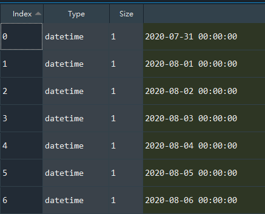

### 執行擷取每日行情的爬蟲任務

而 `get_daily_quotes_by_date_list` 則是將上面獲取的那段日期，用一個迴圈依序取出，代入到剛剛`get_daily_quotes` 函式，此時會得到一個列表，裡面是字典形式，包含日期、盤後交易資料、一般交易資料。

```Python
def get_daily_quotes_by_date_list(dates):
    weekday_mapping = {0:"(週一)",1:"(週二)",2:"(週三)",3:"(週四)",4:"(週五)",5:"(週六)",6:"(週日)"}
    
    daily_quotes = []
    for date in dates:
        d = {}
        weekday = weekday_mapping[date.weekday()]
        date_str = date.strftime("%Y/%m/%d")
        full_date = date_str+" "+ weekday
        
        d["date"] = full_date
        d["after_hours"] = get_daily_quotes(date_str,1)
        d["normal"] = get_daily_quotes(date_str,0)
        
        time.sleep(0.5)
        
        if (not d["after_hours"]) | (not d["normal"]):
            continue
        daily_quotes.append(d)
    return daily_quotes
```

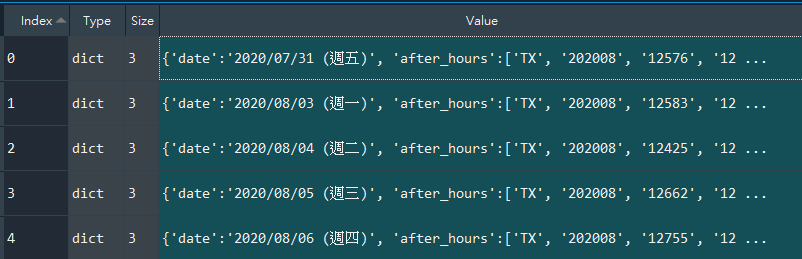

## 寫入excel檔案

資料已經獲取完畢，剩下來的工作便是寫入excel檔案。因為都是整數的緣故，這裡型態直接用 int 轉換，單純閱讀無所謂，但如果是要在 excel 加上自己的公式，用字串型態就會產生錯誤，因此這裡要特別小心。

`Worksheet` 物件支援多種索引方式，有一種是沿用 excel原生的索引風格，例如A2、B5等，這次範例便是使用該索引方式，excel的欄位順序就格外關鍵，如果調換資料就會填錯！

```Python
def record_to_excel(ws,row,daily_quotes):
    #record to excel
    for index,quotes in enumerate(daily_quotes):
        #欲填入的列數
        record_row = row+index
        
        ws[f"A{record_row}"] = quotes["date"]
        print(ws[f"A{record_row}"].value)
    
        #盤後
        ws[f"C{record_row}"] = int(quotes["after_hours"][2])
        ws[f"D{record_row}"] = int(quotes["after_hours"][3])
        ws[f"E{record_row}"] = int(quotes["after_hours"][4])
        ws[f"F{record_row}"] = int(quotes["after_hours"][5])
        
        #一般
        ws[f"G{record_row}"] = int(quotes["normal"][2])
        ws[f"H{record_row}"] = int(quotes["normal"][3])
        ws[f"I{record_row}"] = int(quotes["normal"][4])
        ws[f"J{record_row}"] = int(quotes["normal"][5])
        
        quote_change = "".join([s for s in quotes["normal"][6] if (s.isdigit() or s=="-")])
        ws[f"B{record_row}"] = int(quote_change)
        ws[f"K{record_row}"] = int(quotes["normal"][11])
```
# 小結

今天跟各位分享期貨爬蟲的方法，人工抓取10天資料加上鍵入excel的時間要5–10分鐘，但是短短一百行程式碼，執行起來不到5秒鐘，可以省下瑣碎的時間去進行更有意義的事情，另外，這個程式可以包裝成執行檔，讓沒有Python環境的讀者也可以執行，需要再告知我囉^^
最後，如果文末任何疏漏之處，不吝指正，我將非常感激，謝謝。