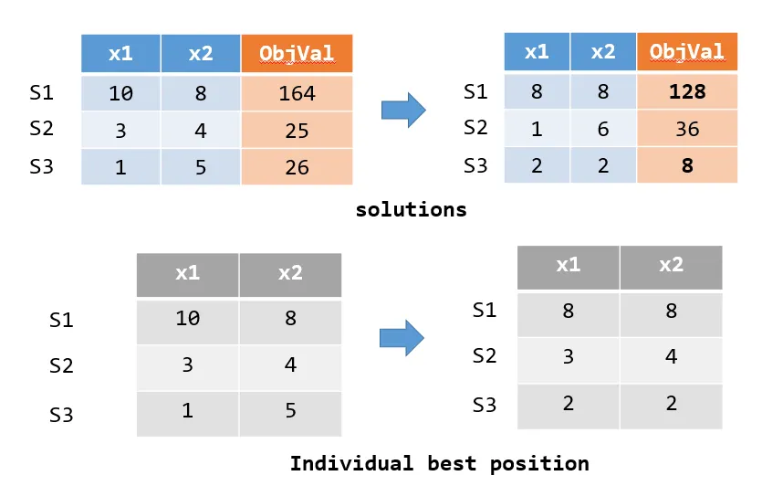
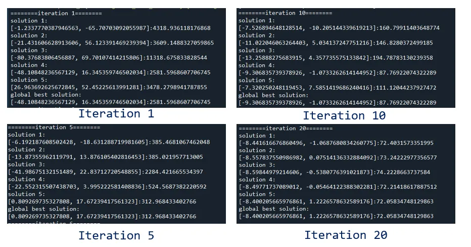
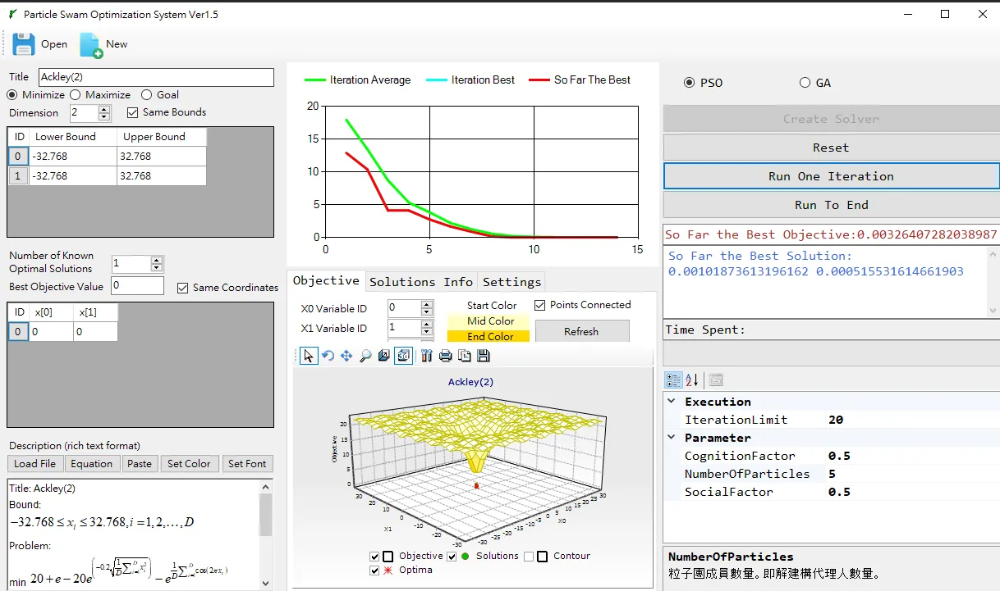

+++
author = "Bingcheng"
title = "實作粒子群演算法 (Particle Swarm Optimization, PSO)"
date = "2021-01-23"
description = "以 Python 實作粒子群演算法"
tags = [
    "啟發式演算法",
    "粒子群演算法",
    "Python"
]
categories = [
    "資料分析"
]
series = ["Themes Guide"]
+++

本篇文章會以 Python 實作粒子群演算法。在啟發式演算法中，粒子群演算法是經典且相對容易實現的演算法，因此適合對啟發式演算法有興趣的讀者參閱。

<!--more-->

# 粒子群演算法

粒子群演算法是一種解決最佳化問題 (Optimization problem) 的啟發式演算法，它的概念來自於對生物社會行為的觀察。最早是來類比鳥群的飛行運動，發現候鳥這種生物會受到自我認知及群體的影響，進而左右覓食、捕食的行為。在演算法中，這些個體們被稱為粒子群 (Particles)，每一個粒子則是一個解的代理人 (solution agent)。由於用候鳥群來比擬比較直觀，下文會以候鳥群作為描述對象。

## 粒子群演算法流程

粒子群演算法主要有三個流程，完成這三個流程稱為一個代次 (iteration)。

1. 指派起始位置，並且記錄個體最佳解及群體最佳解
2. 計算加速度向量，移動候鳥群到新的位置。
3. 更新個體最佳解及全域最佳解

# 最佳化問題

最佳化問題是從所有可行解中尋找最適合的解的問題，它可細分為連續最佳化問題與組合優化。連續優化問題中，主要有 Maximum、Minimum 兩個方向，**本文將以 Minimum 作為目標**，函式則是簡單的平方和，換句話說，每個解都是一組固定長度的陣列，透過呼叫這個函式會有回傳值，在啟發式演算法中又稱為目標值 (objective value)，**演算法的目的就是在尋找使目標值最小的一組解**。

顯而易見地，這個函式的最佳解為一組值為 0 的陣列。

```Python
def compute_objective_value(array):
    val = 0
    for ele in array:
        val += ele*ele
    return val
```

# Python程式碼實現

## 認識變數

首先，先來認識演算法中重要的幾個變數。

* `pop_size`：母體數量，也就是候鳥族群的大小，本文設定為 5 只是為了方便說明，真實在解決問題不會設定那麼低。
* `dimension`：這個問題的變數數量，本文以 2 個為例。
* `solution`： 一組解 (一隻候鳥的位置)，長度為 `dimension`，數學表示如 $[x_1,x_2,..x_{dimension}]$。
* `solutions`：這個問題的所有可能解 (solution)，長度為 `pop_size`。
* `individual_best_solution`：個體最佳解。每個解都會移動位置，試圖往更好的目標值移動，這個變數便是個體截至目前最優的解。
* `global_best_solution`：群體最佳解。個體最佳解中最優良的解
* `cognition_factor`：自我認知的權重。值越高，表示迭代時越傾向往個體最佳解移動，對應到演算法語境，就是候鳥越相信自己過去的最佳經驗。
* `social_factor`：群體經驗權重。值越高，表示演算法越傾向往群體最佳解移動，對應到演算法語境，就是候鳥越相信群體的智慧。

```Python
self.pop_size = pop_size
self.dimension = dimension
self.upper_bounds = upper_bounds
self.lower_bounds = lower_bounds

self.solutions = [] #current solution
self.individual_best_solution = [] #individual best solution
self.individual_best_objective_value = [] #individual best val

self.global_best_solution = [] #global best solution
self.global_best_objective_value = sys.float_info.max;
self.cognition_factor = cognition_factor #particle movement follows its own search experience
self.social_factor = social_factor  #particle movement follows the swarm search experience
self.compute_objective_value = compute_objective_value
```

## 初始化
1. 指派界限內的隨機亂數給每一個體。
2. `individual_best_solution` 先設定為最初的解。
3. 從個體最佳解中，找到目標值最好 (也就是最低) 的那組解作為 `global_best_solution`。

```Python
min_index = 0
min_val = sys.float_info.max

for i in range(self.pop_size):
    solution = []
    for d in range(self.dimension):
        rand_pos = self.lower_bounds[d]+random.random()*(self.upper_bounds[d]-self.lower_bounds[d])
        solution.append(rand_pos)
    
    self.solutions.append(solution)
    
    # update invidual best solution
    self.individual_best_solution.append(solution)
    objective = self.compute_objective_value(solution)
    self.individual_best_objective_value.append(objective)
    
    # record the smallest objective val
    if(objective < min_val):
        min_index = i
        min_val = objective
    
# update so far the best solution
self.global_best_solution = self.solutions[min_index].copy()
self.global_best_objective_value = min_val
```

## 移動候鳥群到新的位置

候鳥群移動會受到自我認知 (`cognition_factor`)、群體經驗 (`social_factor`) 影響，乘上一個隨機亂數，分別以 `alpha` 和 `beta` 表示因子權重。一隻候鳥 `i` 的某變數 `d` 加速度，為下列的和：

* `alpha * (individual_best_solution[i][d]-solutions[i][d])`
* `beta * (global_best_solution[i][d]-solutions[i][d])`
  
候鳥目前的解加上加速度，就是會產生新的解。最後，要確保候鳥的新的位置，要在變數的界限內。

```Python
def move_to_new_positions(self):
    for i,solution in enumerate(self.solutions):
        alpha = self.cognition_factor*random.random()
        beta = self.social_factor*random.random()
        for d in range(self.dimension):
            v = alpha*(self.individual_best_solution[i][d]-self.solutions[i][d])+\
                beta*(self.global_best_solution[d]-self.solutions[i][d])
                
            self.solutions[i][d] += v
            self.solutions[i][d] = min(self.solutions[i][d],self.upper_bounds[d])
            self.solutions[i][d] = max(self.solutions[i][d],self.lower_bounds[d])
```
## 更新最佳解

上述產生新的解，接著要評估新的解的優劣，用一個迴圈逐一計算每個解的目標值，如果該解的目標值，比該個體最佳解還要優良，則個體最佳解會更新，並判斷是否有勝於群體最佳解，如果有則一併更新群體最佳解。

舉例來說，如果有S1、S2、S3三組解，產生新的位置後，計算三者目標值，其中 S1、S3 的目標值更優良，分別從 (164->128、26->8) ，因此則更新 S1、S3 個體最佳解，如下方灰色表格所式。



```Python
def update_best_solution(self):
    for i,solution in enumerate(self.solutions):
        obj_val = self.compute_objective_value(solution)
        
        #udpate indivisual solution
        if(obj_val < self.individual_best_objective_value[i]):
            self.individual_best_solution[i] = solution
            self.individual_best_objective_value[i] = obj_val
            
            if(obj_val < self.global_best_objective_value):
                self.global_best_solution = solution
                self.global_best_objective_value = obj_val
```

到這裡演算法就完成一個代次 (iteration)，我們可以用 20 個 iteration ，觀察解的變化如下，發現個體最佳解會隨著更新逐漸往更好的方向移動，目標值會越降越低。



## 啟發式演算法可視化介面

GUI 可以讓使用者方便觀察每次迭代的情形，像是演算法收斂的情形，有沒有陷入局部最佳解等，這種 GUI 用 C# 撰寫會精美實用許多，下次有時間再寫一篇 GUI 的設計教學文。



# 總結
今天分享一個經典的啟發式演算法 PSO，PSO 優點在易於實現，在維度低時可以有不錯的表現，但在高維度的問題常陷於局部最佳解，通常基因演算法 (genetic algorithm , GA) 是更普遍採用的演算法，下次有機會再寫一篇教學文，如果文中有疏漏錯誤之處，歡迎指正~

**資料集/完整代碼：**
[Github Code](https://github.com/QiuBingCheng/MediumArticle/blob/main/HeuristicAlgorithms/particle_swarm_optimization.py)
