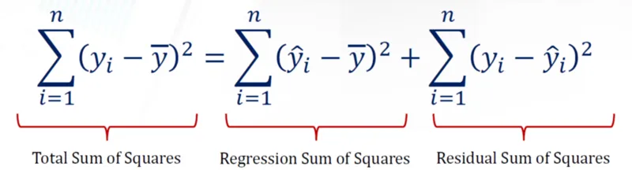

+++
author = "Bingcheng"
title = "回歸分析 (Regression analysis) 的 R平方 (R squared) 與 調整後R平方 (Adjusted R squared)"
date = "2021-03-20"
description = "R平方 (R squared) 與 調整後R平方 (Adjusted R squared)"
tags = [
    "統計學",
    "Python"
]
categories = [
    "資料分析"
]
series = ["Themes Guide"]
+++

介紹衡量回歸模型表現的兩個指標。

<!--more-->

# R平方 (R squared)
R平方 (R squared) 又稱為判定係數 (coefficient of determination)，是一種衡量回歸模型表現的指標，**代表從獨立變數 $X$ 可以解釋依變數 $Y$ 變異的比例**。

# 殘差平方和 (residual sum of squares)

『可以解釋的部分』聽起來有點抽象，或許從『不能解釋的部分』來思考會容易許多，對於一個模型來說，什麼叫做『不能解釋的部分』?就是殘差(residual)。我們耳熟能詳的公式每個樣本點的真實值 $y_i$ -預測值 $f_i$ 即為殘差，為了數學上計算的方便，在加總累計時通常我們都會取平方和，殘差平方和 (residual sum of squares) 公式如下

因此殘差平方和越大，表示模型解釋力越低，非常容易理解。

# 總平方和 (total sum of squares)

殘差既然是不能解釋的部分，欲解釋的總變異量是什麼？我們以真實值-平均觀察值的平方和表示

在此**變異量可以想成是資訊含量**，如果今天觀察值是常數，總變異量會是 0，毫無資訊含量可言。

下方是臺北及恆春的月均氣溫散布圖，藍色直線表示月均氣溫的平均值，依照公式計算臺北月均氣溫的總平方和 (total sum of squares) 為 289，恆春地區則為 89，舉該簡單例子讓讀者體會**數據的變異程度對總平方和值的影響**。

**臺北和恆春的月均溫觀測值及其平均值**

上述說明殘差平方和 (residual sum of squares) 就是『不能解釋的部分』，總平方和 (total sum of squares) 為『欲解釋的總變異量』，因此不能解釋的變異的比例為：

可以解釋的比例，自然就是以1去相減，就得到大家耳熟能詳的R平方(R squared) 的公式。

**附註**

事實上總變異平方和就是回歸平方和及殘差平方和的組成。

# 解讀R平方 (R squared)

以上圖筆者繪製的一張圖來體會，左邊紅色正方形的面積總和就是依變數 $y$ 的總變異量，計算方式是觀察點 (圓心) 與 $\bar{y}$ 的距離取平方的加總，代表我欲解釋的部分。

右邊藍色正方形的面積加總，就是殘差平方和，為模型不能解釋的部分，計算方式是觀察點 (圓心) 與 $f_i$ (預測值)的距離取平方的加總，殘差平方和越小，表示不能解釋的部分越小，則 $R^2$ 自然越高，如果找到一條完美回歸線穿越所有資料點，使殘差變成 0，$R^2$ 就會變成 1，表示模型解釋所有變異量。因此，正常情況下 $R^2$ 的值會落在 $[0,1]$。

$R^2$ 有沒有可能是負的？

有，當模型的殘差平方合大於總變異量時，$R^2$ 就是負的，如下圖：

這表示模型完全沒有用處，預測效果比用平均值來猜測還要糟糕！

# 調整後R平方 (Adjusted R squared)

$R^2$ 越高越好?

當然不是。回想最小殘差平方和的表示如下：

其中 $X_i$ 是表示第 $i$ 組解釋(獨立)變數的 row vector，$b$ 則是對應 $X$ 的係數；$y_i$ 則是第 $i$ 組的依變數。

理論上獨立變數 $X$ 越多，殘差平方和只會越小，可以想像新增的一個 $X$ 變數，即使對解釋目標 $y$ 毫無貢獻，就使其係數變成 0 即可，因此殘差平方和最差就是打平，不會有反增的情況，在殘差平方和越小的情況，當然只會使 $R^2$ 變得越高。
$R^2$ 變高本身是好事，代表解釋程度更高，但是放太多不重要的變數，會使得係數的估計變得不穩定 (這裡會另外寫一篇推導估計係數的變異數)。

因此 $R^2$ 不是一個客觀的指標，在此把變數的數量也納入考量，得到 R平方 (Adjusted R²)，調整R平方可視為 $R^2$ 的不偏估計式，重新書寫如下：

其中 $n$ 為樣本數量，$p$ 為變數數量。這裡可以注意到，得到的 $Adjusted\  R^2$ 會小於$R^2$。