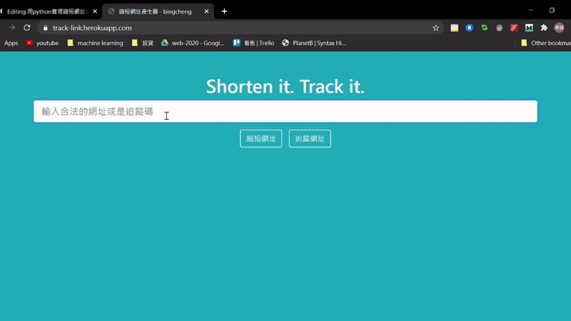
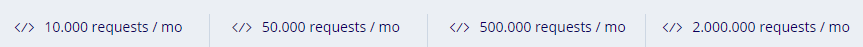
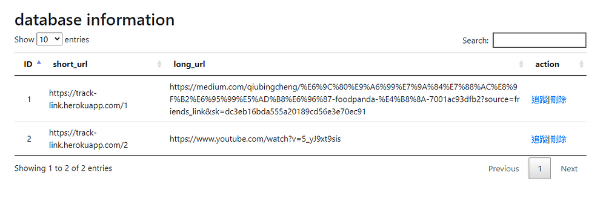

+++
author = "Bingcheng"
title = "用 Python 實現縮短網址功能"
date = "2020-07-18"
description = "Flask框架+Heroku雲端平台"
tags = [
    "短網址"
]
categories = [
    "網站設計"
]
series = ["Themes Guide"]
+++

短網址，顧名思義就是在形式上比較短的網址，用戶存取縮短後的網址時，重新導向到原來的網址。在web2.0的今天無疑是一個潮流，在網路上已經有很多類似的服務，幫助你將冗長網址精簡成較短的網址以方便分享連結。

<!--more-->

# 短網址優點
短網址的好處在於容易記憶且方便管理，這在Twitter、微博等每條訊息有限制字數的社交媒體有廣泛的使用，站在開發者的角度，還可以針對網址進行流量、點擊等統計，挖掘出有價值的訊息，以利於未來對該項目的決策。

# 短網址作法
關於短網址實現有許多做法，說明如下

## 長網址透過雜湊函數轉成短網址
長網址透過雜湊函數轉成短網址，由於雜湊演算法所計算出來的雜湊值（Hash Value）具有不可逆的性質，因此需要將長短網址關係儲存在DB中，透過短網址來尋找對應的長網址，但雜湊函數無法避免「雜湊碰撞（collision）」，因此有一定機率會出現多個長網址對應到同一個短網址，當然，有很多解決碰撞的方法，代價是會增加系統的複雜度。

## 通過發號策略
通過發號策略，初始值為0，每次接受生成短網址的請求，便遞增該號碼，再將10進制號碼轉換成62進制(0-9a-zA-Z)，例如第一次請求為1，轉換成62進制是0；第二次請求為2，轉換成62進制是1；第15次請求轉換成f；第100次轉換成1C；156次轉換成2w等。
理論上直接用10進制也可以，號碼遞增緣故不會有碰撞情形(兩個長網址對應到同一個短網址)，但用62進制可以讓網址在形式上更短。
(發號策略其實是對岸用語，如果知道台灣的用法為何歡迎在底下留言告知我^^)

**10進制 vs 62進制**

| 10進制 | 62進制 |
| ------ | ------ |
| 1      | 0      |
| 10     | 9      |
| 15     | f      |
| 63     | 11     |

# 短網址服務實現畫面

## 一般使用者

**實現畫面動圖**



一般使用者主要是兩個頁面，一個就是首頁，有產生短連結、追蹤連結兩個功能，兩個功能都會跳轉到追蹤連結的頁面，該頁面會顯示短連結瀏覽的資訊，包括瀏覽時間、IP位址、Port、User agent等，透過第三方API還可以進一步抓到使用者的國家、地理位址等，這裡我使用的是 ipstack 這家公司的免費方案。
題外話，他的方案介面委實讓我很困惑，為什麼請求數量限制會有小數點？？ (後來有熱心讀者指出是千分位符號)



## 管理者

**簡陋的管理者頁面**



管理者則是多一個管理網址的頁面，如果看到網址含有色情、暴力等字眼，就可以手動刪除，當然更好的方法是在產生短網址之前就做好把關，加上一層篩選機制防止惡意連結，事後審查是亡羊補牢的意思。
未來預計可以加上瀏覽的統計資訊、像是瀏覽人數、瀏覽地區的分組統計等等，可以呈現的資訊很多，未來可以找時間慢慢建構。

實現畫面主要介紹到這裡，下方說明實作的過程。

# Python實現短網址服務

作法方面我採用發號策略，來避免雜湊函數的碰撞問題；而框架部分，因為縮短網址服務架構比較簡單，因此我採用輕量級的Flask框架，能夠快速構建一個小型的網站；雲端平台則是 Heroku ，因為 Heroku 部屬十分簡單，加上有免費方案，即使有容量、使用頻率等諸多限制，對於一個非商業用途的專案來說是綽綽有餘。

## 進制轉換
縮短網址服務的核心，就是如何將長網址透過某種算法轉成短網址，這裡採取上述提到的發號策略，ALPHABET 就是"**0–9 a-z A-Z**"合計62個字元，產生短網址的方法就是將每次地遞增1的號碼 (10進制) 轉到 62 進制。

```Python
def base62_encode(num, alphabet=ALPHABET):
    """10進制轉62進制"""
    if (num == 0):
        return alphabet[0]
    arr = []
    base = len(alphabet)
    while num:
        rem = num % base
        num = num // base
        arr.append(alphabet[rem])
    return ''.join(arr[::-1])
```

## 資料庫
資料庫是建構兩張表格，Url是存放長短網址的映射關係，他的Id就是遞增的流水號，(Flask框架會自動將數值類型的主鍵設定為自動遞增)；第二張表格是 Tracing，會存放使用者發出請求時的後端擷取的資訊，例如IP位址、Port等。這裡的追蹤碼 (tracing_code) 其實有點取巧，我見識過提供專業的短網址服務網站，他們的追蹤碼是另外生成的，但這裡我只是單純的以轉制成62進位的結果作為追蹤碼，因此其實就是短網址最尾端的那串英數字。

```Python
class Url(db.Model):
    __tablename__ = 'url'

    Id = db.Column(db.Integer, primary_key=True)
    short_url = db.Column(db.String(64))
    long_url = db.Column(db.String(256))

    def __init__(self, short_url, long_url):
        self.short_url = short_url
        self.long_url = long_url

class Tracing(db.Model):
    __tablename__ = 'tracing'

    Id = db.Column(db.Integer, primary_key=True)
    tracing_code = db.Column(db.String(64))
    date = db.Column(db.DateTime)
    ip = db.Column(db.String(64))
    port = db.Column(db.String(8))
    location = db.Column(db.String(25))
    user_agent = db.Column(db.String(256))

    def __init__(self, tracing_code, date, ip, port, location, user_agent
                 ):
        self.tracing_code = tracing_code
        self.date = date
        self.ip = ip
        self.port = port
        self.location = location
        self.user_agent = user_agent
```

## 日期時間
在儲存日期格式要特別小心，因為資料庫的DateTime欄位，其實是沒有時區概念的，對資料庫而言日期不過是一個符合特定格式的物件，因此在建立日期資料時，我會使用`datetime.utcnow().replace(tzinfo=timezone.utc)`，先將當前時間轉換 UTC 的時間，等到要從資料庫擷取日期資料時，再視需求決定要轉換成何種時區，例如台灣的話便是使用 `astimezone(timezone(timedelta(hours=8)))` 。

# 主程式
我大致講解一下主程式的邏輯。

## 首頁
在首頁的話會接受表單的長網址，索取Url表格目前最大的Id+1，以方才提到的base62_encode 函式轉成62進制成為token(就是追蹤碼)，放到網域名稱的後面形成短網址，將長短網址映射關係存放到DB中，未來使用者向有存放於DB中的短網址發出請求時，便能重新定向到長網址給使用者！
例如我的網域名稱是 *https://track-link.herokuapp.com*
產生的短網址就是 *https://track-link.herokuapp.com/<tracing_code>* 的形式。

## 追蹤頁面

追蹤頁面的網址是trace/<tracing_code>，在首頁點擊追蹤連結，就是會將追蹤碼代入到這個網址，剛剛有提過我的短網址就是網域名稱後面加上追蹤碼，然後我會用 `Url.query.filter_by(short_url=short_url).first_or_404()` 根據來判斷是否存在於資料庫，如果不存在則直接導向404頁面，如果存在，則根據追蹤碼用 `Tracing.query.filter_by(tracing_code=tracing_code).all()` 取得Tracing表格中該追蹤碼的歷史瀏覽資訊。

# 小結
今天為各位分享我如何實作短網址服務，核心算法就是單純的進制轉換，相信各位讀者逐步操作也能領悟。目前網站介面及功能都還很陽春，未來預計新增會員管理系統，讓登入的使用者可以有比較進階的操作，除了享有更完善的瀏覽報告，還可以隱藏短網址的瀏覽紀錄，避免被第三方人士看到，如果這篇有幫助到你，請為我在下面拍手鼓勵，如果文中有誤，也歡迎指點糾正，讓我有改進的空間！