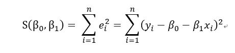
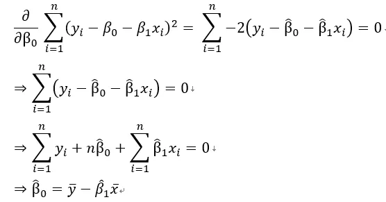
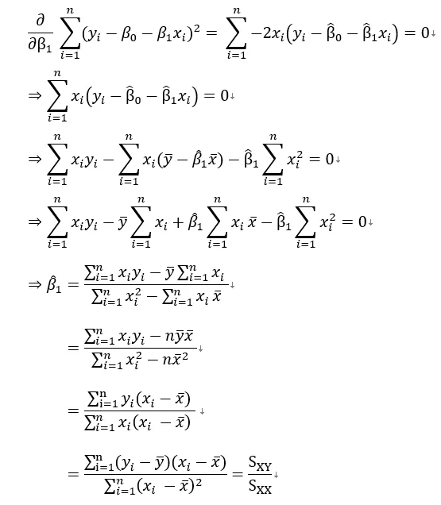

+++
author = "Bingcheng"
title = "簡單線性回歸 (Simple Linear Regression) 公式推導"
date = "2021-03-14"
description = "簡單線性回歸 (Simple Linear Regression) 公式推導"
tags = [
    "統計學",
    "Python"
]
categories = [
    "資料分析"
]
series = ["Themes Guide"]
+++

簡單線性回歸是在描述一個我們感興趣的變量 (應變量) 是如何受到另一個變量 (自變量) 的影響。

<!--more-->

簡單線性回歸常用於以下兩個目的：

1. 描述兩個變量之間的線性關係
2. 透過一個變量來預測另一個變量
   
簡單線性回歸時常以如下的形式表達

$$
Y = a+bX
$$

這裡的 $Y$ 就是應變量，通常是我們感興趣的變量，或者就是我們想預測的值，$X$ 則是自變量。

# 舉例

比如，一個人想減肥，他想知道**減少一公斤脂肪，需要燃燒多少大卡的熱量**，根據健康網站上顯示減少一公斤脂肪需要燃燒 7700 大卡，此時$X$ 是自變量，表示為欲減少的脂肪公斤數，Y是應變量表示為需要燃燒多少大卡，因此關係可以表示為 $Y = 7700X$。故意舉這個例子是為了說明，**線性回歸不能解釋因果**，以這個例子的時間先後順序顯然是

燃燒卡路里=>減少脂肪

但是今天我關注的對象是需要燃燒多少卡路里，因此將其放在 $Y$，$X$ 反而變成減少多少公斤的脂肪，由此可知，**線性回歸無法解釋因果，只能說明兩者之間的線性關係**。

延續燃燒脂肪的例子，倘若今天沒有健康網站明確告知，燃燒熱量大卡及減少脂肪數值的關係，但我們手邊有資料，通常這群資料會是一組 $(X_i,Y_i)$ 變數，並且以散佈圖形式呈現，有了資料我們就可以透過公式找出最合適的模型，來描述這兩個變量之間的關係，並且加以預測。

# 公式推導

**目標式定義如下**

**對 $\beta_0$ 微分**

**對 $\beta_1$ 微分**

