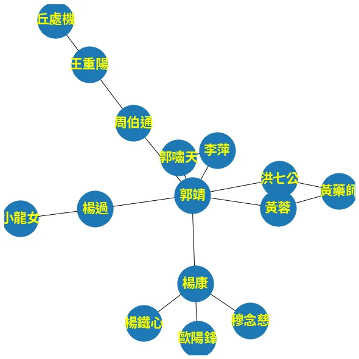
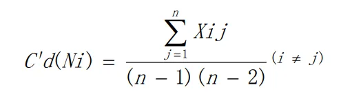
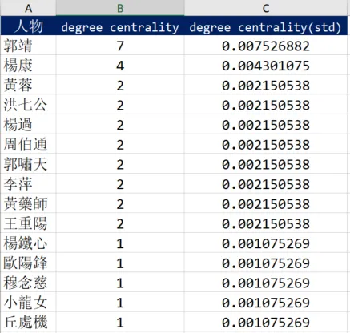
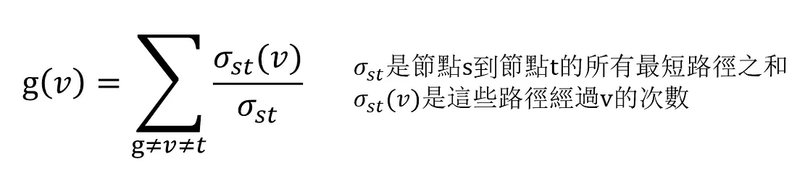
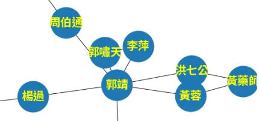
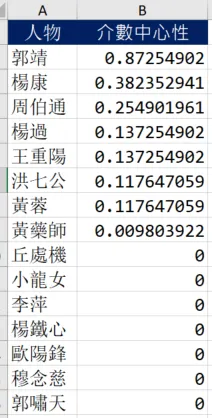
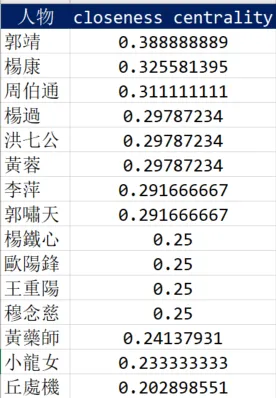

+++
author = "Bingcheng"
title = "社會網路分析 (Social Network Analysis)的度中心性(degree centrality)、介數中心性 (betweenness centrality) 及接近中心性 (closeness centrality)"
date = "2020-09-13"
description = "用Python進行社會網路分析 (Social Network Analysis)"
tags = [
    "社會網路分析",
    "Python",
    "networkx"
]
categories = [
    "資料分析"
]
series = ["Themes Guide"]
+++

社會網路分析（Social Network Analysis, SNA）是根據網路 (Network theory)及 圖論 (Graph theory) 對社會結構進行探索的分析方法。

<!--more-->

中心性（$centrality$）則是社會網路分析中常用到的概念，用來闡述某個節點(人)在網路中的重要程度。一般而言，$centrality$ 有常見的三個衡量標準，就是本文標題揭示的 度中心性 ($degree\ centrality$)、介數中心性 ($betweenness\ centrality$) 及 接近中心性 ($closeness\ centrality$)，本篇文章將會逐一闡述這些衡量標準，並且以射鵰英雄傳的人物關係作為社交網路，以 Python 進行計算。

# 前言

網路是有物件相互連結的集合，用來表示物件之間對稱或非對稱的關係，通常這些物件被稱為節點 (node) 或頂點 (vertex)。而網路分析被使用到諸多領域，例如生物網路分析 (Biological network analysis)、敘事網絡分析 (Narrative network analysis) 以及今天涉及到的主題-社會網路分析 (Social network analysis)。下文會逐一介紹衡量網路中心性 $centrality$ 的三個指標，其中舉例部分將以射鵰英雄傳的人物關係作為網路，並且可以注意到，這是一個無向圖 (undirected graph)，有向圖的計算方式會另寫一篇文章。

# 免責聲明
人物關係請忽略一些不合理之處，因為小說人物關係錯綜複雜，故經過調整以利說明，失真之處敬請海涵。

首先我們先建立 `friendships` 列表變數，以元組表示人物彼此相互熟識，這裡使用python的 `networkx` 的套件來呈現人物網路圖，待會實作部分便是使用 `friendships` 變數作為資料集！

```Python
friendships = [("郭靖","黃蓉"),("郭靖","楊康"),("郭靖","洪七公"),("郭靖","楊過"),
               ("郭靖","周伯通"),("郭靖","郭嘯天"),("郭靖","李萍"),
               ("黃蓉","黃藥師"),("楊康","楊鐵心"),("楊康","歐陽鋒"),("楊康","穆念慈"),
               ("洪七公","黃藥師"),("楊過","小龍女"),("周伯通","王重陽"),
               ("王重陽","丘處機"),("李萍","郭嘯天")]
def draw_basic_network_graph(nodes):
    G = nx.Graph()
    G.add_edges_from(friendships)
    plt.figure(figsize=(8,6)) 
    nx.draw(G, with_labels=True, node_size=3000, font_size=20, font_family='Source Han Sans TW',font_color="yellow", font_weight="bold")
    plt.show()
    
draw_basic_network_graph(friendships)
```

<p style="text-align: center;">
  
</p>


# 度中心性 ($degree\ centrality$)

> In a network graph, degree centrality is measured by the total amount of direct links with the other nodes.

度中心性是最容易計算的衡量標準。對於某個節點來說，度 (degree) 就是指該節點的 $edges$ 數量，也就是該節點與其他節點直接連接的總數。

用臉書作為例子，某個人的度中心性就是指這個人的好友數量。比如在臉書上A有50個好友，B有3000個好友，我們會說B在臉書的社交網路中有比較大程度的凝聚力，這時會延伸出一個新的問題，如果C在IG上同樣有3000個好友，那麼B和C要如何進行中心性的比較？不同的網路不能直接進行比較，因此通常會經過標準化(standardization)處理。

如下圖公式所示，分子就是該節點的 $edges$ 數量，而分母的 $n$ 表示所有節點的數量總和。

<p style="text-align: center;">
  
</p>

接著，讓我們用射鵰英雄傳的人物關係作為社交網路，來實際用Python計算人物的 $degree\ centrality$。

上述提到 $degree\ centrality$ 就是在社交網路上該人物朋友的總數，因此迭代 `friendships` 變數，以 `user_friendship_count` 字典紀錄朋友數量，每發現一段友誼兩個人物的朋友數量會同時累加一次，(這裡不考慮單方面的關注、追蹤)，標準化處理就是將最後累計的朋友數量除以 `(n-1)(n-2)`。

```Python
friendships = [("郭靖","黃蓉"),("郭靖","楊康"),("郭靖","洪七公"),("郭靖","楊過"),
               ("郭靖","周伯通"),("郭靖","郭嘯天"),("郭靖","李萍"),
               ("黃蓉","黃藥師"),("黃蓉","洪七公"),("楊康","楊鐵心"),("楊康","歐陽鋒"),
               ("楊康","穆念慈"),("楊過","小龍女"),("周伯通","王重陽"),
               ("王重陽","段智興"),("王重陽","丘處機"),("李萍","郭嘯天")]

#計算好友數量
user_friend_count = defaultdict(int)
for friendship in friendships:
    user_id, friend_id = friendship
    user_friend_count[user_id] += 1
    user_friend_count[friend_id] += 1

#標準化-除以(n-1)(n-2)
total_count = sum(user_friend_count.values())
user_friend_count_after_standardization = {user:count/((total_count-1)*(total_count-2)) for user,count in user_friend_count.items()}
```

經過計算發現郭靖、楊康 $degree\ centrality$ 最高，表示這兩個人物在社交網路中扮演著最為重要的角色。

<p style="text-align: center;">
  
</p>


# 介數中心性 ($betweenness\ centrality$)

> Betweenness centrality is to measure one node undertaking mediation role in a network

介數中心性 ($betweenness\ centrality$) 是在衡量一個節點在網路中的仲介效果，倘若該節點以外的節點，彼此之間的最短路徑大多經過該節點，表示 $betweenness\ centrality$ 越大，它就像是一個重要的交通樞紐，透過它你總能在最短路徑抵達欲尋訪的節點。以社交為例，生活圈中總有所謂的社交達人，透過他總能在最短路徑找到你想找的人，至於計算方式則是，該節點在其他節點彼此聯繫時的最短路徑中"被經過"的次數，標準化 (standardization) 處理，則是再除以所有最短路徑數量之和，公式參考自維基百科如下：

<p style="text-align: center;">
  
</p>

接著我們開始用Python來實作。我想網路上有很多精妙的解法，但過於簡潔可能不易理解 (包括我自己)，在此我是拆成三個步驟來實現，希望能夠讓讀者更明白程式運作的邏輯。

## 找到每個人物的朋友

首先第一步，我們定義 `construct_users_friends` 函式，用來建構人物的朋友列表。這個 `users` 變數得到的結果會如同下方的表格。

```Python
def construct_user_friends(friendships):
    """
    Returns:
        key:userId
        value:friends list
    """
    users = defaultdict(list)
    for friendship in friendships:
        user_id, friend_id = friendship
        users[user_id].append(friend_id)
        users[friend_id].append(user_id)
    return users

users = construct_user_friends(friendships)
```

<p style="text-align: center;">
  
</p>

## 找到每個人物與每個人物的最短路徑

這裡將定義出 `shortest_paths_from` 函示，輸入參數是`from_user` ，表示特定人物，`shortest_paths` 則是返回變數，表示 `from_user` 拜訪其他所有人物的最短路徑，例如"郭靖"要拜訪"小龍女"，其最短路徑就是 `["郭靖", "楊過","小龍女"]` ，最短路徑可以有兩條以上，例如"郭靖"如果要拜訪"黃藥師"，他可以透過"黃蓉"或者"洪七公"，因此會有兩條最短路徑，`["郭靖", "黃蓉","黃藥師"]` 和 `["郭靖", "洪七公","黃藥師"]` 。

`shortest_paths_from` 函示要達到上述目的，透過的演算法是 廣度優先搜尋法 (Breadth-first Search) 的一個實作，簡單來說，程式會先拜訪相鄰的人物，假設是A、B 和 C，再逐一拜訪與ABC相鄰的人物，由廣至深的探索，而已經拜訪過，但是其相鄰點還沒拜訪的人物，會以叫做 `visited` 的一個序列(queue)表示，序列在 `Python`是稱作 `deque` 的資料型態，可以快速地在頭尾加入、取出元素。

演算法的步驟主要是以下兩點：

### 1. 拜訪from_user相鄰的人物

由於相鄰是直接連接的意思，因此肯定是最短路徑，可以迭代`from_user` 的朋友，並加入到最短路徑中，對應到的程式碼便是`shortest_paths[friend_id] = [cur_path]` 。而這些人物都拜訪過，但是其朋友尚未拜訪，因此 `visited` 同時開始記錄這些人物，對應到的程式碼是 `visited.append((cur_path,friend_id))`。
   
### 2. 開始拜訪朋友的朋友
這裡將進入到一個迴圈，條件是 `visited` 為空才會跳出迴圈。每次迴圈會從 `visited` 取出一個人物，開始拜訪他的朋友，如果他的朋友尚未出現在 `shortest_paths` 裡面，那就如同第一步驟直接以`shortest_paths[friend_of_friend] = [cur_path]` 加入到其中，如果已經出現在 `shortest_paths` ，則進一步判斷是否等於先前儲存的最短路徑長度，如果相等則儲存，否則便不用理會。對應到用來判斷的程式碼是 `len(cur_path) == len(shortest_paths[friend_of_friend][0])`。

函式中我有打印重要訊息，實際執行一次就可以非常清楚拜訪的順序，這裡以郭靖作為例子，假如我執行 `shortest_paths_from("郭靖",users)` 函式

<p style="text-align: center;">
  
</p>

找到第1次與 黃蓉 最短路徑
找到第1次與 楊康 最短路徑
找到第1次與 洪七公 最短路徑
找到第1次與 楊過 最短路徑
找到第1次與 周伯通 最短路徑
找到第1次與 郭嘯天 最短路徑
找到第1次與 李萍 最短路徑
**開始拜訪 黃蓉 的朋友**
找到第1次與 黃藥師 最短路徑

**開始拜訪 黃蓉 的朋友**，這句出現的時機便是從 `visited`取出郭靖的朋友黃蓉，開始由黃蓉展開鄰近節點的尋訪旅程，因此這就是廣度優先搜尋的精神，先從相鄰點開始，再逐漸擴散到更外圍(朋友的朋友)的關係！

```Python
def shortest_paths_from(from_user, users):
    shortest_paths = {}  
    visited  = deque() #(節點路徑,該節點ID)
    for friend_id in users[from_user]:
        cur_path = [from_user,friend_id]
        shortest_paths[friend_id] = [cur_path]
        print(f"找到第1次與 {friend_id} 最短路徑")
        visited.append((cur_path,friend_id))
        
    while visited:
        prev_path, friend_id = visited.popleft()
        print(f"開始拜訪 {friend_id} 的朋友")
        #拜訪該節點的朋友
        for friend_of_friend in users[friend_id]:
            #略過from_user本身
            if friend_of_friend == from_user:
                continue
            cur_path = prev_path+[friend_of_friend]
            if friend_of_friend in shortest_paths:
                if len(shortest_paths[friend_of_friend][0])==len(cur_path):
                     shortest_paths[friend_of_friend].append(cur_path)
                     visited.append((cur_path,friend_of_friend))
                     path_count = len(shortest_paths[friend_of_friend])
                     print(f"找到第{path_count}次與 {friend_of_friend} 最短路徑")
            else:
                shortest_paths[friend_of_friend] = [cur_path]
                print(f"找到第1次與 {friend_of_friend} 最短路徑")
                visited.append((cur_path,friend_of_friend))
    return shortest_paths
```

## 計算人物的 $betweenness\ centrality$

執行上面的函式，理應找到每個人物與每個人物之間的最短路徑，儲存變數叫 `user_shortest_paths`，結果大致如下方圖片所示。

<p style="text-align: center;">
  
</p>

`betweenness_centrality` 函示將是我們最後一個步驟，這裡依序取出 `user_shortest_paths` 最短路徑，至於從哪個人物出發、抵達哪個人物，並非十分重要，理由在於根據公式 開始節點≠結束節點≠欲計算中心性的節點，因此我們真正在意的是從開始節點到結束節點的這些中間節點。

函示開始會先用三個迴圈，看起來很複雜，其實只是為了取出`user_shortest_paths` 最裡面的最短路徑而已，取出之後判斷路徑長度如果等於2，就略過這次迴圈，這表示這最短路徑是相鄰朋友，例如 `["郭靖", "黃蓉"]`，除了開頭兩端顯然沒有經過其餘節點，因此便不理會；如果長度大於2，則依序取出中間節點，用字典變數`frequency_of_visits` 累計加1，最後再用字典推導式除以最短路徑之和 `total_shortest_paths` 。

```Python

def betweenness_centrality(user_shortest_paths):
    """
    Keyword arguments:
        user_shortest_paths - {from_user:{to_user:[[shortest_path],[shortest_path]]}}
    Returns:
       user_betweenness_centrality - {user_id:betweenness_centrality}
    """
    frequency_of_visits = defaultdict(int)
    total_shortest_paths = 0
    for from_user in user_shortest_paths:
        for to_user in user_shortest_paths[from_user]:
            for path in user_shortest_paths[from_user][to_user]:
                if len(path) == 2:
                    continue
                for node in path[1:-1]:
                    frequency_of_visits[node] += 1
                total_shortest_paths += 1
    
    users = user_shortest_paths.keys()
    user_betweenness_centrality = {user:frequency_of_visits[user]/total_shortest_paths
                                   for user 
                                   in users}
    return user_betweenness_centrality
```

得到的結果會如下，郭靖、楊康和周伯通三個人物得到的分數最高，周伯通的排名比較起以 $degree\ centrality$ 指標衡量明顯高一點，是因為 $degree\ centrality$ 單純比較朋友數量，但是 $betweenness\ centrality$ 看重的是擔任最短路徑之橋樑的程度，由下圖可以發現要拜訪到王重陽和丘處機勢必要經過周伯通這條管道，因此便發揮較強烈的仲介效果。

<p style="text-align: center;">
  
</p>

<p style="text-align: center;">
  
</p>

## 接近中心性 (closeness centrality)

> Closeness centrality indicates how close a node is to all other nodes in the network

$closeness\ centrality$ 是指一個節點在網路中的緊密程度，可預期一個節點如果距離其他所有節點越近，它理當會是處於較為中心的位置，這也相當符合人類的視覺感受。$closeness\ centrality$ 計算方式非常簡單，該節點到達其他所有節點的最短路徑長度取平均值，並取其倒數便是 $closeness\ centrality$，以下用Python計算。

在計算 $betweenness\ centrality$，我們已經建構 `user_shortest_paths` 變數，直接沿用那個變數當作函式的輸入變數，`user_closeness_centrality` 是 `defaultdict(lambda :[0,0])` 型態，在值的部分是列表，索引0儲存的是最短距離；索引1儲存的是次數，這是為了方便計算平均使用的小技巧。

```Python
def closeness_centrality(user_shortest_paths):
    user_closeness_centrality = defaultdict(lambda :[0,0])
    for user in user_shortest_paths:
        for to_user in user_shortest_paths[user]:
            user_closeness_centrality[user][0] += len(user_shortest_paths[user][to_user][0])
            user_closeness_centrality[user][1] += 1
            
    return {user:1/(count[0]/count[1]) for user,count in user_closeness_centrality.items()}

user_closeness_centrality = closeness_centrality(user_shortest_paths)
```
<p style="text-align: center;">
  
</p>

# 小結

今天為各位介紹社交網路分析的中心性，它有三個常見的重要指標，分別是 $degree\  centrality$、$betweenness\  centrality$、$closeness\ centrality$，在計算這三個指標時都是以射鵰英雄傳的人物關係無向圖作為網路，其中 $betweenness\  centrality$ 演算法較為複雜，是一個廣度優先搜索的實作，其餘的指標計算上都算簡單也易於理解，希望各位讀者能從中受益，若文中有誤也歡迎指正！

**資料集/完整代碼：**
[Github Code](https://github.com/QiuBingCheng/MediumArticle/blob/main/NetworkAnalysis/Centrality%20Evaluation/network_%20analysis.py)

# 參考來源
* [社交网络分析(SNA)的中心性(centrality) 度中心性(degree),接近中心性(closeness),中介中心性(betweenness)](https://zhuanlan.zhihu.com/p/37626390)
* [如何简单地理解中心度，什么是closeness、betweenness和degree？]()
* [Network Structure and Measures](https://www.sciencedirect.com/topics/computer-science/closeness-centrality)
* [Graph Creation and Analysis for Linking Actors: Application to Social Dat](https://www.sciencedirect.com/topics/computer-science/betweenness-centrality)
* [Social network analysis 101: centrality measures explained](https://cambridge-intelligence.com/keylines-faqs-social-network-analysis/)