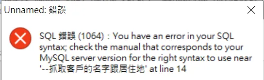

+++
author = "Bingcheng"
title = "SQL Injection 原理及範例"
date = "2020-04-05"
description = "介紹 SQL Injection 原理及範例"
tags = [
    "資訊安全",
    "SQL"
]
categories = [
    "資料庫"
]
series = ["Themes Guide"]
+++

SQL Injection 是一種常見的網路攻擊手法，藉由在輸入字串中夾帶惡意指令，試圖改變SQL語法上的邏輯，得以非法破壞、入侵資料庫伺服器，例如竊取使用者機密資料，帳戶資料，密碼等，倘若駭客取得系統權限，甚至可能癱瘓全系統，傷害之大，不可不慎。
<!--more-->

要知道 SQL Injection，我們必須先知道何謂 SQL。

# SQL介紹

SQL 是一種應用程式與資料庫之間溝通的術語，利用SQL可以對資料庫進行插入(Insert)、讀取(Read)、更新(Update)、刪除(Delete)等常見的操作。SQL指令種類繁多，在此僅針對下文SQL injection章節有使用到的語法進行說明。

## SQL的SELECT敘述
SELECT是SQL檢視資料庫內容的語法。該SQL語法架構是：

```sql
SELECT column FROM table
```

假設資料庫有一張名為Customers的表格，存放客戶的名字、居住城市等欄位，今天想從中擷取特定欄位資訊，便可使用下面語法獲取：

```sql
SELECT CustomerName, City FROM Customers;
```

## SQL語法的註解
註解是SQL使用者寫下的註記，資料庫伺服器會自動略過註解後的文字不會執行，註解符號視資料庫版本而有所差異，常見有以下三種：

1. `/*`
2. `--`
3. `#`
   
這裡要特別注意，使用--註解符號後面要記得空一格，空白之後再輸入註解文字，否則有些版本的資料庫會報錯，如下圖所示：


## SQL 語法的聯集
聯集(UNION)是用來結合兩個以上的select敘述查詢集合。

假設資料庫有一張名為Customers的表格，存放客戶的名字、居住城市等欄位，此外還有另一張名為Supplier的表格，也存放類似的欄位資訊，可以使用以下的SQL語法，將兩個各自的查詢結果合併起來。

```SQL
SELECT CustomerName, City FROM Customers
UNION
SELECT ContactName, City FROM Suppliers;
```
使用UNION查詢，要小心有以下兩點限制:

1. 每一SELECT敘述的欄位數量必須一致。
1. 每一SELECT敘述的欄位必須有相似的資料型態。
   
註:搭配UNION的SELECT查詢結果的欄位名稱，會以第一個SELECT為主。

## 小結
SQL 語法靈活多變，一條 SQL 語句的輸出可作為另一條 SQL 語句的輸入，在不考慮效能的情況下，可以進行複雜的檢索功能，由於篇幅的限制，在此只做簡單介紹，如果對 SQL 語法想有更深入的認識，[w3schools](https://www.w3schools.com/sql/sql_select.asp) 是很好的入門管道

# SQL injection

接著我們來介紹 SQL injection 的幾個範例

## 範例1-非法登入網站

首章提及資料庫會自動忽略註解的文字，以下範例說明駭客如何利用註解特性來通過帳密驗證機制以非法登入網站。

一個具備會員登入系統的網站，後端程式(如PHP語言)會驗證表單的帳號及密碼的正確性，以判斷該User是否為合法的會員。一個簡單直觀的SQL語法如下：

```SQL
SELECT * FROM members WHERE account='$name' AND password='$password'
```
如果只在帳號輸入欄位輸入「`' or 1=1 /*`」，SQL語法會變成：
```SQL
SELECT * FROM members WHERE account='' OR 1=1 /*' AND password=''
```
藉由在字串中夾帶特殊字元，便可以改變SQL語法邏輯進而登入網站。

## 範例2-非法取得資料庫內容

SQL injection除了發生在登入表單的場景，也可能發生在網頁的參數上，以UNION聯集方式取得資料庫內容。

比方說，在經營部落格的讀者可能會發現，你的網頁網址會有如下的格式:

`http://example.com/blog/post/1`


「post/」後面的數字1，即是該篇貼文專屬的ID。後端程式解析GET Method的參數取得該獨一無二的ID，便能透過SQL語法，在資料庫檢索出吻合該ID的相關欄位資訊，像是文章標題、作者、內文等。

假設資料表名稱為*BLOGPOSTS*，後端SQL語法大致如下：

```PHP
SELECT author,title,content FROM BLOGPOSTS where id=$id
```

駭客如果將id參數，設為

```SQL
0 UNION SELECT TABLE_NAME, COLUMN_NAME, DATA_TYPE FROM INFORMATION_SCHEMA.COLUMNS
```
後端接收的SQL語法將變成：

```SQL
SELECT author,title,content FROM BLOGPOSTS where id=0 UNION SELECT TABLE_NAME, COLUMN_NAME, DATA_TYPE FROM INFORMATION_SCHEMA.COLUMNS
```
因此，只要UNION中的SELECT敘述欄位數量一致，就是合法的SQL語法，便能獲取資料庫的INFORMATION_SCHEMA(資訊結構描述)中的相關訊息，掌握這些訊息，將有利駭客進行更深入的攻擊。

## 防範SQL injection方法

### 1.過濾輸入值

在PHP語言中有 `mysqli_real_escape_string` 函式可以將\x00、\n、'、"等特殊字元進行轉譯，但利用編碼的漏洞仍然可以來實現輸入任意密碼就能登錄的SQL injection。

目前比較受到推崇的方法是使用PDO (**PHP Data Objects**)。PDO是PHP連接資料庫的使用介面，採用預處理的方式，事先創建 SQL 語句模板並發送到資料庫，預留的值使用參數「?」 標記，資料庫將自動檢查數據格式，並轉換特殊字元，如此能確保參數不會汙染SQL執行語句，保持SQL的結構性。

```PHP
 $query = "SELECT * FROM USER where account=? and password=?";
 $stmt = $pdo->prepare($query);
 $stmt->bindParam(1, $account);
 $stmt->bindParam(2, $password);
 $stmt->execute();
```

### 2.控制資料庫存取程度
為使用者依照權限大小分類，給予使用者滿足其工作的最低權限，或是針對資料庫無須進行更新刪除的場合，僅使用資料庫的視圖view以降低入侵傷害。

### 3.避免透漏錯誤資訊
駭客能夠利用錯誤資訊進行SQL injection，因此竭力避免網站打印出SQL錯誤資訊，比如數據格式錯誤、字段不匹配等，暴露程式的SQL語句。

# 參考資料
* [SQL Injection Cheat Shee](https://www.netsparker.com/blog/web-security/sql-injection-cheat-sheet/#LineCommentAttacks)
* [SQL Tutorial](https://www.w3schools.com/sql)
* [資安滲透攻防筆記-1](https://medium.com/@gordonfang_85054/%E8%B3%87%E5%AE%89%E6%BB%B2%E9%80%8F%E6%94%BB%E9%98%B2%E7%AD%86%E8%A8%98-1-c9a6b8ada5fa)
* [SQL Injection 常見的駭客攻擊方式](https://www.puritys.me/docs-blog/article-11-SQL-Injection-%E5%B8%B8%E8%A6%8B%E7%9A%84%E9%A7%AD%E5%AE%A2%E6%94%BB%E6%93%8A%E6%96%B9%E5%BC%8F.html)
* [魔術引號、addslashes 和 mysql_real_escape_string的防禦以及繞過](https://www.itread01.com/content/1496403494.html)


