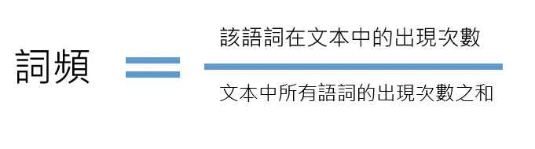
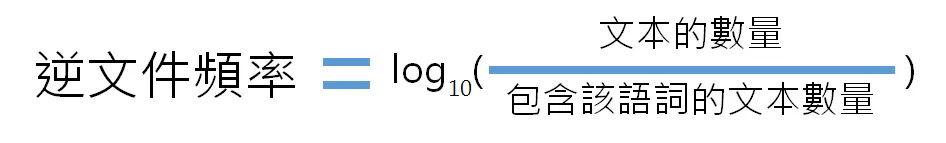
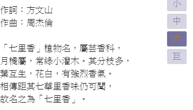
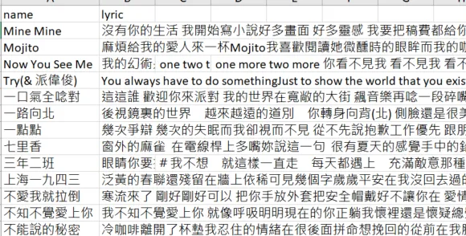
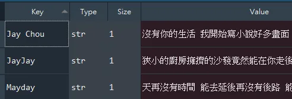
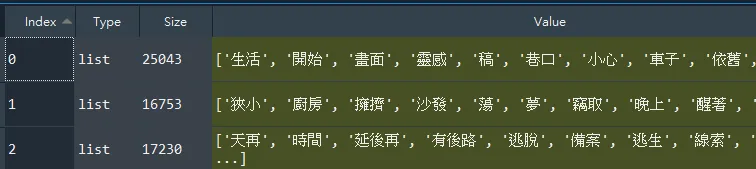
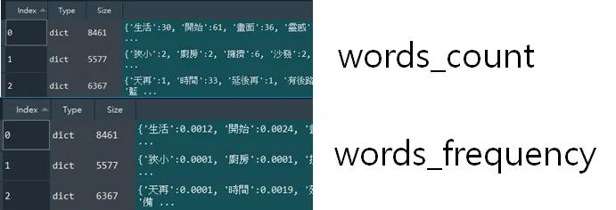
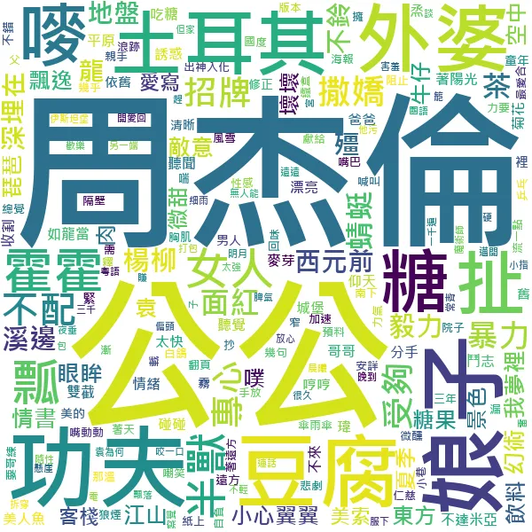
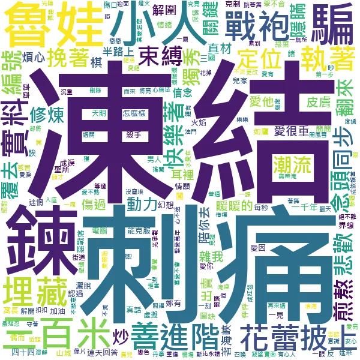
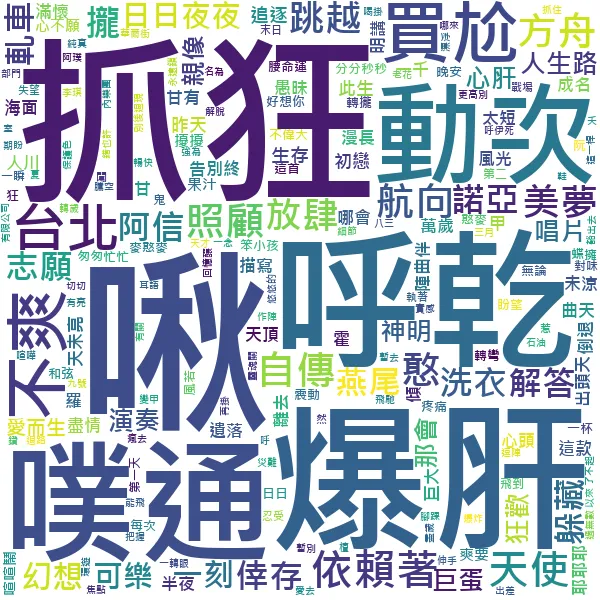

+++
author = "Bingcheng"
title = "以 Python 實作 tf-idf 算法，並以文字雲視覺化呈現"
date = "2020-08-01"
description = "以 Python 實作 tf-idf 算法，並以文字雲視覺化呈現"
tags = [
    "tf-idf",
    "文字探勘",
    "文字雲"
]
categories = [
    "資料分析"
]
series = ["Themes Guide"]
+++

這篇文章會用周杰倫、五月天、林俊傑三者的歌詞文本作為資料集，以 tf-idf 加權技術萃取三者歌詞文本的關鍵字，並且以文字雲的方式呈現。
<!--more-->

# 文本關鍵字
一個文本的關鍵字，應該具備何種性質？常理判斷該語詞倘若出現最多次，便越可能成為關鍵字，否則何必反覆在文中提起，語詞次數來衡量關鍵字，這是一個看似合理的方法，可惜會面臨到以下兩種缺失：

1. **文本長度不一致**，衡量便不再可靠，因為長篇幅的文章出現特定語詞的次數相對來說比較高。
2. **語詞普遍性問題**。如果一個詞語在大多數檔案都有出現，顯然這個語詞對該篇文章也不是那麼關鍵，比如說『我們』、『然後』，這類常見的語詞，雖然在一篇文章次數很高，但這類人稱代名詞或轉折詞往往不具備資訊含量，因此我們通常不會認為這些是關鍵詞。

因為上述兩個缺失，在探索關鍵字上便出現一種加權技術，可以更客觀合理的衡量文字的權重。

# tf-idf
tf-idf是一種加權技術，可以用來衡量文本語詞的權重，他是由以下兩個要件相乘得出的結果，這兩個元件恰好依序克服上述所及單純以『語詞次數』衡量權重的兩個缺失。

## 詞頻（term frequency，tf）
指的是某一個給定的詞語在該文本中出現的『頻率』，算法是該語詞在文本的出現次數，除以文本中所有語詞的出現次數之合，便可以得出該此語詞的『頻率』，如此可以防止偏向較長的文本。



ex：周杰倫的歌詞中，『微笑』語詞出現70次，周杰倫歌詞所有語詞的數量是 25000 個左右，則『微笑』語詞的詞頻就是70/25000=0.0028。

## 逆向文件頻率（inverse document frequency，idf）
旨在衡量一個詞語普遍重要程度，算法是文本的數量除以包含該語詞的文本數量，並將結果取以10為底的對數。由公式可知悉如果該語詞在其他文本很少見到，表示該語詞對於本文越關鍵。



ex：周杰倫的歌詞的『中世紀』語詞，因為五月天、林俊傑的歌詞都沒有出現過該語詞，因此逆文件頻率會是log(3/1)，約為0.4771。

# 資料來源
資料來源是透過爬蟲擷取魔鏡歌詞網的網頁得到，該網頁的結構沒有一致，歌詞頁面會參雜附註段落，卻沒有與歌詞區隔開來，例如七里香的歌詞中前面是七里香植物的科普，與歌詞本身並無關連，版面沒有一致，導致在清理資料階段十分漫長痛苦，資料梳理的困難也直接造就本文的限制，只以僅僅三者的歌詞文本來探索。過濾不必要的雜訊後以csv檔案儲存在clean data資料夾裡面。

**七里香歌詞摻揉附註**



**以csv格式儲存不同歌手的歌詞**



以下正式進入到實作環節，完整程式碼請見文末。

# 實作

## 讀取資料集

首先歷遍 clean data 內所有歌手的歌詞，每位歌手的歌詞以字串形式連接，裝納進 `singers` 這個字典中，得到的結果會如下圖所示。

```Python
for filename in filenames:
    path = f"{storage_folder}/{filename}"
    with open(path,encoding="utf-8") as file:
        #每位歌手的歌詞以字串形式連接
        lyric = ""
        for i,line in enumerate(file.readlines()):
            if i==0:continue
            title, content = line.split(",",1)
            lyric += content
        singer = filename.split(".")[0]
        singers[singer] = lyric
```
**singers**



## 以 jieba 套件分詞

tf-idf實現是本文重點，礙於篇幅限制，關於jieba套件用法在此不表，會另外寫一篇講解。我將分詞的動作直接包裝成 `WordSegment` 類別去呼叫，這裡發生了三件事情：

1. `read_dictionary`。讀取字典，除了 `jieba` 內建字典，我尚且手動新增了字典在dictionary資料夾內。
2. `read_stop_words`。讀取停用詞，停用詞是不必要、無意義的語詞，比如說『然後』、『因此』、『了』等語助詞。
3. `remove_stop_words`。移除上述讀取的停用詞。

```Python
ws = WordSegment(singers.values(),stop_words_path=stop_words_path)
ws.read_dictionary()
ws.read_stop_words()
ws.remove_stop_words()
```
**分詞結果**



## 統計詞頻

`words_count` 是列表，依序代表周杰倫、林俊傑、五月天，列表內是字典，表示歌手語詞的次數，有了次數之後便能統計 `words_frequency` 頻率。

```Python
words_count = []
for file in text_files:
    count = {}
    for word in file:
        if word in count:
            count[word] += 1
        else:
            count[word] = 1
    words_count.append(count)
```



## 統計逆文件頻率
`occurrences_of_word` 是一個字典，鍵值是語詞，值則是該語詞在幾個歌手歌詞中出現過，比如說『中世紀』語詞只有周杰倫的歌詞才有，映射關係就是{"中世紀":1}，得到這層映射關係，我們便可用迴圈逐一取得歌手歌詞的語詞，除以文件數量(也就是歌詞文本數量，在此是3)，再將結果取以10為底的對數。

```Python
#先取得每個語詞在歌手歌詞中"出現過"的次數
all_words = []
for word in words_count:
    all_words.extend(list(word.keys()))
    
occurrences_of_word = {}
for word in all_words:
    if word in occurrences_of_word:
        occurrences_of_word[word] += 1
    else:
        occurrences_of_word[word] = 1
        
inverse_document_frequency = []     
for word_count in words_count:
    #出現過的次數
    invFre = {} 
    for word in word_count.keys():
        occurrences = occurrences_of_word[word]
        invFre[word] = math.log(round((len(words_count)/occurrences),4))
    inverse_document_frequency.append(invFre)
```

## 詞頻x逆文件頻率
最後，得到的詞頻和逆文件頻率要記得相乘，得到的`all_tf_idf`，就是三位歌手的 tf-idf 的值了！

```Python
##tf*idf
all_tf_idf = []
for i,words in enumerate(words_frequency):
    tf_idf = {}
    for word,freq in words.items():
        tf_idf[word] = freq*inverse_document_frequency[i][word]
    all_tf_idf.append(tf_idf)
```

# 視覺化呈現

以下是使用 WordCloud 套件視覺化的效果。
身為周杰倫的腦殘粉，每個語詞看到都會忍不住響起旋律哈哈，周杰倫三個字佔比會那麼重，可不是我沒把歌曲作者資訊刪除，有興趣者請聽周杰倫的完美主義便知道:)。

這也是值得探討的地方，如果一首歌反覆出現同一個語詞，詞頻會很高，一首歌的語詞數量相較於一篇文章短許多，即便除以總文本語詞數量仍無法客觀衡量，而另一個逆文件頻率也面臨到相同的問題，在文本數量 (歌手數量) 不夠多的情況，逆文件頻率也無法精準衡量"獨特性"。

**周杰倫的歌詞 tf-idf 文字雲**



**林俊傑的歌詞 tf-idf 文字雲**



**五月天的歌詞 tf-idf 文字雲**



# 小結
今天向各位分享如何從一份結構化的文本，從讀取字典、移除停用詞、分詞、統計tf-id、到最後的視覺化描述等一系列探勘流程。

關於 tf-idf 效果有在視覺化描述章節提到，因為歌詞文本較短，語詞次數影響會增大，我想到的辦法是可以加入特定限制，例如一首歌的語詞次數有上限，畢竟我們想探索的是一位歌手"整體"會在歌詞中運用到什麼詞彙，多少能夠反映出個人風格，如果僅僅只是一首歌恐怕有失偏頗。

本文僅作教學示範用途，不保證資料集的品質，未來有時間我會好好梳理歌詞文本，到時樣本數增加，質量也變好，可能會有更有趣的發現！

**資料集/完整代碼：**
[Github Code](https://github.com/QiuBingCheng/MediumArticle/tree/main/Text%20Mining/tf-idf)
