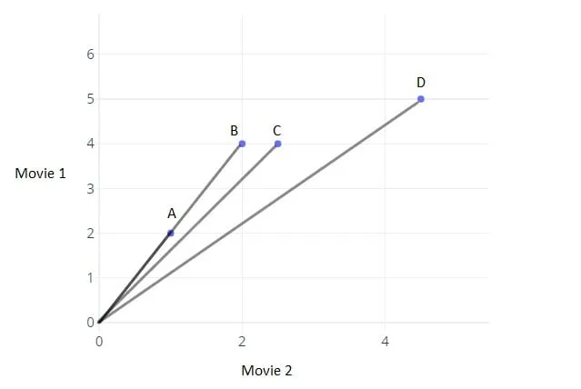
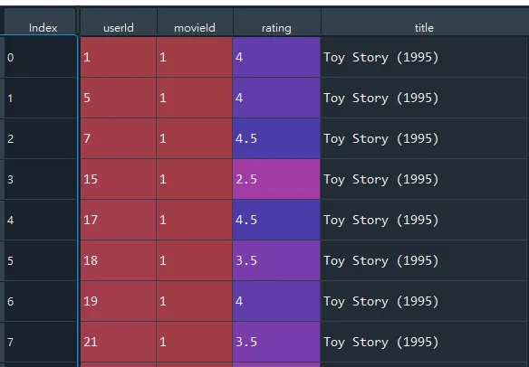

+++
author = "Bingcheng"
title = "以 Python 實現推薦系統的協同過濾算法 (User-based Collaborative Filtering)"
date = "2020-05-27"
description = "介紹推薦系統的協同過濾算法"
tags = [
    "推薦系統",
    "基於使用者推薦"
]
categories = [
    "資料分析"
]
series = ["Themes Guide"]
+++

今天我要為各位介紹的是協同過濾的其中一種算法，基於使用者的協同過濾推薦 (User-based Collaborative Filtering)，通過不同用戶對 item 的評分來評測用戶之間的相似性，並基於此相似性做出推薦。

<!--more-->

# 前言

推薦系統可粗分為兩大類，一類是**基於內容推薦**(Content-based Recommendations, CB)，另一類是**協同過濾推薦**(Collaborative Filtering, CF)。

**基於內容推薦**

筆者在 [以Python打造簡單實用的電影推薦系統(Content-based Recommendation)](/post/content-based-recommendation) 一文中，為各位介紹的便是一種基於內容推薦 (Content-based Recommendations, CB) 的方式，將使用者與電影嵌入在同一個向量空間，按照使用者和電影的相似度，為使用者推薦相似度高的影片，也可以反過來將影片推播給相似度高的用戶。

今天我要為各位介紹的是協同過濾的其中一種算法。


# 基於使用者的協同過濾推薦(User-based Collaborative Filtering)

什麼是協同過濾(Collaborative Filtering)？根據擁有共同經驗的群體的喜好來推薦使用者感興趣的資訊，最經典的例子就是電影推薦。

我們用以下圖片來說明，圖上散布點分別代表使用者ABCD，X軸和Y軸則分別是使用者對Movie 2和Movie 1的評價，**直線之間的夾角愈大，則兩個使用者的相似度愈低；直線之間的夾角愈小，則兩個使用者愈相似**。我們發現圖表上顯示使用者A和B代表的直線所構成的夾角幾乎為0，因此表示使用者A和B在對電影的品味上非常接近，如果要推薦影片給使用者A，我們會優先考慮**使用者B觀看過且使用者A尚未觀看過的影片來做推薦**。



舉個生活上的實際例子，我喜歡《海角七號》、《等一個人咖啡》、《與神同行》；你喜歡《海角七號》、《等一個人咖啡》，因此我們在觀看電影的品味上是相似的，因此合理推測你也會喜歡《與神同行》，這就是協同過濾基本的精神。

綜上所述，在推薦電影給使用者的場景中，**基於內容推薦是基於自身歷史觀看紀錄的電影類型，來推測相似的電影**；**而協同過濾是參考其他相似使用者的經驗，因此有機會挖掘到使用者潛藏的喜歡品項**，但是缺點是新的使用者因為觀看紀錄較少，難以匹配合適的相似者，推薦效果較差，這類型的問題也稱為冷啟動。

# 實現流程
協同過濾算法粗淺來說主要有以下三個步驟：

1. 找到與使用者擁有相同電影愛好(相似度高)的人
2. 找到該相似使用者們觀看的其他電影
3. 將這些相似使用者的平均電影評分最高幾部推薦給該使用者

# Python代碼實現
## 1. 讀取資料
本文採用的資料集與上次雷同，按照慣例，資料集和完整程式碼放置文末。上次實作，我們是利用電影的類型來做為相似度衡量的基準，但在這次我們採用的是使用者對電影的評分，因此先使用drop函數將genres欄位剔除，並將電影的資料與使用者觀看紀錄進行合併，合併結果如下圖所示。

```Python console
movies = pd.read_csv(r"dataset\MovieLens\movies.csv")
movies.drop(columns="genres",inplace=True)
df = pd.read_csv(r"dataset\MovieLens\ratings.csv")
df.drop(columns="timestamp",inplace=True)
df = pd.merge(df, movies, on='movieId')
```


## 2. 找到與使用者相似的人
**我們以共同觀賞過的電影其評分的相似度作為指標，相似度越高，表示在電影的品味上越接近**。例如使用者A對電影1的評分是5、電影2評分是1；使用者B對電影的評分是4.8、電影B評分是0.8，則這兩個使用者是相似的，因為同樣都喜歡電影A、不喜歡電影B。相似度有很多衡量方式，在電影評分的情境上由於我們不在乎絕對值的大小，在意的是方向的差異，因此採用餘弦相似度來衡量 (可以參考筆者撰寫的[歐氏距離與餘弦相似度的比較](/post/euclidean-vs-cosine))。

### 2.1 計算使用者與其他使用者的相似度

在這裡我們借助兩個輔助函式，第一個是 `find_common_movie`，該函式會取得使用者共同看過的電影ID，之後再利用`cal_similarity_for_movie_ratings` 輔助函式，計算這些共同看過的電影ID的餘弦相似度，其他使用者ID及相似度分別以 `user_ids` 和 `similarities` 表示。

```Python
# Calculate the similarity between the user and other users
similarities = []
user_ids = []
for other_user in df.userId.unique():
    if other_user == user:
        continue
    
    common_movies = find_common_movies(user,other_user)
    sim = cal_similarity_for_movie_ratings(user,other_user,common_movies)
    similarities.append(sim)
    user_ids.append(other_user)
```
### 2.2 取得其他使用者中相似度最高的前n位

為什麼不選擇相似度最高的那位就好？因為越多位推薦的可靠度越高，試想一個跟你一樣品味的人說電影A好看，以及10位跟你一樣品味的人說電影A好看，哪一種推薦效果較好？顯然是後者。

我們使用np.argsort函式針對相似度大小進行排序(注意 `np.argsort` 是排序結果的索引，並非值)，由於 `argsort` 排序預設是遞增排序，我們在後面加上 `[::-1]` 反轉序列，並且取前num位，得到列表變數 `most_similar_users` ，該使用者與其他使用者最相似的前 num 位 Id。

```Python
# Find top n similar users
similarities,user_ids = np.array(similarities),np.array(user_ids)
sorted_index = (np.argsort(similarities)[::-1][:num]).tolist()
most_similar_users = user_ids[sorted_index] 
print(f"Top-{num} similar users: {most_similar_users}")
```

## 3. 找到這群相似者中評價最高的前幾部電影
至此，我們已經找到最相似的前num位使用者，接著便是羅列出這些最相似的使用者已經觀看過，但是該使用者沒有看過的電影，並在這些電影中篩選評價較佳的前幾部作為推薦標的。

具體的做法如下，我們先使用 `not_seen_cond` 作為該使用者未看過的電影的篩選條件，`similar_cond` 則是最相似的使用者已經觀看過的電影的篩選條件，兩者篩選條件的交集結果儲存在`not_seen_movies_ratings` dataframe 中。

```Python
# Find the movies the user hasn't seen and the similar users have seen.
seen_movies = np.unique(df.loc[df["userId"]==user,"movieId"].values)
not_seen_cond = df["movieId"].isin(seen_movies)==False
similar_cond = df["userId"].isin(most_similar_users)
not_seen_movies_ratings = df[not_seen_cond & similar_cond][["movieId","rating"]]
```

截至目前為止，我們有了最相似的前 num 位使用者的觀看紀錄，我們要從中取得評價最高的幾部影片，一個直觀想法就是將影片評分取平均值，觀察這些最相似的使用者普遍推薦哪部影片。舉個簡單例子就是，你有AB兩個電影共同愛好者，你沒看過《與神同行》，A評價《與神同行》5分，B評價《與神同行》4分，於是就折衷取平均值，以4.5分表示推薦分數。

我們使用 `groupby("movieId")`，將這些最相似使用者對影片的評分取平均，並用 `sort_values` 對 ratings 進行遞減排序，藉此找到平均評分中最高的前 top_n 部影片，結果儲存在`top_ratings` ，推薦結果如圖所示。

```Python
# Find average ratings by the most similar users
average_ratings = not_seen_movies_ratings.groupby("movieId").mean()
average_ratings.reset_index(inplace=True)
top_ratings = average_ratings.sort_values(by="rating",ascending=False).iloc[:top_n]
top_ratings.reset_index(inplace=True,drop=True)
print(f"Top-{top_n} average ratings by the most simiilar users:")
print(top_ratings.to_string(index=False))
```


# 小結
推薦系統的協同過濾，旨在以擁有共同經驗的群體的喜好來推薦使用者感興趣的資訊，算法本身並不困難，相信讀者照著本文流程走，都能快速掌握核心的概念，未來我會繼續講解其他推薦系統的算法，要是讀者有任何疑問都可以告知我，我會盡可能為你解惑的^^。

**資料集/完整代碼**： [Github Code](https://github.com/QiuBingCheng/MediumArticle/tree/main/Recommendation%20System)

# 參考資料
* [浅谈推荐系统+3个小时上手python实现（完整代码）](https://zhuanlan.zhihu.com/p/68373487)
* [協同過濾-維基百科](https://zh.wikipedia.org/wiki/%E5%8D%94%E5%90%8C%E9%81%8E%E6%BF%BE)
* [歐氏距離與餘弦相似度的比較](https://medium.com/qiubingcheng/%E6%AD%90%E6%B0%8F%E8%B7%9D%E9%9B%A2%E8%88%87%E9%A4%98%E5%BC%A6%E7%9B%B8%E4%BC%BC%E5%BA%A6%E7%9A%84%E6%AF%94%E8%BC%83-c78163ad51b)
* [淺談推薦系統](https://codingnote.cc/zh-tw/p/26735/)